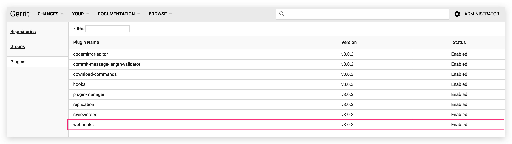

本文主要介绍 Zadig 工作流的触发，包括：手动触发、代码变更触发、定时器触发和 OpenAPI 调用触发。

## 手动触发

手动触发的两个入口：
- 工作流列表页
- 工作流详情页入口

### 工作流启动入口-列表页

点击列表中工作流右侧对应的`执行`按钮，启动工作流。

### 工作流启动入口-工作流详情页

点击工作流操作中的`执行`按钮，启动工作流。

### 工作流启动参数说明

从以上两个入口点击`执行`按钮之后，都会弹出启动工作流，如下图所示。

参数说明：

- `环境`：选择此次任务所要更新的环境。
- `服务`：选择此次任务更新的服务组件名称，支持在一次工作流任务中更新多个服务组件。
- `代码选择`：用户完成选择服务后，可以自由选择代码信息，Zadig 提供四种代码构建方式：
    - 选择某个 Branch，系统会拉取该 Branch 的代码进行构建。
    - 选择某个 Branch + pull request 构建，系统会在工作目录中将 pull request 自动合并到所选 Branch 后进行构建。
    - 选择某个 pull request，系统会拉取该 pull request 的代码进行构建。
    - 选择 Tag 构建，系统会拉取该 Tag 的代码进行构建。
- `环境变量`：构建和测试脚本中设置的自定义变量，在启动工作流时候可以传入具体的值。

## 代码变更触发

在工作流中添加触发器配置后，会在对应的代码托管平台创建 Webhook。当出现满足触发条件的代码变更时，会自动触发运行工作流。目前支持以下 3 个代码托管平台：

- GitHub：在工作流中配置触发器后，会自动在 GitHub 平台创建 Webhook。
- GitLab：在工作流中配置触发器后，会自动在 GitLab 平台创建 Webhook。
- Gerrit：需要先在 Gerrit 上安装 Webhook 插件支持，再在工作流中配置触发器。具体安装可参考[链接](https://gerrit-review.googlesource.com/Documentation/config-plugins.html#installation)，插件安装成功后效果图示如下：

为工作流配置触发器包括 `GUI 方式`和`YAML 配置文件方式`，下面展开介绍。

### GUI 方式
在工作流界面中实现触发器的配置，配置过程更直观，可指定代码变更分支（一个分支或通过正则表达式匹配多个分支）、触发事件等。具体配置请参考 [GUI 方式配置触发器](/dev/project/workflow/#gui-方式)。

### YAML 配置文件方式

将触发器配置组织在代码库的 YAML 文件中，在 YAML 文件中设置相关触发条件和工作流执行策略，在 Zadig 工作流触发器配置中填写 YAML 文件的路径即可。具体配置请参考 [YAML 配置文件方式配置触发器](/dev/project/workflow/#yaml-方式)。

### 触发效果

配置完成后，根据配置提交 pull request、merge request 或者 push 可触发工作流，以 GitLab 为例，在 merge request 中可以查看工作流的反馈信息，如下所示。

### 进阶使用场景：Pull request 独立测试环境
::: warning
Pull request 独立测试环境验证功能目前仅支持 GitLab 代码仓库触发
:::

> 通过工作流触发器中配置基准环境和环境销毁策略实现 pull request 独立测试环境的持续交付过程，完成一段代码的全生命周期质量验证。

Pull request 级持续交付分为以下步骤：
- 提交更新的 pull request 代码
- 根据选择的基准环境生成一个相同服务版本的临时环境
- 执行工作流更新该测试环境中的服务版本，以及针对该集成环境进行相关自动化测试验证
- 根据环境销毁策略对测试环境进行回收操作

具体配置如下图所示：

提交代码变更，在对应 pull request 下可看到关于独立环境的状态信息：

创建的独立环境效果如下：

## 定时器触发

可以通过工作流的定时器功能来实现工作流的定时触发。具体配置请参阅[定时器](/dev/project/workflow/#定时器)。

## OpenAPI 调用触发

通过 OpenAPI  接口调用来触发工作流，具体操作请参阅[执行工作流](/dev/api/workflow/#执行工作流)。
