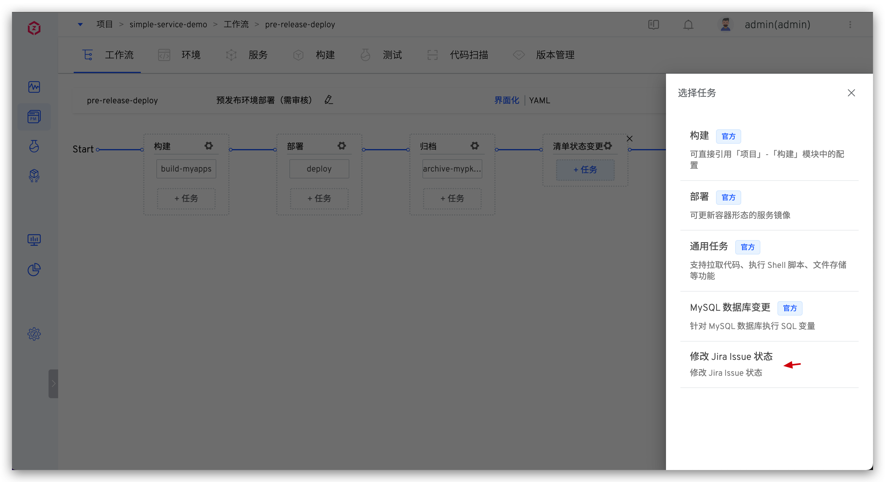

本文介绍如何在 Zadig 系统上集成工作流任务来源。工作流任务主要用于自定义工作流中，实现工作流的开放能力。

## 准备工作
第一步：编码实现自定义工作流任务，并将代码入库，目录结构组织如下：
``` bash
path/to/your/repo         # 代码库根目录
├── hello                 # 任务目录，每个任务在单独的目录中
│   └── v0.0.1            # 版本号
│       └── hello.yaml    # 对应该任务的 YAML 文件
└── jira
    └── v1.0.0
        └── jira.yaml
```

以 Zadig 库中的 [mysql-runner](https://github.com/koderover/zadig/tree/release-1.14.0/pkg/microservice/aslan/core/workflow/service/workflow/plugins) 任务说明代码目录结构组织：
``` bash
mysql-runner                 # 任务目录，需要在代码库的根目录中
└── v0.0.1                   # 版本号
    ├── Dockerfile           # 对应 mysql-runner 的镜像构建 Dockerfile
    ├── Makefile             # mysql-runner 的工程编译文件
    ├── main.go              # mysql-runner 任务的实现源码
    └── mysql-runner.yaml    # 任务的 YAML 配置文件
```

其中 `mysql-runner.yaml` 文件解读如下：

``` yaml
name: "MySQL 数据库变更"                     # 任务名称
version: "v0.0.1"                          # 任务版本
description: "针对 MySQL 数据库执行 SQL 变量" # 任务描述
image: koderover.tencentcloudcr.com/koderover-public/mysql-runner:v0.0.1-amd64 # 任务镜像

inputs: # 参数配置，执行自定义工作流时可指定
  - name: mysql_host
    description: "mysql host"
    type: string
    default: ""
  - name: mysql_port
    description: "mysql port"
    type: string
    default: ""
  - name: username
    description: "mysql username"
    type: string
    default: ""
  - name: password
    description: "mysql password"
    type: string
    default: ""
  - name: query
    description: "query to be used"
    type : text
    default: ""

envs: # 注入环境变量，任务执行时会读取该变量，具体实现请查看源码 main.go 文件
  - name: MYSQL_HOST # 环境变量的名称
    value: $(inputs.mysql_host) # 环境变量的值，形式为 $(inputs.key)
  - name: MYSQL_PORT
    value: $(inputs.mysql_port)
  - name: USERNAME
    value: $(inputs.username)
  - name: PASSWORD
    value: $(inputs.password)
  - name: QUERY
    value: $(inputs.query)
```

第二步：将上述代码库在 Zadig 中集成，可参考 [代码源集成](/v1.14.0/settings/codehost/gitlab/)。


## 来源配置

系统管理员访问 `系统设置` -> `集成管理` -> `工作流任务`，配置代码仓库、分支等信息后保存。

> 若集成来源成功后，代码库中任务实现有改动，点击 `同步` 即可。


## 使用

在自定义工作流中添加任务，选择任务即可，可修改任务中的变量配置。



