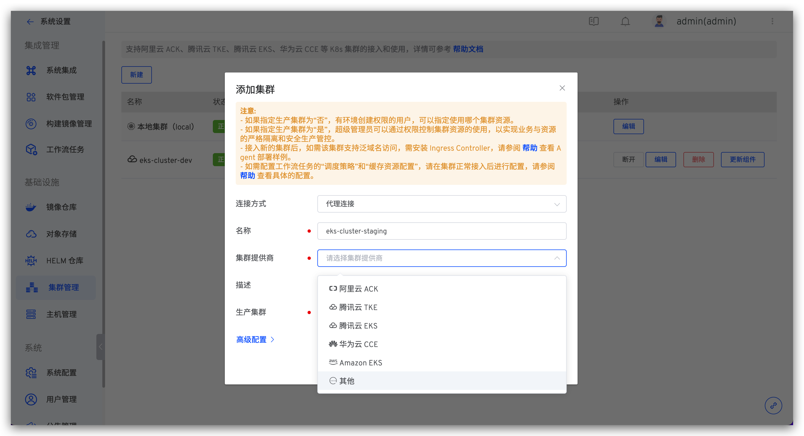

本文介绍如何在 Zadig 系统上进行多集群管理。Zadig 基于本地集群安装，同时支持外部多个 K8s 集群资源的接入和使用。

## 添加集群

:::warning
需要保证添加的集群可以访问到 Zadig 所在的集群
:::

访问 `系统设置` -> `集群管理`，点击 `新建` 添加集群。

参数说明：

- `连接方式`：支持`代理连接`和`直接连接`两种方式，具体操作请参考 [代理连接方式](#代理连接)、[直接连接方式](#直接连接)。
- `名称`：集群名称只支持小写字母、数字和中划线。
- `集群提供商`：该集群的提供商信息。
- `描述`： 该集群的用途描述信息。
- `KubeConfig`：待接入集群的 KubeConfig 配置文件内容，使用`直接连接`方式时需填写。

创建集群时可设置高级配置，也可以在创建完成后再修改。高级配置说明：
- `指定项目范围`：指定该集群可被哪些项目使用，默认为创建集群时，系统当前全部项目。

### 代理连接
> 在外接集群中安装 Agent，适用场景：外接集群可以访问 Zadig 所在的集群。

选择`代理连接`方式填写集群基本信息后，在待接入集群中执行 Agent 安装脚本，如图所示：

脚本执行完毕后，刷新集群列表查看集群状态，状态正常即为接入成功。

### 直接连接
> 需要外接集群的 admin 权限，在 Zadig 系统中配置其 KubeConfig，适用场景：Zadig 所在的集群可以访问外接集群。

选择`直接连接`方式填写集群基本信息及外接集群的 KubeConfig 内容后保存即可。

## 基本操作
- `断开`：断开集群操作并不会删除已经在集群中创建的环境资源，如需清理，请手动删除。集群断开后，可通过再次执行 Agent 安装脚本接入。
- `编辑`：可修改集群的基本信息及高级配置。
- `删除`：删除集群操作并不会删除已经在集群中创建的环境资源，如需清理，请手动删除。
- `更新 Agent`：更新 Zadig 系统在该集群中安装的 Agent，即：koderover-agent 命名空间下的 dind、koderover-agent-node-agent 和 resource-server 资源。

## 设置调度策略
点击`编辑`，可设置该集群资源的调度策略。以执行工作流任务为例对不同的策略说明如下：

- `随机调度`：不需要指定标签，工作流任务将被随机调度在集群的任意节点上执行。
- `优先调度`：需要指定标签，工作流任务将被优先调度到符合标签的节点上执行，若节点资源无法满足调度需求，则该任务会被分配给其他节点。

## 缓存资源配置

可按需对不同集群资源配置缓存策略。

### 使用对象存储

将会使用系统默认对象存储来缓存资源，可在[对象存储管理](/v1.15.0/settings/object-storage/)中设置默认对象存储。

### 使用集群存储

可使用集群中已有的存储资源或按需动态创建资源。

**选择存储资源**

- `动态生成资源`：选择文件存储类型的 StorageClass 并指定动态生成的存储空间大小，注意：若使用腾讯云 cbs 作为 StorageClass，则有效的存储空间大小范围 (GiB)：[10, 32000]。
- `使用现有存储资源`：选择已有存储资源，注意：创建该存储资源的 PVC 中，accessModes 需要是 ReadWriteMany。

**缓存目录规则**

可设置缓存资源在集群存储中的存储目录相对路径规则，实现共享缓存，或者根据不同的项目/工作流/服务组件独享缓存。支持以下变量：

    $PROJECT：项目名称
    $WORKFLOW：工作流名称
    $SERVICE_MODULE：服务组件名称 (测试工作流中无此参数，对于测试工作流的缓存，该变量将被忽略)

举例说明如下：
| 缓存目录规则 | 说明 |
|---------------------------------------|--------------------------------------------------------------------------|
| `$PROJECT/$WORKFLOW/$SERVICE_MODULE`  | 为同一项目同一工作流中的服务组件单独设置独享缓存，不同服务组件之间互不干扰            |
| `$PROJECT/$WORKFLOW`                  | 同一项目下的同一工作流共享缓存；不同工作流之间独享缓存互不干扰                      |
| `$PROJECT/$SERVICE_MODULE`            | 同一项目下的相同服务组件共享缓存                                               |
| `$PROJECT`                            | 同一项目共享缓存；不同项目的缓存资源将存储在集群 PVC 的不同目录中，彼此独享缓存互不干扰 |
| `cache`                               | 缓存资源将存储在集群 `/<PVC 根目录>/cache` 目录下，所有项目共享使用缓存            |
|  无                                   | 缓存资源将存储在集群 `/<PVC 根目录>` 下 ，所有项目共享使用缓存                     |

### 更多信息

若修改了集群的缓存资源配置（比如将`对象存储`修改为`集群存储`，或者`动态生成资源`修改为`使用现有存储资源`），则修改之前已缓存的资源在修改后将不再生效，会在新的存储资源下重新开始缓存。

## 集群使用

1. 在 Zadig 系统中接入外部集群后，便可以在该集群上创建新环境，并使用工作流对新环境进行更新操作，环境操作可参考 [创建环境](/v1.15.0/project/env/k8s/#创建环境)。