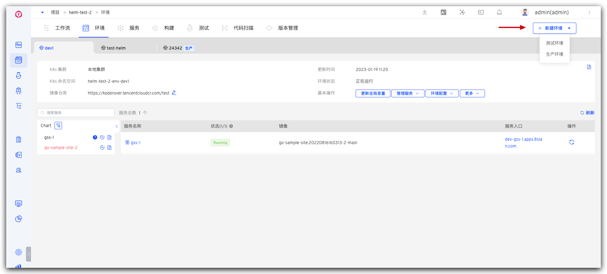

本文主要介绍 K8s Helm Chart 项目中的环境相关操作。

## 创建环境
在项目中，点击`创建环境`按钮，选择测试环境后进入创建环境页面。（生产环境相关内容可查看：[生产环境](/dev/project/env/release/)）

### 基本信息
- `环境名称`：要创建的环境的名称，比如：`dev`、`pre-release`。
- `创建方式`：包括`新建`和`复制`。
	- `新建`：基于服务的 Chart 配置，创建全新的环境。
	- `复制`：基于在 Zadig 中已有的环境复制一份新的环境出来。
- `选择环境`：当创建方式是`复制`时需要配置该项，用于选择要复制的环境。
- `资源选择`：
	- `K8s 集群`：选择创建环境时所使用的集群资源，其中`本地集群`指 Zadig 系统所在的集群。关于集群的集成可参考[集群管理](/v1.16.0/pages/cluster_manage/)。
	- `K8s 命名空间`：不同的环境会使用独立的 Kubernetes 命名空间实现隔离。Zadig 系统创建命名空间的默认规则为 `项目名-env-环境名`，用户也可以自定义或者选择已有命名空间。
	- `镜像仓库`：指定环境创建后所使用的镜像仓库，使用工作流构建部署服务，以及修改服务镜像，均会使用此处指定的镜像仓库。关于镜像仓库的集成可参考[镜像仓库管理](/v1.16.0/settings/image-registry/#添加镜像仓库)。

### 环境配置

在创建环境时为环境创建配置，说明如下：

- 可创建多个 Ingress、ConfigMap、Secret、PVC 类型的配置
- 支持直接粘贴或从 GitHub/GitLab 代码库导入上述配置的 K8s YAML 文件内容
- 环境创建成功后，此处新建的配置即会在环境/集群中生效，也可以在环境创建完成后再管理环境配置，参考[环境配置管理](/v1.16.0/project/env/k8s/#环境配置管理)

### 全局变量
点击展开`全局变量`，可修改 values 文件内容设置环境级别的变量值，系统支持 2 种方式设置全局变量：

- 手动输入 YAML 格式文件的内容，内容详情即为要设置的变量信息。
- 从指定 GitHub/GitLab 代码库同步 values。
	- 在导入时打开自动同步开关，Zadig 会定时从指定的代码库获取最新的 values 文件并将其自动更新到环境中。<Badge text="企业版" />

后续代码库中 values 内容有变化时，会自动同步修改当前环境的全局服务变量内容。

### 服务变量

可选择修改指定服务的 values 文件内容配置服务级别的变量值，系统支持 3 种方式修改服务变量：
- 手动输入 values 文件内容。
- 从指定 GitHub/GitLab 代码库同步 values 文件。
	- 在导入时打开自动同步开关，Zadig 会定时从指定的代码库获取最新的 values 文件并将其自动更新到环境中。<Badge text="企业版" />

- 手动输入 key/value 键值对，覆盖在创建 Helm Chart 服务时导入的 values 文件内容。

::: tip 扩展知识
1. 服务变量的设置只对单一服务生效。
2. 全局服务变量的设置对当前环境的所有服务都生效。
2. 如果既设置了全局服务变量，又设置了服务变量时，服务变量的优先级高于全局服务变量。
:::

### 开始创建
输入环境名称，按需设置服务变量等信息后，点击`立即创建`按钮即可开始创建环境。

::: tip
1. 在将指定的服务部署到新创建的环境中前，系统会使用 dryRun 参数对相关 chart 进行渲染，若有提示报错请检查服务 chart 配置是否合法。
2. 服务数量以及启动服务所需的资源会影响环境的创建时间，请耐心等待。
:::

## 查看环境
环境创建完成后，点击不同的环境 Tab 即可切换到该环境的详情页面。

### 基本信息
基本信息包括 K8s 集群，K8s 命名空间，更新时间，环境状态，镜像仓库，服务列表及 [Chart 视图](#chart-视图)。

环境状态有以下几种情况：
- `创建中`：正在创建。
- `更新中`：正在更新。
- `删除中`：正在删除。
- `正在运行`：环境中所有服务都是正常的 Running 状态。
- `运行不稳定`：环境中一部分服务处于 Unstable 状态，可能的情况有两种：
	- 容器服务出现了问题。
	- 容器服务正在进行更新操作，例如更新镜像，会出现短时间的服务 Unstable，当更新过程完成之后，服务状态会恢复为 Running。
- `环境可更新`：当已创建的环境对应的环境模板有更新之后，环境处于可更新状态，有读写权限的用户可以看到`更新环境`按钮，点击按钮可对环境进行模板和配置的更新。

### 基本操作

环境操作包括：

- `更新全局变量`：修改服务的 values 内容，对当前环境下的所有服务都生效
- `管理服务`：包括[添加服务](#添加服务)、[更新服务](#更新服务)、[删除服务](#删除服务)
- `环境配置`：为环境配置 Ingress、ConfigMap、Secret、PVC 资源，细节描述请阅读[环境配置管理](/v1.16.0/project/env/k8s/#环境配置管理)
- `删除环境`：删除当前创建的环境，环境删除后不可恢复

#### 更新全局变量

点击`更新全局变量`，可修改全局服务变量，支持以下几种方式：

- 可手动输入 values 内容
- 从代码库导入 values 文件
- 使用变量组，变量组管理参考[变量组配置](/v1.16.0/project/config/#变量组) <Badge text="企业版"/>

#### 添加服务

点击 `管理服务` -> `添加服务` 选择要添加的服务，可按需修改其 values 内容 -> 点击`确定`即可将新的服务添加到当前环境中。

资源检测 <Badge text="企业版" />

系统将校验 release 在 Namespace 是否存在
- 如果存在，显示提示 `release 名称在命名空间已存在` ，默认选择 `仅导入服务`。
- 如果不存在，可以添加 Values 文件、指定需要覆盖的键值对。

#### 更新服务

点击`管理服务` -> `更新服务` -> 选择要更新的服务，可按需修改其 values 内容 -> 点击`确定`即可对环境中的服务进行更新。

> 若更新服务时不修改其 values 内容，则会使用服务配置中的 values 来修改该服务

#### 删除服务

点击`管理服务` -> `删除服务` -> 选择要删除的服务 -> 点击`确定`即可将该服务从当前环境中删除。

### 变更记录
点击右上角的图标可查看该环境的操作日志。

### 服务详情

在服务列表中点击具体的服务可查看该服务的更多信息，可以对服务进行服务重启、服务伸缩、配置管理、更新镜像等操作。具体请阅读[服务详情](/v1.16.0/project/env/service/)。

### Chart 视图

在服务列表左侧的 Chart 视图中可查看服务实例的 values 文件内容，点击左侧的更新按钮可对环境中的服务进行更新。

若更新失败，服务会变为红色，可查看具体的失败原因。

## 环境配置管理

可对环境中的 Ingress、ConfigMap、Secret、PVC 配置进行操作，参考[环境配置管理](/v1.16.0/project/env/k8s/#环境配置管理)。

## 自测模式

参考[自测模式](/v1.16.0/project/env/k8s/#自测模式)。

## 删除环境
点击`基本操作` -> `更多` -> `删除环境`按钮并输入环境名即可删除环境。当勾选`同时删除环境对应的 K8s 命名空间和服务`后：

- 如果环境是基于新的 Namespace 创建的，则删除环境操作会删除环境对应的 Namespace 及其中由 Zadig 系统创建的资源。
- 如果环境是基于已有 Namespace 创建的，则删除环境操作会删除 Namespace 中由 Zadig 系统创建的资源，但不会删除 Namespace。

