本文主要介绍 Zadig 的工作流的配置和使用。
## 配置工作流

工作流支持多种策略组合，完成从`构建`->`部署`->`测试`->`分发`全流程的自动化编排，快速验证快速反馈，保证代码的质量。

### 基本信息

> 主要包含工作流名称、描述信息、所属项目信息

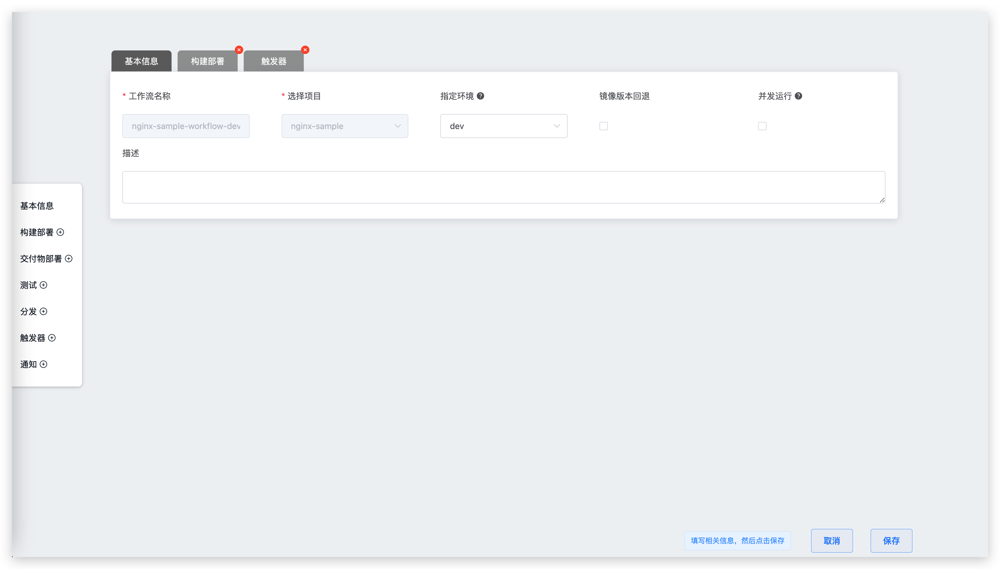


参数说明:
- `工作流名称`：名称只支持字母大小写和数字，特殊字符只支持中划线。
- `选择项目`：选择工作流所更新的项目名称。
- `描述`：描述该工作流的详细信息，在工作留详情页展示。
- `并发运行` <sup style='color: red'>新</sup>：多名合作者先后触发该工作流更新不同的服务时，产生的多个任务将会并发执行以提升构建、部署、测试效率。
- `镜像版本回退` <sup style='color: red'>新</sup>： 若开启，则工作流执行完毕后，被更新服务的镜像会回退到工作流任务执行前的版本。更多信息可阅读：[工作流的镜像版本回退](/v1.7.1/workflow/image/rollback/)。

### 构建部署

为服务配置构建后，工作流通过构建部署模块提供更新环境的能力。
> 服务构建配置细节可参阅[构建配置](/v1.7.1/project/build/)

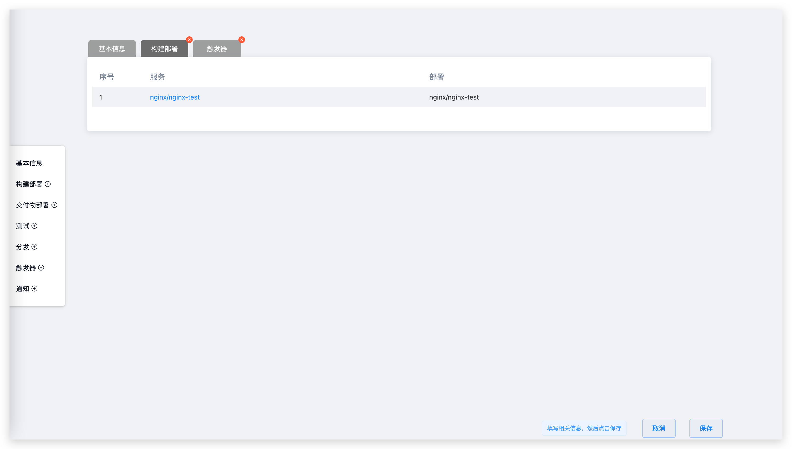

### 交付物部署

> 提供通过构建产物直接更新服务的能力

::: tip
同一个工作流中交付物部署和构建部署为互斥功能，只能选择一个进行开启
:::

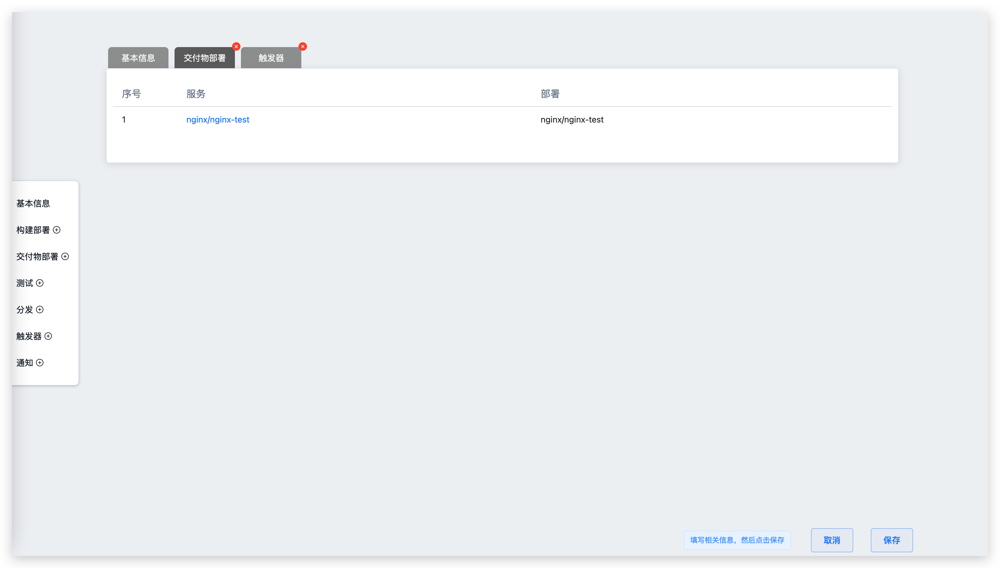


### 测试

通过修改工作流的测试配置，来实现测试步骤，关于测试配置的创建和使用，请参阅[测试管理](/v1.7.1/project/test/)

#### 自动化测试

用户可以通过添加测试按钮从测试配置中选择要添加的测试项目进行测试。

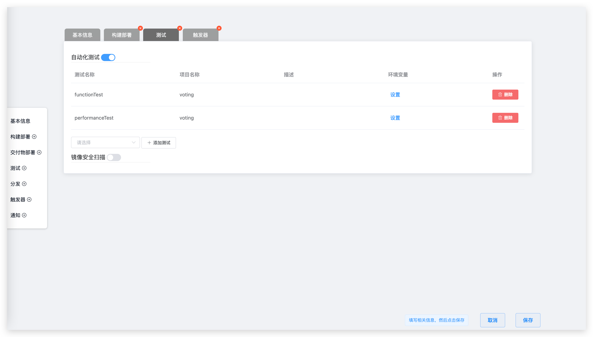

### 分发

> 通过配置分发模块，用户可以对服务的构建产物进行分发操作，目前支持镜像仓库分发和存储空间分发
::: tip 前提
镜像的分发支持需要管理员提前正确配置[`镜像仓库`](/v1.7.1/settings/image-registry/)<br>
存储空间的分发支持需要管理员提前正确配置[`对象存储`](/v1.7.1/settings/object-storage/)
:::


参数说明：

- 添加服务：要被执行分发的目标服务
- 镜像仓库：构建的镜像产物被分发的目标镜像仓库，可在系统设置的 [镜像仓库](/v1.7.1/settings/image-registry/) 中查阅
- 对象存储：构建的文件产物（一般为压缩包）被分发的目标对象存储，可在系统设置的 [对象存储](/v1.7.1/settings/object-storage) 中查阅

### 定时器
通过配置定时器，可以实现周期性的运行工作流

目前工作流支持的定时器方式主要有：
- 定时循环：在某个时间点定时执行某个工作流，例如每天 12:00 运行，每周一 10:00 运行
- 周期循环：周期性的执行某个任务，例如每 30 分钟执行一次工作流
- Cron 表达式：使用标准的 Linux Cron 表达式灵活的配置定时器，例如："45 4 1,10,22 * *"，每月 1、10、22 日 4:45 分执行工作流任务

#### 定时循环

具体操作步骤：
- 点击添加按钮添加一项定时循环条目，分别选择周期时间以及时间点
- 设置工作流任务参数，执行时按设置的参数执行

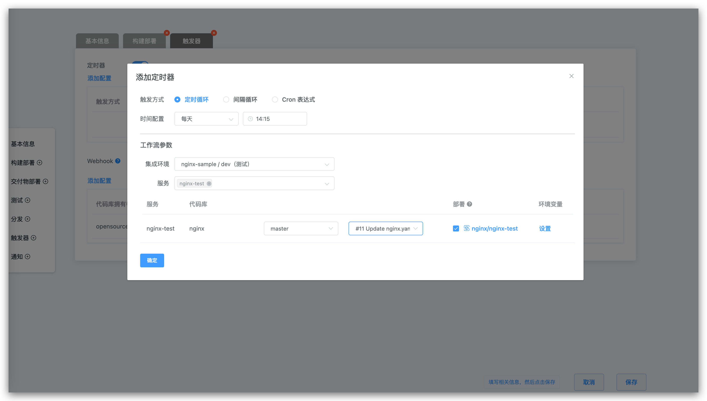
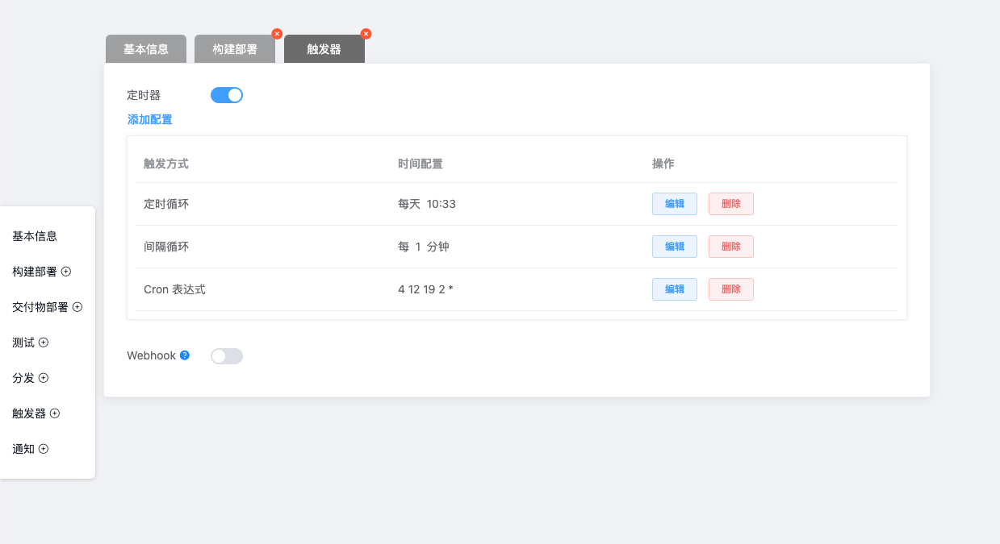


#### 间隔循环

具体操作步骤：

- 第 1 步：点击添加按钮添加一项间隔循环条目，分别选择间隔时间以及间隔时间单位
- 第 2 步：设置工作流参数，执行时按设置的参数执行

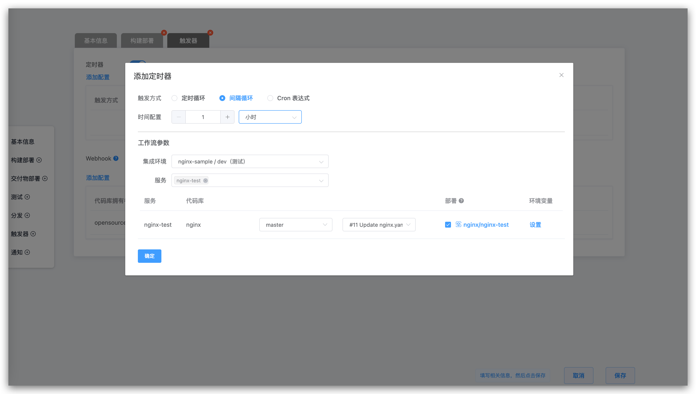

#### Cron 表达式
具体操作步骤：

- 第 1 步：点击添加按钮添加一项 Cron 表达式条目，填写 Cron 表达式
- 第 2 步：设置工作流参数，执行时按设置的参数执行

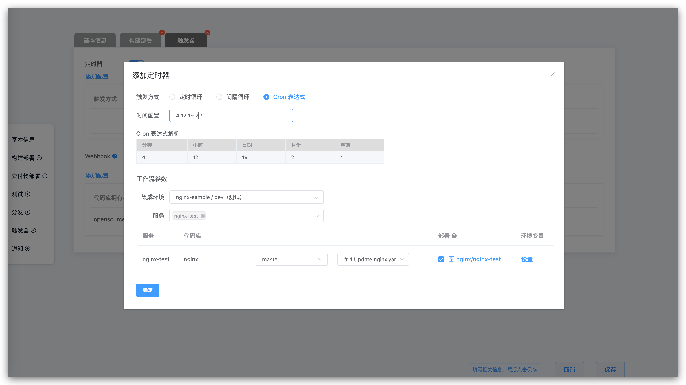

### Git Webhook

新增触发器模块，打开 Webhook 开关

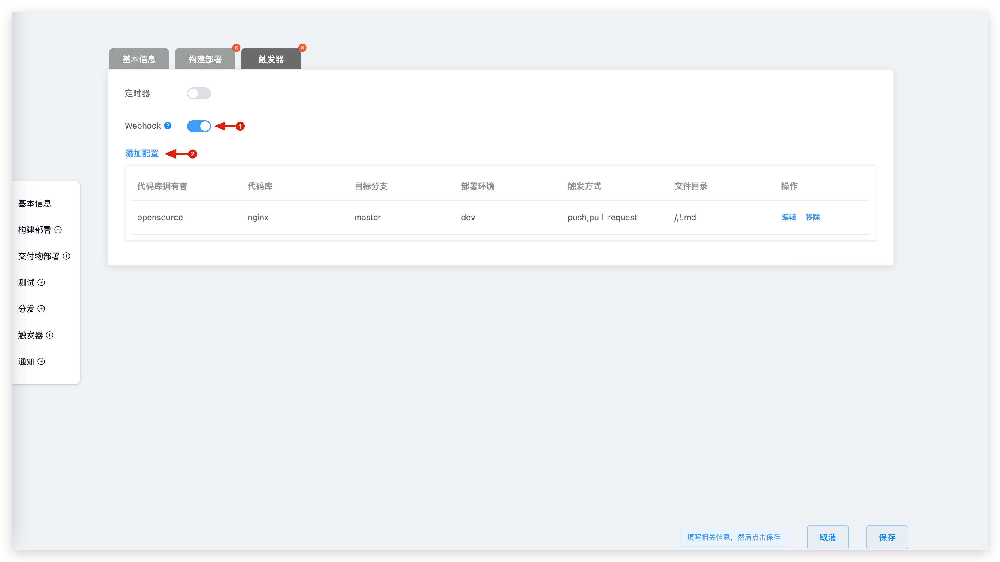

点击添加配置

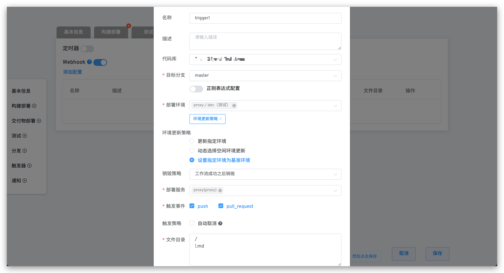

参数说明：

- `代码库`：需要监听触发事件的代码仓库，代码源选择不同对应的触发事件也会不同。
- `目标分支`：提交 pull request 时的 Base 分支。支持正则表达式配置，语法参见 [Regexp Syntax](https://pkg.go.dev/regexp/syntax@go1.17.3#hdr-Syntax)。
- `部署环境`：指定触发任务部署步骤更新的环境，可指定多个环境。
- `环境更新策略`：部署步骤更新环境的策略，可选策略如下：
    - `更新指定环境`：`部署环境`参数中指定一个环境时可选，部署更新该环境。
    - `动态选择空闲环境更新`：在`部署环境`指定的环境中，动态选择一个相对空闲的环境，对其进行部署更新。
    ::: tip
    环境的空闲标准由正在对其进行部署更新的工作流任务数量而定，Webhook 触发事件发生时，当前工作流任务比较少的环境即为相对空闲的环境。
    :::
    - `设定指定环境为基准环境`：**[高级选项]** `部署环境`参数中指定一个环境，且代码库是 GitLab 代码源时可选。以该环境的服务版本为基础创建一个名为 `pr-prID-随机字符串`的环境，对该环境进行部署更新。
- `环境销毁策略`：**[高级选项]** `环境更新策略`为`设定指定环境为基准环境`时可选。在 Webhook 事件触发工作流执行完毕后，对上述 `pr-prID-随机字符串`环境的销毁策略，包括：每次保留，每次销毁，工作流成功后销毁。
- `部署服务`: 指定触发任务构建部署的相应服务。
- `触发事件`: `push` 事件（Merge 操作）时触发，`pull_request` 提交 pull request 时触发，`change-merged` 修改被 merge 之后触发。
- `触发策略`: 如果你希望只构建最新的提交，则使用这个选项会自动取消队列中的任务。
- `文件目录`: 通过设置文件和文件目录，可以实现对文件以及目录的监听，当文件或者目录发生变化时（新增、修改或者删除），触发工作流。也可以忽略对应的文件或者目录变更，不进行工作流的触发。

使用以下代码仓库文件结构为例：

``` bash
├── reponame  # 仓库名称
  ├── Dockerfile 
  ├── Makefile
  ├── README.md   
  ├── src        
    ├── service1/
    ├── service2/
    └── service3/
```
| 触发场景 | 文件目录配置 |
|----|------------|
| 所有文件更新|`/`|
| 除 *.md 以外的其他文件更新|`/`<br>`!.md`|
| 除 service1 目录下的其他文件更新 | `/`<br>`!src/service1/`|
| service1 目录下所有文件更新 | `src/service1/` |
| src 目录下（除 service1 目录下的文件）的文件更新|`src`<br>`!src/service1/`|

## IM 状态通知

目前支持配置工作流最终执行状态通知到企业微信、钉钉、飞书，下文将展开介绍。

### 企业微信

请参照[企业微信配置文档](https://work.weixin.qq.com/help?doc_id=13376)获取详细信息。

若为某个群组添加 Bot 可以登录企业微信 -> 选择某个群组后右键点击，选择添加机器人，可以获取到相关 Webhook 地址。

参数说明:

- `企业微信 Webhook 地址` : 通知到企业微信群 Bot 机器人的地址
- `通知事件`: 可配置通知的规则，工作流状态可多选

配置步骤图示：

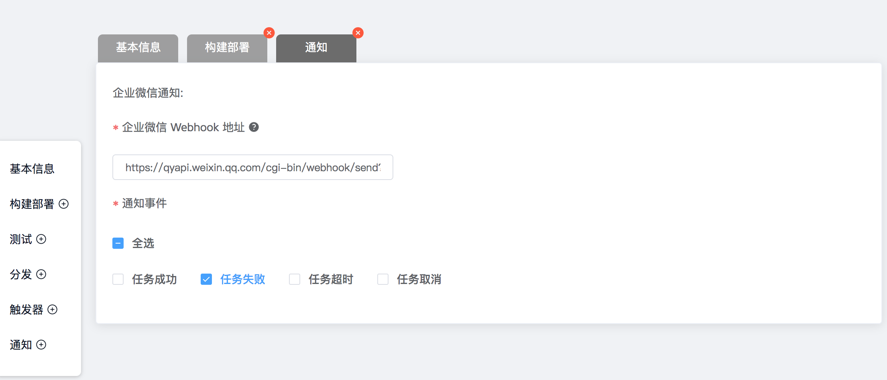

通知效果图示：

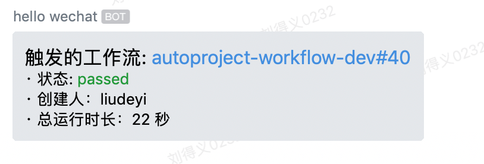
### 钉钉
请参照[钉钉自定义机器人配置](https://developers.dingtalk.com/document/robots/custom-robot-access)获取详细信息。

在钉钉上添加自定义 Bot 机器人的时候，必须开启安全设置，安全设置有 3 种，可以设置一种或多种：

- `自定义关键字`：如果选择自定义关键字，请输入`工作流`三个字
- `加签`：开启后，Webhook 地址获取参考：[获取加签后的 Webhook 地址](https://developers.dingtalk.com/document/robots/customize-robot-security-settings)
- `IP 地址(段)`：具体配置请参考配置文档

配置步骤图示：

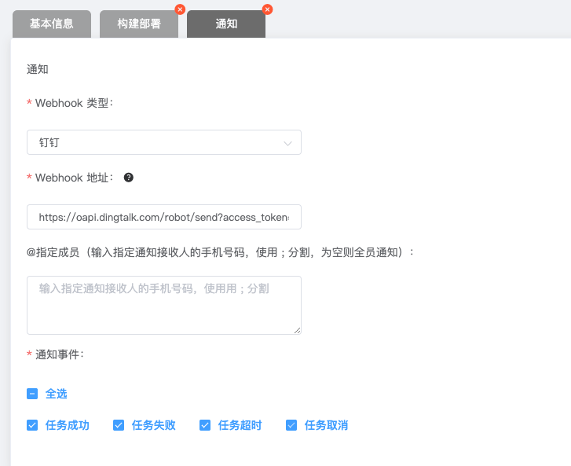

通知效果图示：

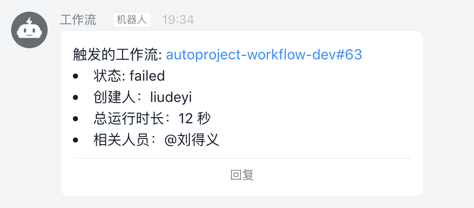

### 飞书
请参照[飞书配置](https://getfeishu.cn/hc/zh-cn/articles/360024984973)获取详细信息。

若为某个群组添加 Bot ，可以选择要添加 Bot 的飞书聊天组，点击配置按钮，选择添加机器人。

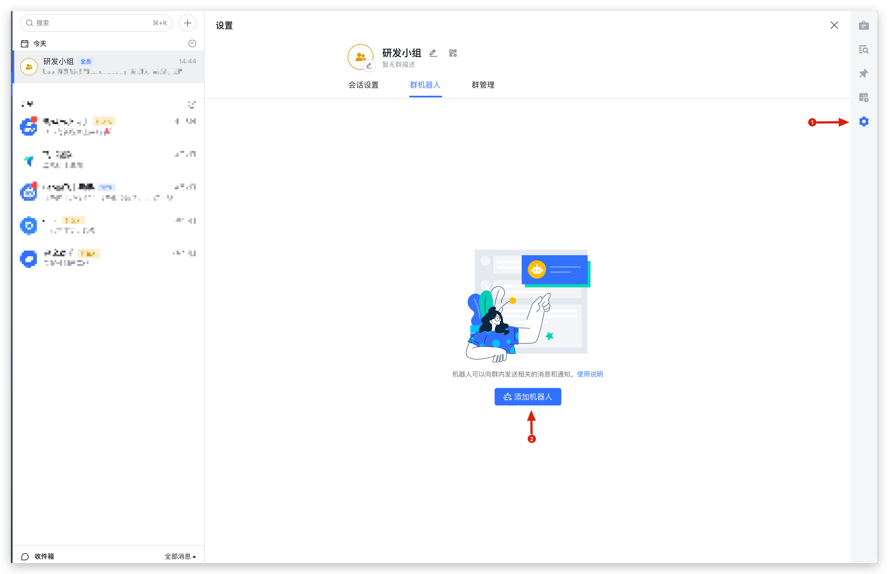

点击下一步，选择添加自定义机器人


填写机器人描述

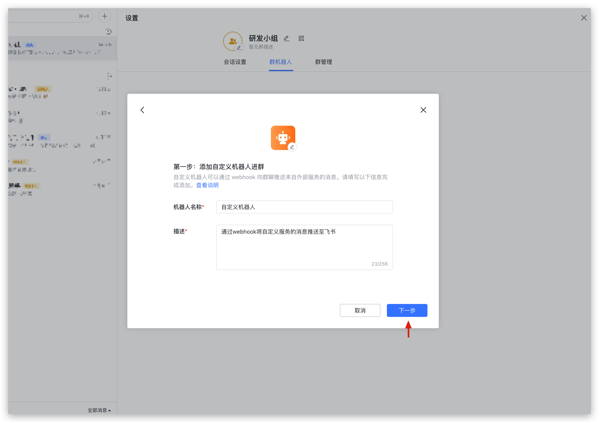


复制 Webhook 地址

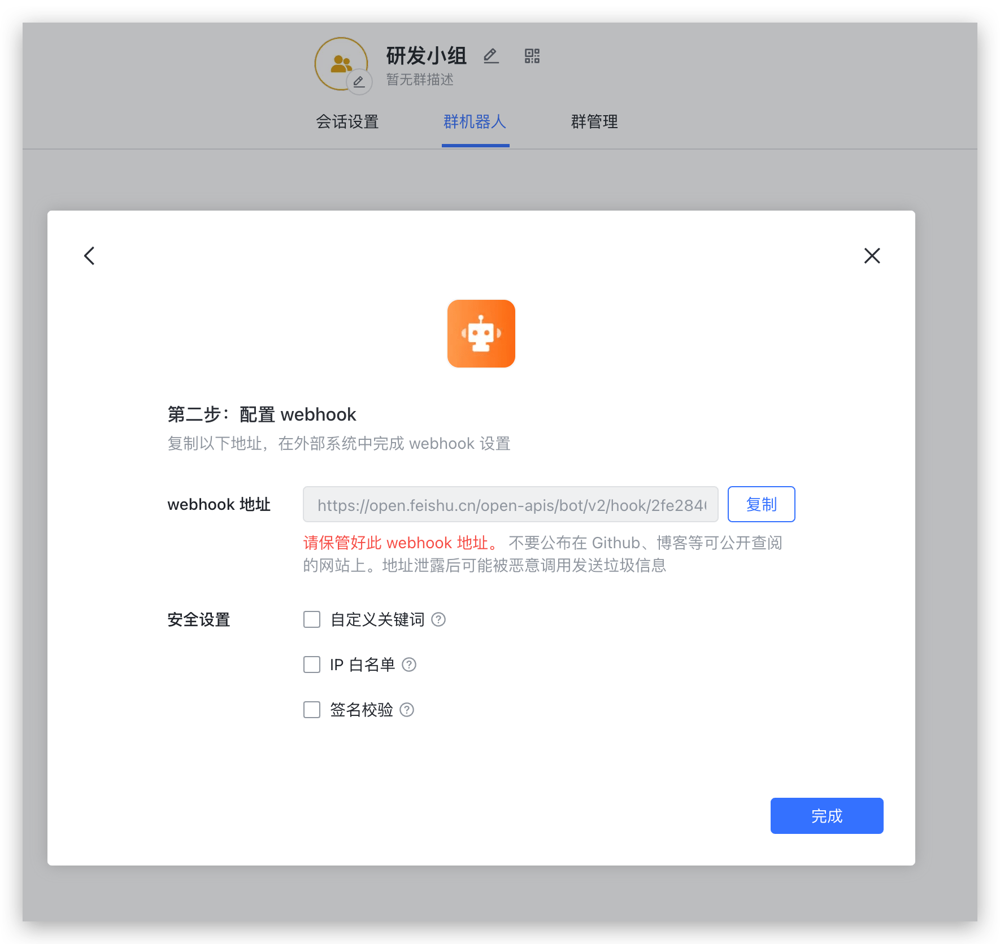

将复制的 Webhook 地址回填到工作流配置页面

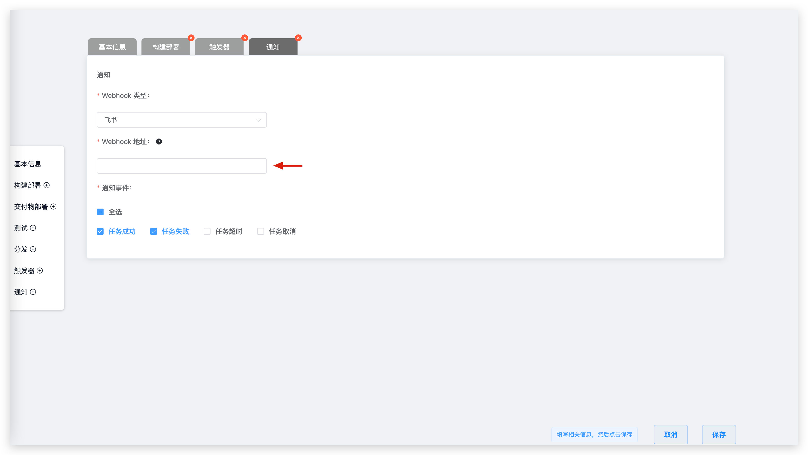

通知效果图示：


## 运行工作流

工作流支持多种构建方式，用户可以根据需求灵活配置。工作流模块支持通过自动构建（定时器/ Webhook）的方式实现对代码进行持续集成和持续部署，进行快速验证和快速反馈，保证代码的质量。
具体操作可以参阅[工作流的触发](/v1.7.1/workflow/trigger/)部分获取更多的信息。
