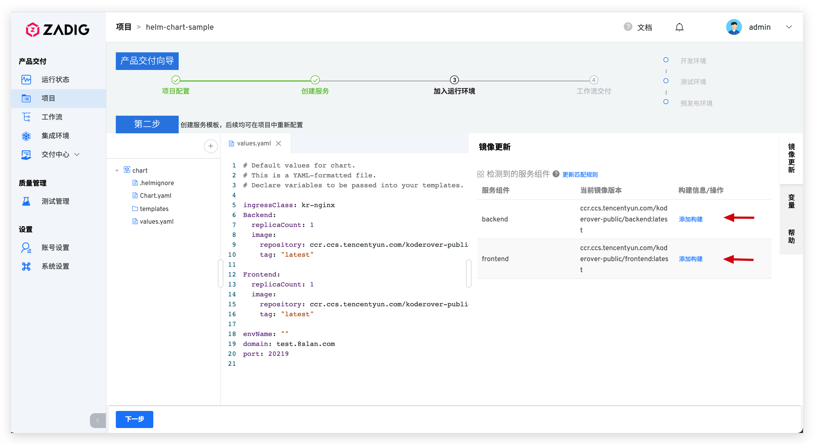

## 新建项目

进入 Zadig 系统，点击「项目」-「新建项目」，基于`Kubernetes`、`新建集成环境`、`Helm Chart 部署`的特点组合，点击「立即创建」，完成项目创建。

## 服务配置

点击`下一步`，创建服务并为服务配置构建。

- 选择从代码仓库导入 Helm Chart 相关配置，本例中使用 [koderover/zadig](https://github.com/koderover/zadig) 仓库的 [microservice-demo](https://github.com/koderover/zadig/tree/main/examples/microservice-demo/chart) 案例。
> 更细节的信息可参考 [Helm Chart 服务](/v1.8.0/project/service/#helm-chart-服务)

::: tip 关于本案例源码的几点额外说明
1. 本例在实践时使用的是私有镜像仓库，需要配置 imagePullSecrets 来拉取镜像
2. 如果您用的也是私有镜像仓库，请在 Zadig 系统所在集群里创建相关 secret 并配置 [registrySecret](https://github.com/koderover/zadig/blob/bdd220192279aba1666bbdbd5da2dd35dcaff999/examples/microservice-demo/chart/values.yaml#L21)

    2.1 关于 imagePullSecrets 的配置可参考 [Create a Secret based on existing Docker credentials](https://kubernetes.io/docs/tasks/configure-pod-container/pull-image-private-registry/#registry-secret-existing-credentials)

3. 如果您使用的是公有镜像仓库，则无需配置相关 secret，删除源码中的以下内容：

    3.1 [secret.yaml](https://github.com/koderover/zadig/blob/bdd220192279aba1666bbdbd5da2dd35dcaff999/examples/microservice-demo/chart/templates/secret.yaml) 文件
    
    3.2 [values.yaml](https://github.com/koderover/zadig/blob/bdd220192279aba1666bbdbd5da2dd35dcaff999/examples/microservice-demo/chart/values.yaml) 文件中的 [registrySecret](https://github.com/koderover/zadig/blob/bdd220192279aba1666bbdbd5da2dd35dcaff999/examples/microservice-demo/chart/values.yaml#L21)
    
    3.3 `backend` 服务的 [imagePullSecrets](https://github.com/koderover/zadig/blob/bdd220192279aba1666bbdbd5da2dd35dcaff999/examples/microservice-demo/chart/templates/backend.yaml#L29) 配置
    
    3.4 `frontend` 服务的 [imagePullSecrets](https://github.com/koderover/zadig/blob/bdd220192279aba1666bbdbd5da2dd35dcaff999/examples/microservice-demo/chart/templates/frontend.yaml#L39) 配置
:::

- 导入完毕后，系统会自动解析 values 文件中定义的服务组件。

- 为 `backend` 服务配置构建：点击`添加构建`，为服务组件添加构建配置，填写构建所需基本信息和构建脚本后保存。

> 1. 添加构建所需应用，选择`go`
> 2. 选择代码仓库
> 3. 填写构建脚本

>  更细节的信息请参阅 [构建配置](/v1.8.0/project/build/)。

## 配置环境

服务配置完毕后点击`下一步`, 可对系统默认创建的环境进行配置调整。

点击`创建环境`，待环境创建完毕，点击`下一步`，进入到工作流交付环节。

## 工作流交付

- 执行 `helm-chart-sample-workflow-dev` 工作流，对 `dev` 环境的服务进行更新升级。

- 在工作流执行详情页面可实时跟踪构建日志，待工作流成功运行完毕，服务会被自动更新部署。

