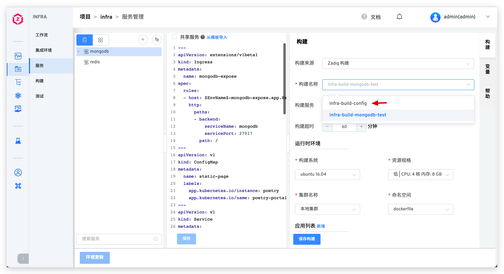
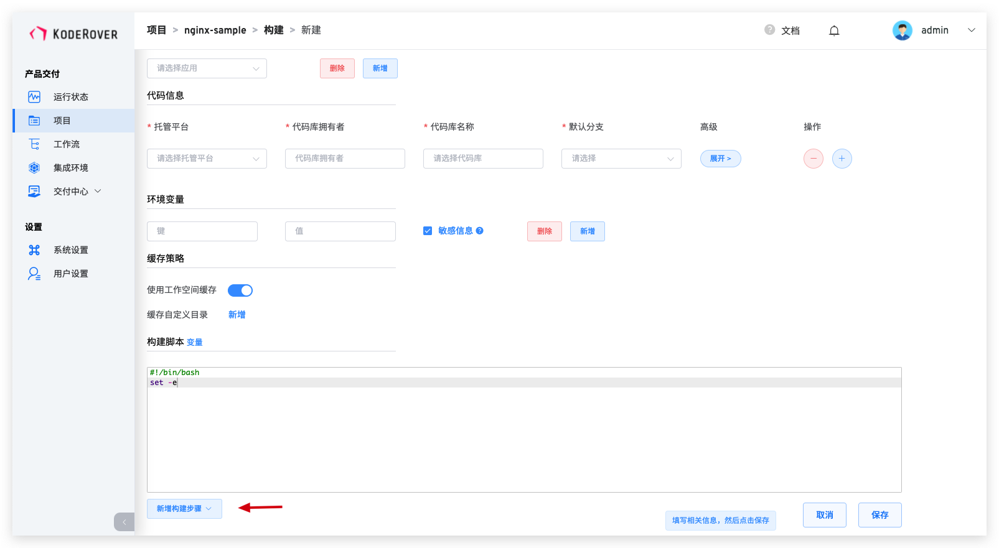
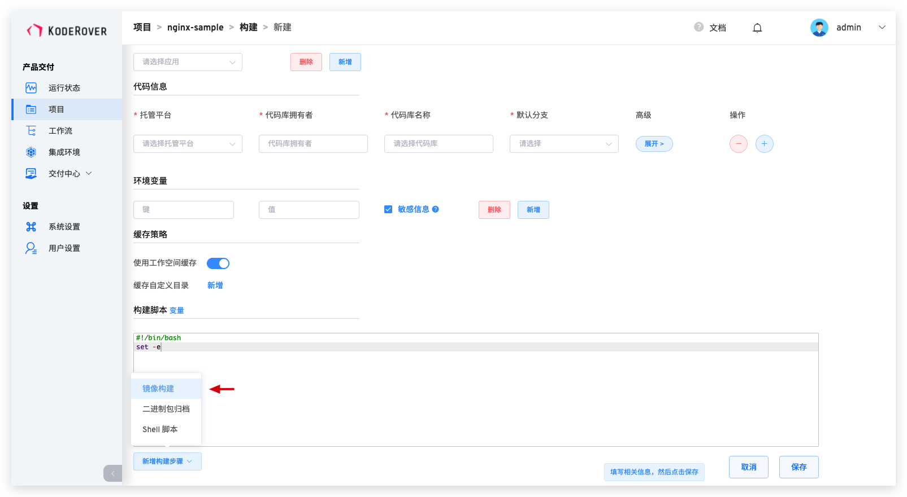
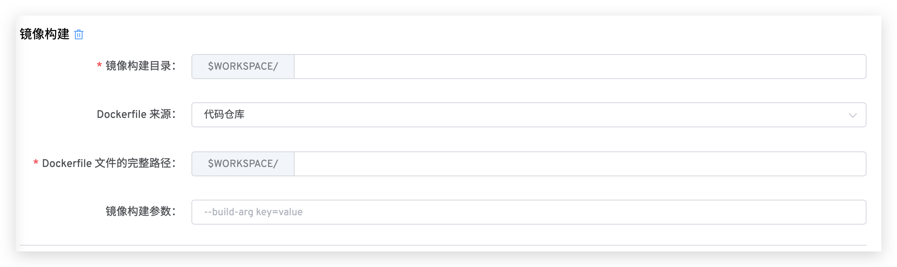

本文主要介绍 Zadig 的构建模块。Zadig 构建模块支持 Zadig 构建和其他第三方构建系统，比如 Jenkins 构建。

## 新建构建

在项目页面中点击`构建`进入构建的详情页面，可以选择 Zadig 构建或者 Jenkins 构建。

## Zadig 构建
::: tip 扩展知识
- 引用其他项目中的共享服务时，构建过程会使用该共享服务对应的构建脚本。
- 为服务配置构建时，可以新建，也可以按需选择复用已有的构建配置。

:::

Zadig 构建提供模版化构建能力，构建过程通过配置构建脚本实现，简单易用。整个构建模块分成通用配置、编译环境、应用、代码库信息、敏感信息、构建脚本、镜像构建、二进制包归档和 Shell 脚本。

### 准备工作

无论用何种工具构建一个服务，首先都要明确构建需要的依赖，依赖项包括：
- 服务编译的代码依赖（比如依赖 Base 库，开源库等）
- 服务编译的环境依赖（比如 Go 版本、Node 版本、编译工具等）
- 服务编译的系统依赖（比如操作系统等）

### 运行时环境

配置构建过程运行时的环境。

#### 构建系统

目前平台默认提供以下构建系统：
- Ubuntu 16.04
- Ubuntu 18.04
- Ubuntu 20.04

::: tip 扩展知识

平台提供的构建系统中都安装了以下工具/命令，可以在[应用安装脚本](/v1.8.0/settings/app/)和构建脚本中直接使用。

- build-essential
- cmake
- curl
- docker
- git
- libfontconfig
- libfreetype6-dev
- libpcre3-dev
- librrd-dev
- libsasl2-dev
- netcat-openbsd
- pkg-config
- python
- tar
- wget
:::

> 支持使用自定义镜像作为构建系统，详情请参阅[构建镜像管理](/v1.8.0/settings/custom-image/#步骤-1-生成构建镜像)

#### 资源规格
平台提供 高/中/低/最低 四种配置供选择，可以根据实际需要自定义规格。

#### 集群名称
用于选择构建任务运行时所使用的集群，其中`本地集群`指 Zadig 系统所在的集群。关于集群的集成可参考[集群管理](/v1.8.0/pages/cluster_manage/)。

#### 命名空间
用于选择构建任务运行时所使用的 K8s 命名空间。

### 应用列表

构建过程中需要用到的各类工具，比如不同版本的 Java、Go、Govendor、Node、Bower、Yarn、Phantomjs 等等。

::: tip
选择应用工具的过程中需要注意工具的依赖关系，顺序进行安装。例如：Govendor 依赖 Go，那么必须先选 Go，再选择 Govendor。 
平台已内置一些常见的应用，如果有其他应用或者版本需求，系统管理员可以在`系统设置`->`应用设置`中配置应用的安装脚本。
:::

### 代码库

参数说明：
- `托管平台`：代码库所在的平台，目前支持 GitHub、GitLab、Gerrit
- `代码库拥有者`：支持开源库，以及所配置的托管平台下的代码库拥有者
- `代码库名称`：代码库的名称
- `默认分支`：执行工作流时，默认选取的分支，与高级配置中的默认设置配合使用，可以限制每次编译的 Branch
- `Remote name`：指定远程仓库名称，默认 `origin`
- `克隆目录名`：定义代码库被克隆后的目录名称，默认为代码库的名称
- `子模块`：同步 `submodule` 中配置的代码库
- `默认设置`：开启后，创建工作任务时不提供参数化方式，使用工作流设置中的默认配置执行
- `主库` ：多个代码库构建时，如果该代码库设置为主库，构建产物（镜像、Tar 包等）会使用该库的对应信息命名

:::: tip 小贴士
- 指定`克隆目录名`为 A，则代码库的内容将会被克隆到 `$WORKSPACE/A` 中
- `$WORKSPACE` 是 Zadig 系统构建模块内置的变量，关于其更详细的描述可阅：[系统内置环境变量](/v1.6.0/project/build/#构建脚本)
::::

### 环境变量

平台支持用户在构建脚本中使用自定义环境变量，若构建脚本中存在敏感信息，可以设置勾选敏感信息来隐藏控制台 Console 输出。声明自定义环境变量后，工作流执行任务时可以修改变量值。

### 构建脚本

代码的构建过程可以在构建脚本中声明。

构建脚本除了可以使用自定义环境变量外，还可以使用系统内置变量，包括以下变量：

|变量名称|描述|
|-------|---|
|`WORKSPACE`|当前工作流工作目录|
|`TASK_ID`|当前工作流任务的 ID，即任务序号|
|`IMAGE`|输出镜像名称，用于容器服务的部署更新|
|`SERVICE`|编译的服务名称|
|`PKG_FILE`|交付物文件名称|
|`ENV_NAME`|环境名称|
|`BUILD_URL`|构建任务的 URL|
|`CI`|值恒等于 true，可视需要使用，比如用于判断是 CI 脚本，还是其他脚本|
|`ZADIG`|值恒等于 true，可视需要使用，比如用于判断是否在 Zadig 系统中执行|
|`<REPONAME>_PR`|构建过程中指定代码仓库使用的 Pull Request 信息|
|`<REPONAME>_BRANCH`|构建过程中指定代码仓库使用的分支信息|
|`<REPONAME>_TAG`|构建过程中指定代码仓库使用的 Tag 信息|
|`<REPONAME>_COMMIT_ID`|构建过程中指定代码仓库使用的 Commit ID 信息|

::: tip 小贴士
1. 如果 REPONAME 包含中划线 “-“，将 “-” 替换成 “_” 即可正常获取变量 `<REPONAME>_PR`、`<REPONAME>_BRANCH`、`<REPONAME>_TAG`、`<REPONAME>_COMMIT_ID` 。

2. 系统有内置的规则生成 `IMAGE` 和 `PKG_FILE`，关于规则的查看和修改，请参考：[构建交付物生成规则](/v1.8.0/project/build/#构建交付物生成规则)。

:::

### 镜像构建

> 平台默认支持通过 Dockerfile 参数化构建镜像，构建完成后会将镜像推送至镜像仓库。

点击新增构建步骤，并选择镜像构建。

相关参数说明：

- `镜像构建目录:` 执行 Docker build 所在的目录。
- `Dockerfile 来源:` 包括`代码库`和`模板库`，模板库功能可参考 [Dockerfile 模板管理](/v1.8.0/template/dockerfile/)
- `Dockerfile 文件的完整路径:` Dockerfile 来源于代码库时，指定执行 Docker build 用到的 Dockerfile 路径。
- `选择模板:` Dockerfile 来源于模板库时，选择具体的 Dockerfile 模板。
- `镜像编译参数:` 支持 Docker build 的所有参数，比如：`--build-arg key1=value1 --build-arg key2=value2`。

## Jenkins 构建
> 直接使用 Jenkins Job 执行后的镜像产物，用于部署更新 Zadig 中的服务。
::: tip
使用 Jenkins 构建前必须先集成 Jenkins 服务器，详见 [Jenkins 集成](/v1.8.0/settings/jenkins)
:::

相关参数说明：
- `Jenkins Job`：Jenkins Server 中现有的 Jenkins Job。
- `构建参数`：所选 Jenkins Job 中配置的 Build Parameters，其中必须包含 `IMAGE` 变量，作为构建镜像名称，Jenkins 执行构建成功后，Zadig 部署会使用该镜像更新服务。

## 构建交付物生成规则
> 此处特指在 Zadig 系统执行构建并产出交付物。

- 点击修改项目进入到项目的高级配置中，可查看该项目中生成交付物的命名规则，并按需对默认规则进行修改。

::: tip 小贴士
- `自定义镜像`对应[构建脚本](/v1.8.0/project/build/#构建脚本)中的 `IMAGE` 变量
- `自定义 TAR 包`对应[构建脚本](/v1.8.0/project/build/#构建脚本)中的 `PKG_FILE` 变量
:::

- Zadig 系统支持通过以下变量和常量组合的方式生成交付物名称：

|变量名称|描述|
|-------|---|
|`TIMESTAMP`|工作流任务的执行时间戳，形如 `20211029113304`|
|`TASK_ID`|工作流任务的 ID|
|`REPO_BRANCH`|构建过程中指定代码仓库使用的分支信息|
|`REPO_PR`|构建过程中指定代码仓库使用的 Pull Request 信息|
|`REPO_TAG`|构建过程中指定代码仓库使用的 Tag 信息|
|`REPO_COMMIT_ID`|构建过程中指定代码仓库使用的 Commit ID 信息|
|`PROJECT`|构建所属的 Zadig 项目名称|
|`SERVICE`|构建编译的服务名称|
|`ENV_NAME`|构建部署的环境名称|
|`字符常量`|大小写字母、数字、中划线、下划线及点组合生成的 127 个字符以内的常量|
