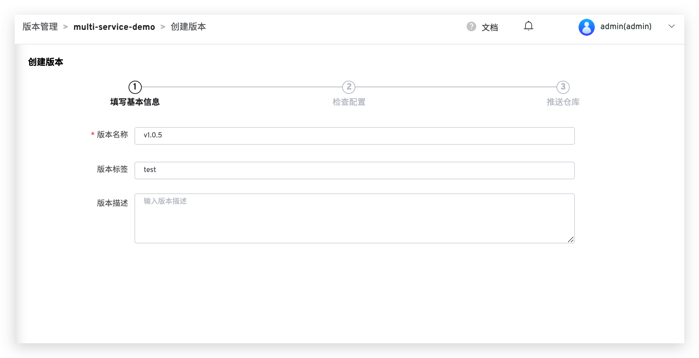
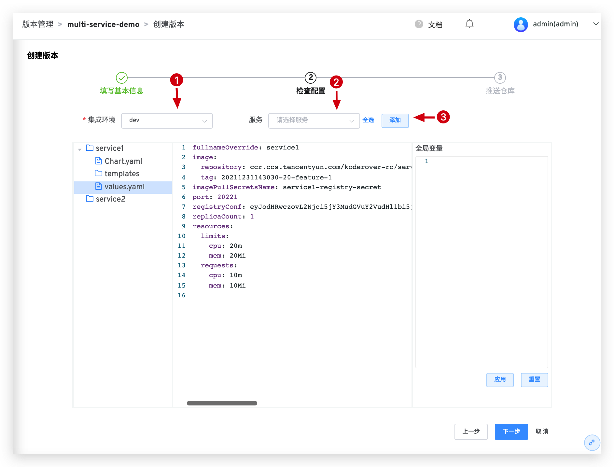
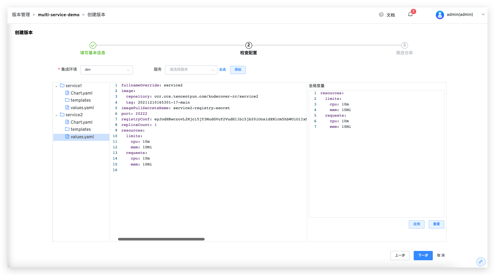
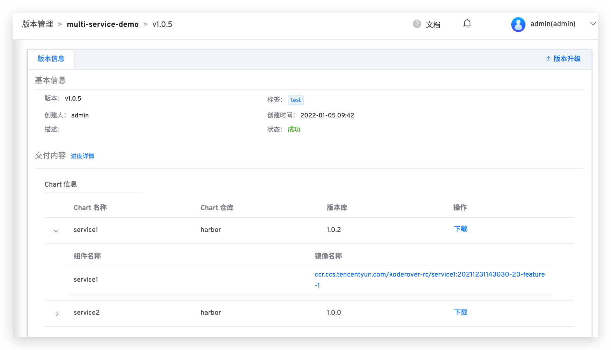

本文主要介绍在 Zadig 上如何进行版本管理。

## K8s YAML 部署项目
### 版本交付

执行交付物部署工作流才可进行版本交付，选择服务镜像添加版本信息，具体配置如下图所示：


点击启动任务，系统收集交付信息，任务详情内可查看版本信息：


点击一级菜单`交付中心` -> `版本管理` -> `选择项目`，查看项目版本列表，点击可以直接查看具体交付信息，本次工作流的所有详细信息都收集在此，包括镜像信息、包信息、服务的启动顺序等等，具体如下图所示：


可执行版本发布，用现在的版本镜像更新选择的环境：


### 版本回溯

您还可以通过交付中心的基础镜像恢复某一个时间点的环境。

- 进入项目集成环境，点击创建环境，选择某一个交付版本点击确定即可全量回溯版本到当时的环境，如下图所示：


## Helm Chart 部署项目
### 版本交付
- 进入 `交付中心` -> `版本管理`，选择对应的项目，点击`创建版本`。


- 进入创建版本流程，第一步填写基本信息。



- 第二步选择环境和服务，并且对所选服务配置做少量修改，以满足线上生产环境服务配置需求。



如果需要统一修改所有服务 values 文件中的变量值可以使用`全局变量`。如下图所示，填写全局变量，点击`应用`，所有服务 values 文件中的对应变量值统一被修改成`全局变量`中设置的变量值。



- 第三步选择交付物推送的仓库。


> Helm 仓库需事先集成，具体配置参考 [Helm 仓库](/v1.8.0/settings/helm/)

- 点击完成后，所选的服务配置（Chart）和镜像将被推送到对应仓库。

### Hook 外部系统

成功创建版本后，Zadig 支持自动 Hook 外部系统，外部系统接收请求后，可以结合自身情况自定义一些操作。具体配置方式如下：

1. 集成外部系统，具体集成方式参见[其他外部系统集成](/v1.8.0/settings/others/)
2. 在项目配置中开启`版本交付 hook 配置`，具体配置方式参见[版本交付 hook 配置](/v1.8.0/project/config/#高级配置)

完成配置后，在`版本管理`中创建版本，成功推送镜像和 Chart 后自动 Hook 外部系统。具体 Payload 信息如下：

```json
{
  "project_name": "helm-test",
  "version": "v1.1",
  "status": "success",
  "error": "",
  "start_time": "1640249525",
  "end_time": "1640249825",
  "charts": [
    {
      "chart_name": "gss-1",
      "chart_version": "1.1",
      "chart_url": "https://technosophos.github.io/tscharts/gss-1-1.1.tgz",
      "images": [    
        {
          "service_module": "go-sample-site",
          "image": "ccr.ccs.tencentyun.com/trial/go-sample-site:20211215150832-27-main"
        },
        {
          "service_module": "go-sample-site-2",
          "image": "ccr.ccs.tencentyun.com/trial/go-sample-site:20211215150832-27-main"
        }
      ]
    },
    {
      "chart_name": "gss-2",
      "chart_version": "1.2",
      "chart_url": "https://technosophos.github.io/tscharts/gss-1-1.2.tgz",
      "images": [
        {
          "service_module": "go-sample-site",
          "image": "ccr.ccs.tencentyun.com/trial/go-sample-site:20211215150832-27-main"
        },
        {
          "service_module": "go-sample-site-2",
          "image": "ccr.ccs.tencentyun.com/trial/go-sample-site:20211215150832-27-main"
        }
      ]
    }
  ]
}
```

**返回说明**
|参数名|类型|描述|
|---|---|---|
|`project_name`|string|项目名称|
|`version`|string|交付版本号|
|`status`|string|任务状态|
|`start_time`|string|Unix 时间戳格式的版本创建时间|
|`end_time`|string|Unix 时间戳格式的版本创建完成时间|
|`charts`|[][charts](#charts)|Chart 信息|

<h5 id="charts">Chart 参数说明</h5>

|参数名|类型|描述|
|---|---|---|
|`chart_name`|string|Chart 名称|
|`chart_version`|string|Chart 版本号|
|`chart_url`|string|Chart 下载链接|
|`images`|[][Image](#image)|镜像信息|

<h5 id="image">images 参数说明</h5>

|参数名|类型|描述|
|---|---|---|
|`service_module`|string|服务组件名称|
|`image`|string|镜像名称|


### 查看版本详情

- 进入 `交付中心` -> `版本管理`，选择对应的项目、点击版本，可查看版本详情，版本所有详细信息包括 Chart 信息、镜像信息等等，如下图所示。



