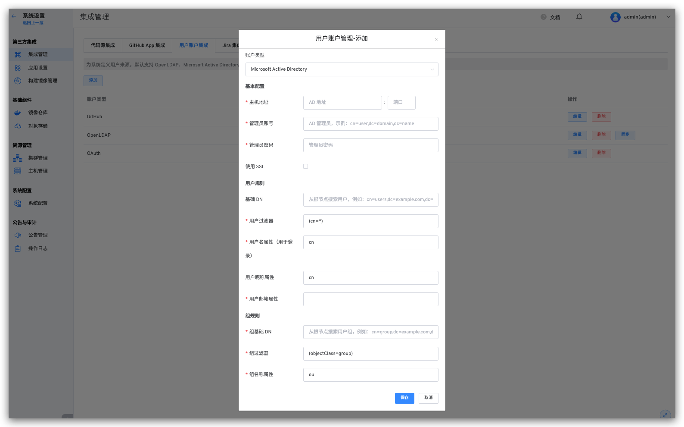
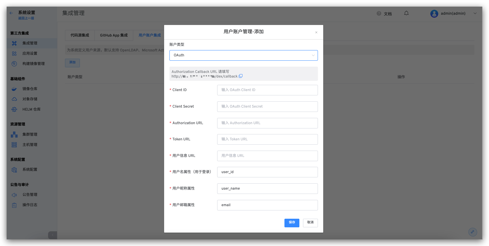
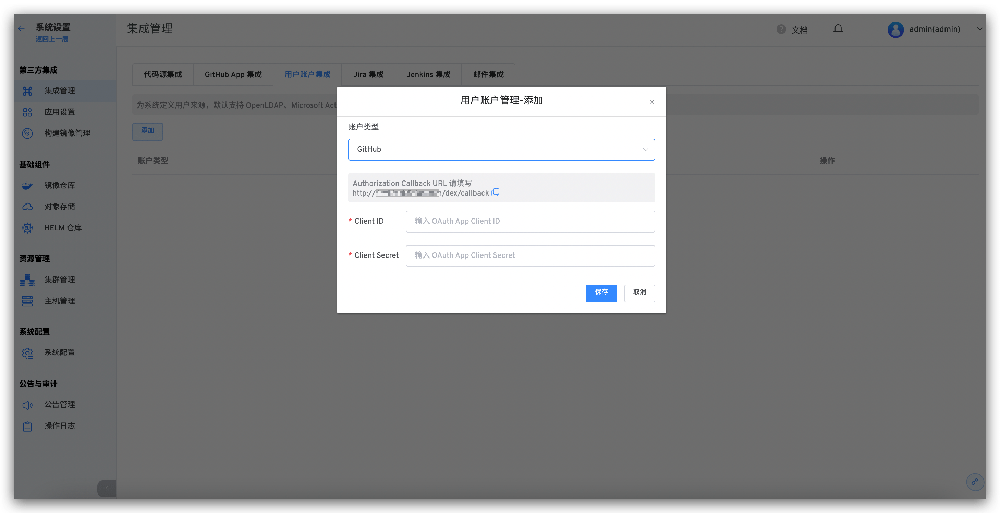

## LDAP

::: tip LDAP
LDAP（Lightweight Directory Access Protocol - 轻量目录访问协议）是一个 Web 应用程序的网络协议，可以从 LDAP 服务上访问和查找用户和用户组信息。
:::
你可以集成 LDAP 目录服务器到 Zadig 上，Zadig 通过授权连接 LDAP 目录服务器，实现用户和用户组的同步。

我们能够支持主流的 LDAP 目录服务器：
- Microsoft Active Directory
- OpenLDAP

1. 管理员依次进入 `系统设置` -> `集成管理` -> `用户账户集成`，进入用户集成页面。
2. 点击添加按钮，选择一个账户类型：
    - Microsoft Active Directory
    - OpenLDAP
3. 根据参数配置，输入需要配置的参数
4. 保存设置

**参数说明：**
| 参数名             | 描述 |
|-------------------|----------|
| 账户类型           | 选择你将要连接的 LDAP 目录服务器类型。  |
| 主机地址            | 目录服务器的主机名。例如：  ad.example.com  ldap.example.com  opends.example.com  |
| 端口               | 你目录服务器正在监听的端口。例如：   389  10389   636（针对 SSL） |
| 管理员账号            | 注意区分该用户名和 Zadig 用户名，该用户名被用来连接目录服务器。例如：  cn=administrator,cn=users,dc=ad,dc=example,dc=com   cn=user,dc=domain,dc=name   user@domain.name |
| 管理员密码               | 上述指定连接目录服务器用户的密码。 |
| 使用 SSL           | 如果目录服务器使用了 SSL（Secure Sockets Layer），则需要勾选这个选项。  备注：如果希望使用这个选项，你需要配置 SSL 证书。  |
|**用户规则**||
| 基础 DN | 根专有名称（DN）将会在你在目录服务器上运行查询的时候使用到。例如：  o=example,c=com   cn=users,dc=ad,dc=example,dc=com  针对 Microsoft Active Directory，使用下面的格式来指定基本 DN：  dc=domain1,dc=local   可以根据实际的需求配置来修改 domain1 和 local。  与此同时 Microsoft Server 提供了一个名为 ldp.exe 工具，管理员可以使用该工具在 LDAP 服务器上进行查找和配置。 |
| 用户过滤器         | 用户过滤器，关于 LDAP Filter 请参考 https://ldap.com/ldap-filters/  |
| 用户名属性（用于登录）|用于登录的用户名称属性|
| 用户昵称属性|用户昵称属性，选填|
| 用户邮箱属性|用户邮箱属性|
|**组规则**||
| 组基础 DN | 根专有名称（DN）将会在你在目录服务器上运行查询的时候使用到。 |
| 组过滤器   | 组过滤器，关于 LDAP Filter 请参考  https://ldap.com/ldap-filters/  |  
| 组名称属性 | 组名称属性 |

## OAuth 2.0

Zadig 支持用户通过 OAuth 2.0 账号授权进行登录。 点击`系统设置` -> `集成管理` -> `账户账号集成`-> 点击添加 -> 选择 `OAuth`。

**参数说明：**
| 参数名                 | 描述                            |
|------------------------|---------------------------------|
| Client ID              | OAuth Client ID                 |
| Client Secret          | OAuth Client Secret             |
| Authorization URL      | 获取 Authorization Code 的地址 |
| Token URL              | 获取 Access Token 的地址        |
| 用户信息 URL            | 获取用户信息的地址              |
| 用户名属性（用于登录）     | 用于登录的用户名称属性          |
| 用户昵称属性             | 用户昵称属性，选填              |
| 用户邮箱属性             | 用户邮箱属性                    |

## GitHub

### 步骤 1：创建 GitHub OAuth 应用

前往 [GitHub](https://github.com/settings/applications/new) 注册一个新的 GitHub OAuth application。

在新建应用程序页面，你需要进行如下步骤：

1. Application name：zadig，也可以填写可识别的任一名称。
2. Homepage URL：http://[zadig.yours.com]
3. Authorization CallBack URL： `http://[zadig.yours.com]/dex/callback`
4. 点击创建

### 步骤 2：获取 Client ID、Client Secret 信息

应用创建成功后，GitHub 会返回应用的基本信息，点击 `Generate a new client secret` 生成 `Client Secret`。

此时页面包括完整的 `Client ID` 、`Client Secret`。

### 步骤 3：集成 GitHub OAuth

点击`系统设置` -> `集成管理` -> `账户账号集成`-> 点击添加 -> 选择 `GitHub`。

**参数说明：**
- `Client ID`: 步骤 2 中获得的 Client ID。
- `Client Secret`: 步骤2 中获得的 Client Secret。
