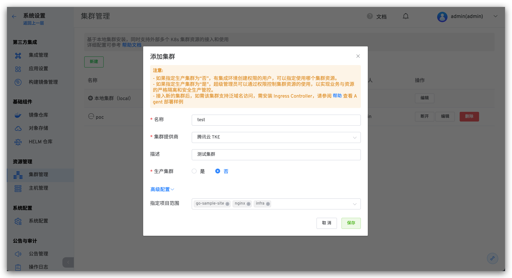
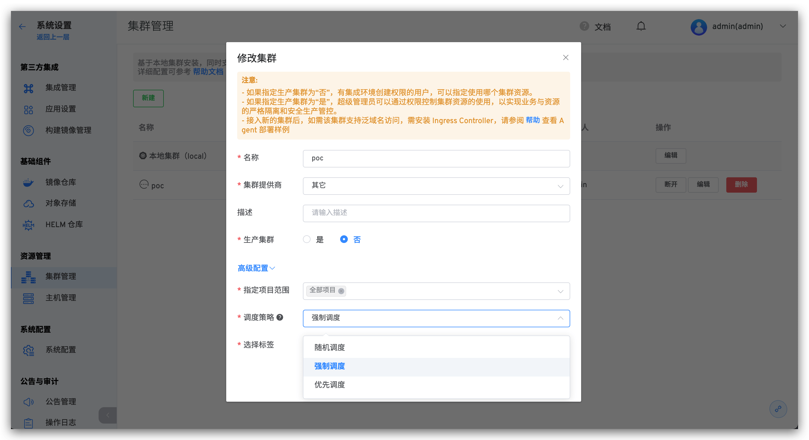

本文介绍如何在 Zadig系统上进行多集群管理。Zadig 基于本地集群安装，同时支持外部多个 K8s 集群资源的接入和使用。其中，测试集群一般用于自测、开发、测试用途，生产集群一般用于预发布和生产发布用途。

## 添加集群

:::warning
需要保证添加的集群可以访问到 Zadig 所在的集群
:::

第 1 步：点击 `系统设置` -> `集群管理` -> `新建`：

参数说明：

- `名称`：集群名称只支持小写字母、数字和中划线。
- `集群提供商`：该集群的提供商信息。
- `描述`： 该集群的用途描述信息。
- `生产集群`：
  - 如果指定生产集群为「否」，有集成环境创建权限的用户，可以指定使用哪个集群资源。
  - 如果指定生产集群为「是」，超级管理员可以通过权限控制集群资源的使用，以实现业务与资源的严格隔离和安全生产管控。
- `指定项目范围`：指定该集群可被哪些项目使用。

第 2 步：执行 Agent 安装脚本，如图所示：

第 3 步：执行脚本完成部署，刷新查看集群状态。

## 设置调度策略
点击`编辑`，可设置该集群资源的调度策略。以执行工作流任务为例对不同的策略说明如下：

- `随机调度`：不需要指定标签，工作流任务将被随机调度在集群的任意节点上执行。
- `强制调度`：需要指定标签，工作流任务将被调度到符合标签的节点上执行。
- `优先调度`：需要指定标签，工作流任务将被优先调度到符合标签的节点上执行，若节点资源无法满足调度需求，则该任务会被分配给其他节点。

## 集群使用

外部集群接入 Zadig 系统后，使用 Zadig 系统可以在该集群上创建新环境，并可以使用工作流对新环境进行更新操作。

- `测试集群`：[创建集成环境](/v1.8.0/project/env/)
- `类生产（生产）集群`：[发布管理 -> 生产环境](/v1.8.0/project/env/) 「类生产（生产）集群，安全级别较高，可以单独控制权限」。
