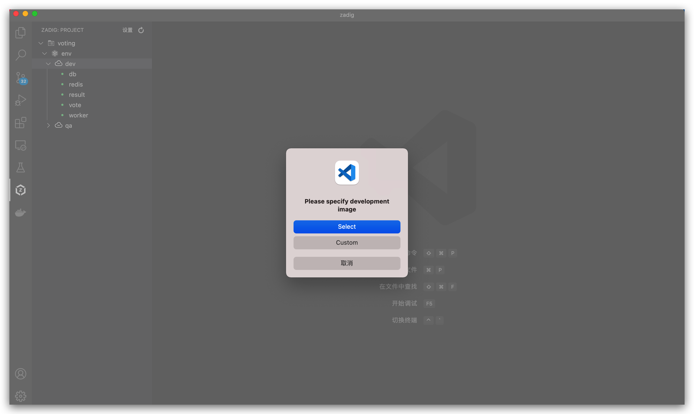
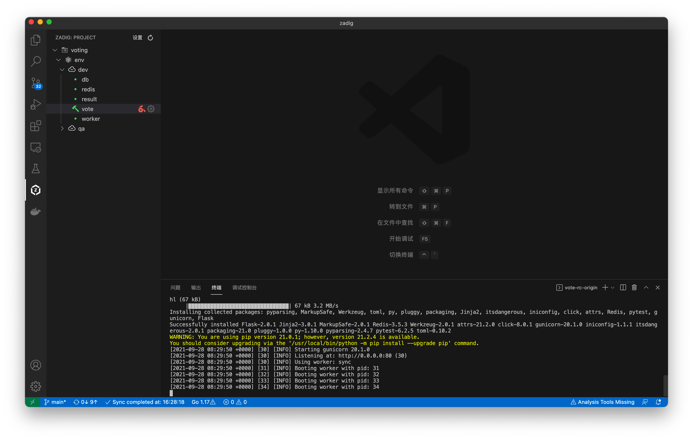
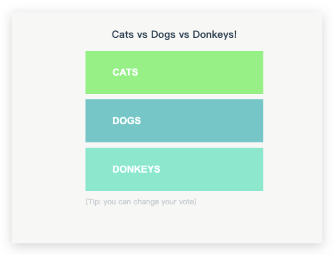
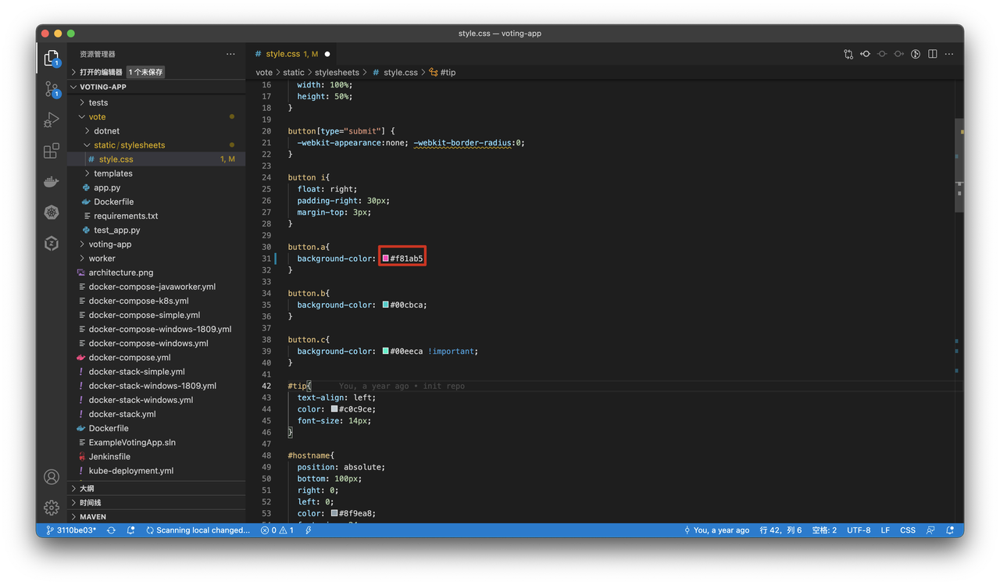
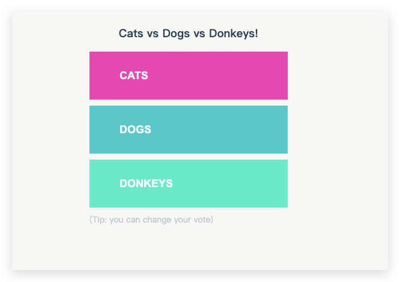
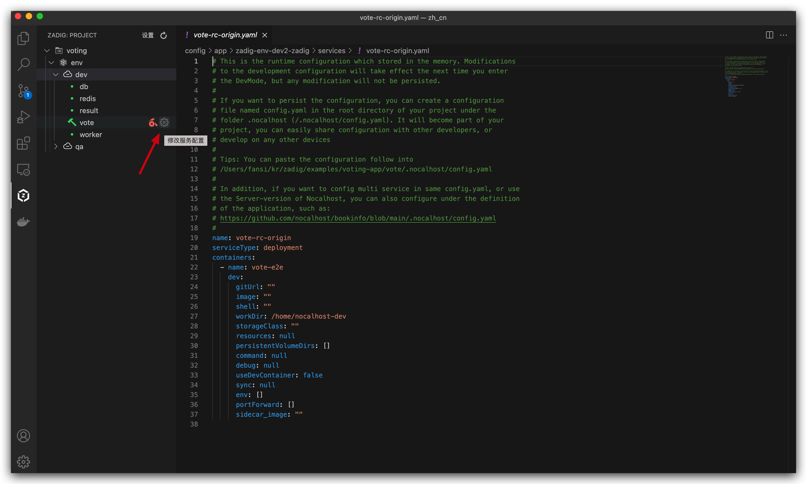
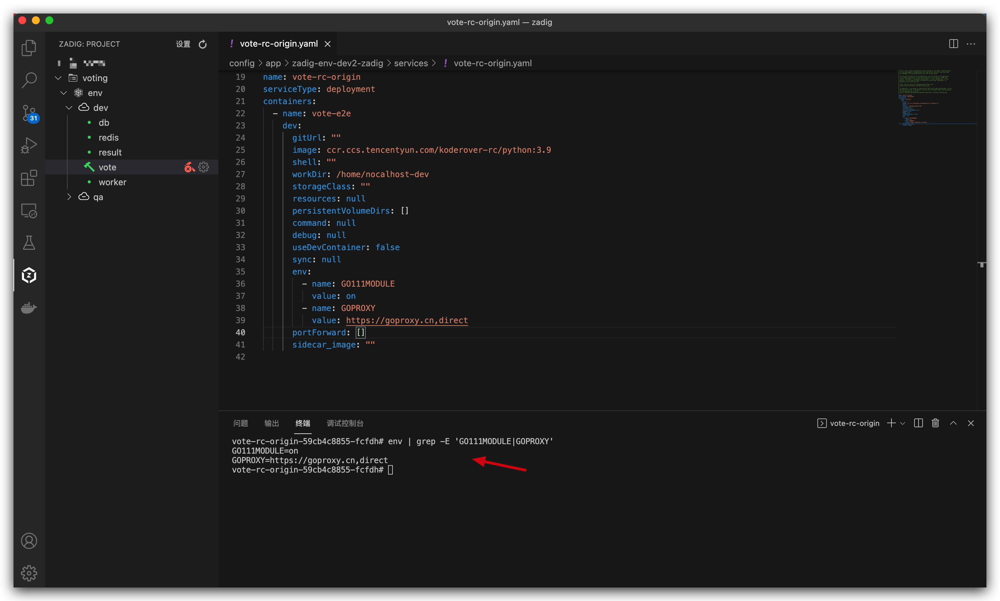

Zadig Toolkit 是 KodeRover 旗下开源产品 Zadig 的 Visual Studio Code 插件。
该插件让开发者无需关注平台切换的繁琐，在 IDE 中即可获得 Zadig 产品核心能力，轻松地对 Zadig 项目中的 Kubernetes 集成环境进行查看、做服务调试和升级、重启及日志实时查看等。
在日常开发代码过程，代码修改后无需提交到 Git 仓库，也无需打包镜像，即可将服务热部署到 Zadig 云端，方便开发者做服务自测、联调和集成验证。
目前 Zadig Toolkit 支持的功能如下：
- Zadig 集成环境查看
- 微服务重启、服务详情查看、服务镜像更换、Pod 实时日志查看
- 远程开发容器配置，远程调试本地应用程序

## 准备工作
- 系统准备：安装 Zadig（ [v1.4.0](/v1.8.0/release-notes/v1.4.0/#版本升级方式) ~ [v1.6.0](/v1.8.0/release-notes/v1.6.0/#版本升级方式) 均可）
- 项目准备：参考[如何使用 GitHub + Zadig 实现产品级持续交付](https://www.koderover.com/tutorials/codelabs/GitHub/index.html?index=..%2F..index#0)

## 安装插件
- 打开 Visual Studio Code 并进入应用市场。
- 在应用市场中搜索 “Zadig Toolkit”，查看详情并安装。


## 配置插件
1. 打开已安装的 Zadig Toolkit 插件。
2. 点击“设置”进入插件配置页。


**配置参数说明：**
1. Zadig 部署地址：请根据实际协议，填写完整的 URI，例如：http://zadig.com。
2. Zadig API Token：进入 Zadig 系统，点击“用户设置”，如下图所示。


配置完成后，可在左侧栏看到 Zadig 系统中的项目。


## 如何使用
### 远程调试本地代码

::: warning
如果 Zadig 是[基于 Helm 命令安装](/v1.8.0/install/helm-deploy/)，需配置 [`kubernetes.server` 参数](/v1.8.0/install/helm-deploy/#其他参数)，以下功能才可正常使用。
:::

下面以准备好的 voting 项目为例，介绍如何通过 Zadig Toolkit 进行远程调试。
- 选择 `vote` 服务，点击调试按钮进入开发模式。


- 选择本地开发代码目录。


- 选择开发环境使用的基础镜像。




- 进入开发容器，代码自动同步到开发容器中。


- 进入 `examples/voting-app/vote` 目录，执行启动命令。
```bash
pip install -r requirements.txt -i https://mirrors.aliyun.com/pypi/simple/
gunicorn app:app -b 0.0.0.0:80 --log-file - --access-logfile - --workers 4 --keep-alive 0
```


- 访问 Zadig 系统中 `voting` 项目的 `vote` 服务地址，查看结果。



- 修改本地代码并保存。



- 代码自动同步到远端开发环境，再次执行启动命令，修改结果如下图所示。



- 点击红色按钮结束开发模式，容器恢复正常。


至此一个完整的本地调试流程演示完毕。

### 查看集成环境和服务
日常联调测试过程中，需要对服务进行诊断，通过 Zadig Toolkit 可以查看服务的状态，重启服务，更换服务镜像，查看服务的实时日志等。
- 右键点击服务，点击「服务详情」按钮，可以查看服务的基本信息，点击镜像右侧的铅笔图标可修改镜像，点击「实时日志」可查看日志。
- 右键点击服务，点击「重启服务」可以对服务进行重启。


### 配置远程开发环境
通过 Zadig Toolkit 插件亦可对远程开发环境进行配置。
- 点击`vote`服务右侧的 </img> 图标。


- 替换`vote-rc-origin.yaml`内容，修改`env`环境变量。

```
name: vote-rc-origin
serviceType: deployment
containers:
  - name: vote-e2e
    dev:
      gitUrl: ""
      image: ""
      shell: ""
      workDir: /home/nocalhost-dev
      storageClass: ""
      resources: null
      persistentVolumeDirs: []
      command: null
      debug: null
      useDevContainer: false
      sync: null
      env:
        - name: GO111MODULE
          value: "on"
        - name: GOPROXY
          value: https://goproxy.cn,direct
      portForward: []
      sidecar_image: ""
```
- 重新进入开发模式，执行 `env | grep -E 'GO111MODULE|GOPROXY'` 命令查看环境变量的值，可发现配置生效。



- 配置设置后，即可基于新的环境配置对本地代码进行远程调试。
