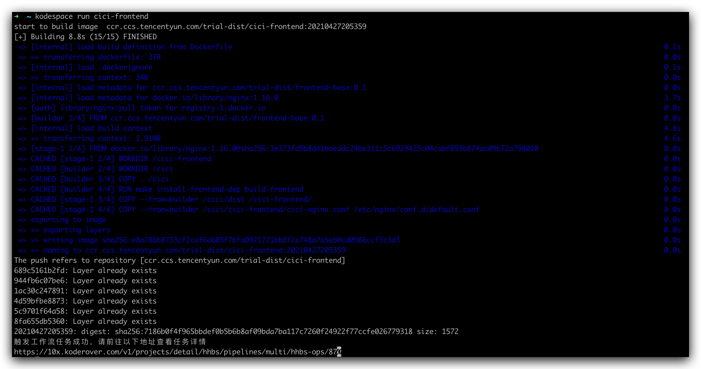

本文主要介绍如何使用 KodeSpace CLI 构建本地代码，部署到云上环境的能力。

## 初始化配置

* 完成安装后，需要进行简单的初始化配置，执行以下命令，进入交互式配置页面。

```bash
kodespace config set-context [configName]
```
其中，`configName` 为自定义配置名称，默认值为 default。

* 终端提示输入站点地址时，输入您使用的 Zadig 系统域名并 Enter。

* 终端提示输入 API Token 时，在 Zadig 系统的用户设置中，复制 Token，粘贴并 Enter。


* 选择您需要使用的交付物部署工作流


* 完成以上配置后，自动生成配置文件 `$HOME/.kodespace/kodespace.yaml`，并自动生成基本内容，接下来需要您手动修改配置中的`dockerfile_path`和`docker_build_path` 两个字段的信息，需填写绝对路径。


## 执行构建部署

完成配置后，执行以下命令，进行构建部署本地代码。

```bash
kodespace run [service1 service2...]
```
其中 `service1 service2...` 是你需要执行构建部署任务的服务，以空格分隔多个服务。

执行结果如下图所示，执行成功后可以在 Zadig 集成环境中对服务进行调试。



::: warning
- 目前仅支持配置中「指定环境」并且包含「交付物部署」步骤的工作流。
- 确保本地 docker 正在运行。
:::

