Zadig 的服务可以是一组 Kubernetes 资源集合（下面简称 K8s YAML）、一个完整的 Helm Chart 或者是主机服务。下面分别介绍这几种类型的服务操作。

## K8s YAML 服务

### 新增服务

项目中点击服务部分，进入服务管理页面。

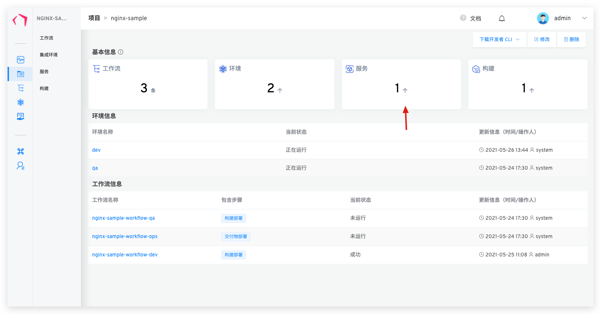

K8s YAML 服务的创建支持平台管理、代码仓库导入以及从 K8s YAML 模板导入三种方式：
- `平台管理`：在创建服务时手动输入服务的 K8s YAML 配置文件，内容存储在 Zadig 系统中。
- `仓库导入`：服务的相关 K8s YAML 配置文件托管在代码仓库中，可通过在 Zadig 平台配置好 YAML 文件的目录路径后导入该部分配置。支持两种方式来从代码仓库中同步服务的 K8s YAML 配置文件：
  - 手动同步：点击`加载`按钮，获取仓库中最新的配置。
  - 自动同步：通过配置 Webhook（参阅 [Webhook 配置](/v1.9.0/settings/webhook-config/)），Zadig 监听分支上有代码改动，对应的服务配置会被自动同步。
- 从 K8s YAML 模板导入：事先在平台中创建 K8s YAML 模板，创建服务时，在模板的基础上对服务进行重新定义。

#### 平台管理

* 点击新建按钮新建服务。

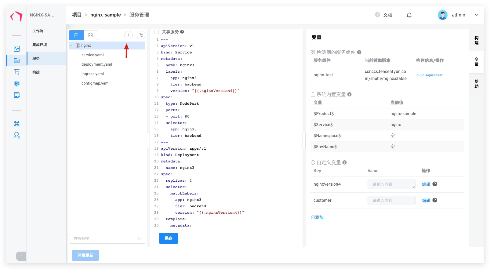

* 输入新的服务名称。


* 将服务 YAML 填入编辑器并保存。


* 更新环境，该服务会自动加入到选择的环境中。


#### 仓库导入

* 选择仓库导入，选择代码仓库
* 选择服务配置所在文件目录，加载服务

#### 从模板导入

::: tip 前提
需要先在系统模板库里创建 K8s YAML 模板，请参考 [K8s YAML 模板管理](/v1.9.0/template/k8s_yaml/)
:::

- 访问使用 K8s YAML 部署的项目的服务模块，点击`+`按钮新建服务，输入服务名称后，点击`从模板导入`。

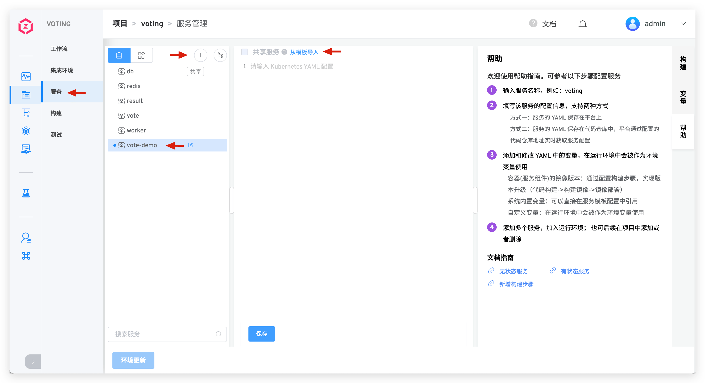

- 选择具体的 K8s YAML 模板后，可修改模板中预定义的变量值。点击`确定`后即可基于模板和新的赋值创建服务成功。

::: tip  解锁模板中变量的更多使用姿势
1. 在 K8s YAML 模板中定义变量并赋予默认常量值。从模板导入服务时，对默认值进行修改，见下图中的 `MyVersion` 变量和 `MemoryLimits` 变量。

2. 在 K8s YAML 模板中定义变量并赋予系统支持的变量值，见下图中的 `IngressPrefix` 变量和 `CPULimitsInTemplate` 变量。系统支持被赋值的变量可参考[变量配置](/v1.9.0/project/service/#变量配置)。
:::


### 更新服务

#### 平台管理

* 修改服务 YAML 并保存。

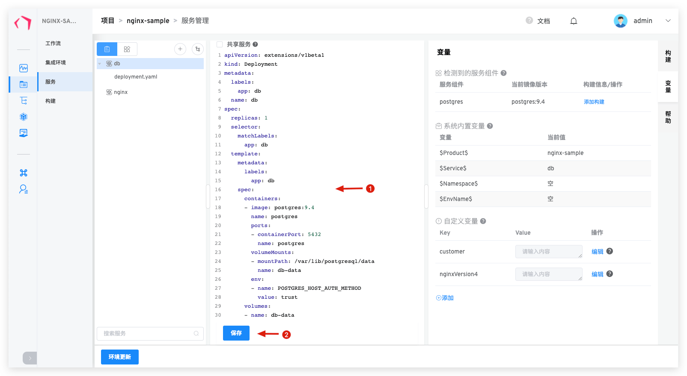

* 选择相应环境进行更新。


#### 仓库导入

* 提交服务配置变更到代码仓库

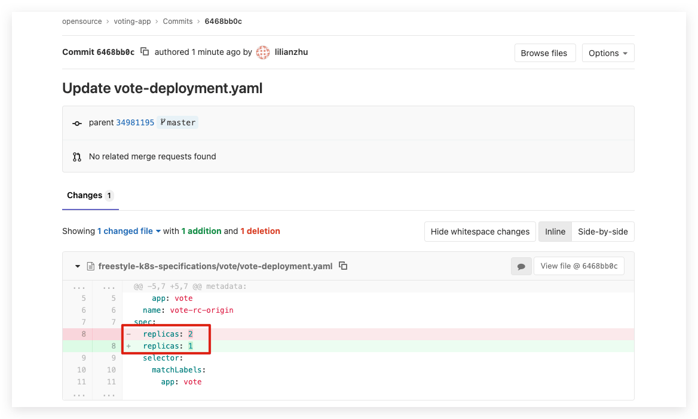

* 变更合并到主干分支后，通过 Webhook 的能力自动同步最新配置到 Zadig 系统。也可以在界面上手动同步服务配置，如下图所示。

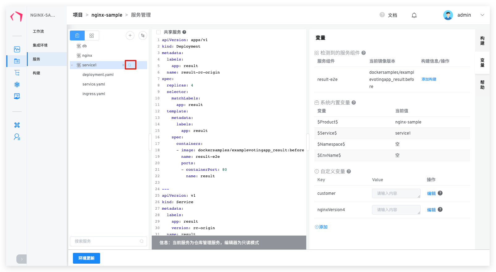

* 在 Zadig 集成环境中，查看服务配置的变更，点击服务更新按钮执行更新操作


### 删除服务

* 从`服务` 模块中将服务配置删除。
* 更新环境，将删除的服务从相应环境中移除。

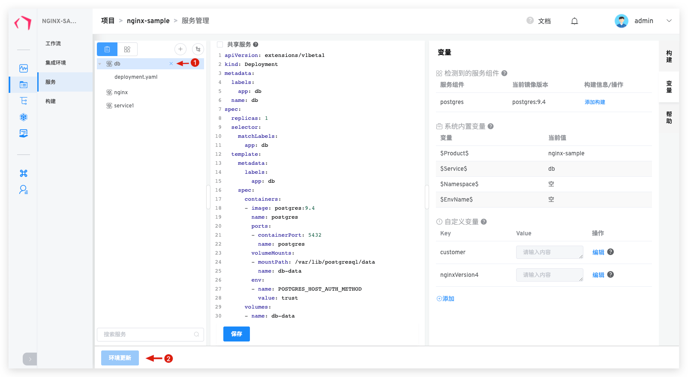

### 服务编排
> Zadig 系统支持对多个服务进行编排，重新组合定义多个服务的启动顺序，适用于多个服务的启动顺序有先后依赖关系的场景。

访问项目的服务，点击`服务编排`图标，按照实际需要对服务启动顺序进行拖拽组合。


### 共享服务
> 一个 K8s YAML 服务在某个项目中被设置为共享后，可被添加到使用 K8s YAML 部署的其他项目中去，参与该项目的服务编排。

- 设置共享服务：访问项目的服务，点击选中需要被设置为共享的服务，勾选`共享服务`复选框即可设置该服务为共享服务。

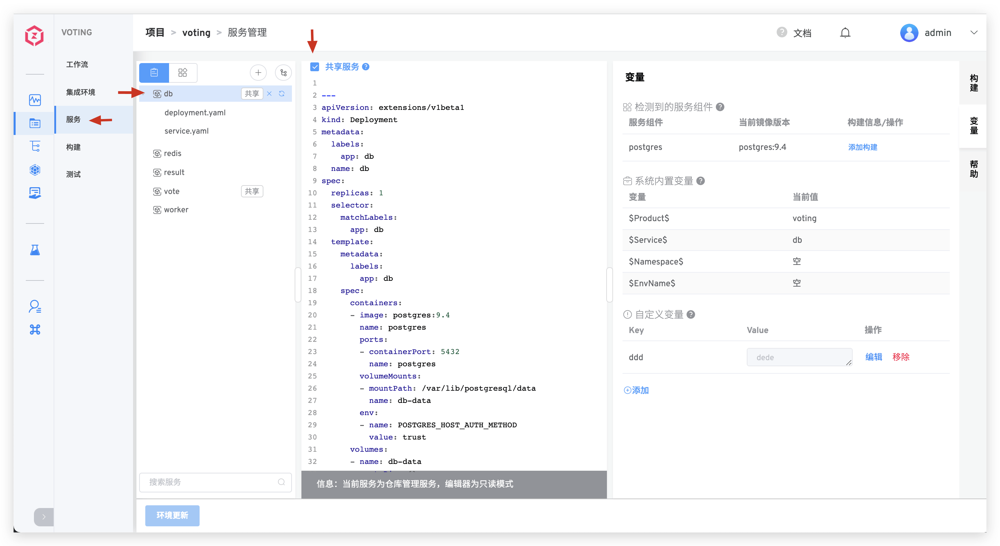

- 使用共享服务：访问另一个项目的服务，可查看共享服务列表，点击服务右侧的`+`即可将该服务添加到当前项目中，在该项目的服务列表中，会有`共享`字段标识。

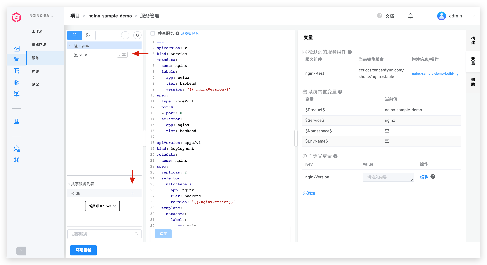

::: tip 扩展阅读
- 使用共享服务只是复用服务的定义，并不是共享服务实例。在不同项目的集成环境中，相同的共享服务也是独立的服务实例。
- 使用其他项目中的共享服务时，构建过程会使用该共享服务对应的构建脚本。
:::

### 变量配置

> 变量主要分为系统内置变量和自定义变量，均可在服务 YAML 中进行引用，其中服务组件名和镜像信息中只能引用使用内置变量 `$Product$` 和 `$Service$`。

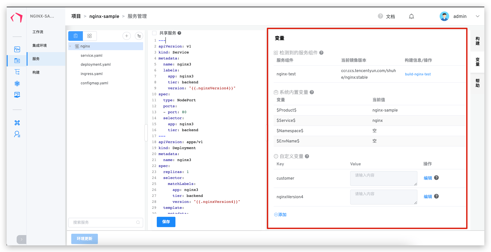

添加服务或者更新服务时可创建或更新变量

#### 系统内置变量
包括 `$Namespace$`、`$Product$`、`$Service$`、`$EnvName$`，可直接在 YAML 中进行引用，具体说明如下：

  - `$Namespace$`：项目创建的集成环境所在的 K8s 空间名称，不可用于服务组件名称和镜像信息中
  - `$Product$`：项目名称
  - `$Service$`：服务名称
  - `$EnvName$`：创建的集成环境名称，不可用于服务组件名称和镜像信息中
#### 自定义变量

通过平台新增 `Key`，可输入默认 `Value`，通过关键字：<span v-pre>`{{.key}}`</span> 引用

例如：在 K8s YAML 中引用配置的变量
```yaml
apiVersion: extensions/v1beta1
kind: Ingress
metadata:
  name: $Product$-index  //引用系统内置变量 $Product$，环境创建时被渲染
spec:
  rules:
  - host: {{.portal_host}} //引用自定义变量 portal_host，环境创建时被渲染
    http:
      paths:
      - backend:
          serviceName: $Product$-index
          servicePort: 80
        path: /
```
#### 变量的使用

##### 创建集成环境时使用

在集成环境创建时，对项目中所有服务的 YAML 和服务配置文件进行渲染。


##### 环境变量更新时使用

在集成环境中，对于正常运行中的服务，可以自行更新变量值，基本操作中点击`更新环境变量`，即可更新对应集成环境中的环境变量。


### 服务 YAML 样例
#### 无状态服务

概念：服务运行的实例不会在本地存储需要持久化的数据，并且多个实例对于同一个请求响应的结果是完全一致的。可以参考[这篇文章](https://kubernetes.io/zh/docs/tasks/run-application/run-stateless-application-deployment/)了解无状态服务的更多细节。
::: details
```yaml
apiVersion: apps/v1
kind: Deployment
metadata:
  name: nginx-deployment
spec:
  selector:
    matchLabels:
      app: nginx
  replicas: 2 # 2 个 Pod 实例
  template:
    metadata:
      labels:
        app: nginx
    spec:
      containers:
      - name: nginx
        image: nginx:1.14.2
        ports:
        - containerPort: 80
```
:::
#### 有状态服务

概念：服务的实例可以将一部分数据随时进行备份，并且在创建一个新的有状态服务时，可以通过备份恢复这些数据，以达到数据持久化的目的。可以参考[这篇文章](https://kubernetes.io/zh/docs/tasks/run-application/run-replicated-stateful-application/)了解有状态服务的更多细节。
::: details
```yaml
apiVersion: v1
kind: ConfigMap
metadata:
  name: mysql
  labels:
    app: mysql
data:
  master.cnf: |
    # Apply this config only on the master.
    [mysqld]
    log-bin
  slave.cnf: |
    # Apply this config only on slaves.
    [mysqld]
    super-read-only
---
# Headless service for stable DNS entries of StatefulSet members.
apiVersion: v1
kind: Service
metadata:
  name: mysql
  labels:
    app: mysql
spec:
  ports:
  - name: mysql
    port: 3306
  clusterIP: None
  selector:
    app: mysql
---
# Client service for connecting to any MySQL instance for reads.
# For writes, you must instead connect to the master: mysql-0.mysql.
apiVersion: v1
kind: Service
metadata:
  name: mysql-read
  labels:
    app: mysql
spec:
  ports:
  - name: mysql
    port: 3306
  selector:
    app: mysql
---
apiVersion: apps/v1beta1
kind: StatefulSet
metadata:
  name: mysql
spec:
  selector:
    matchLabels:
      app: mysql
  serviceName: mysql
  # 1 master and 2 slave
  replicas: 3
  template:
    metadata:
      labels:
        app: mysql
    spec:
      initContainers:
      - name: init-mysql
        image: mysql:5.7
        command:
        - bash
        - "-c"
        - |
          set -ex
          # Generate mysql server-id from pod ordinal index.
          [[ `hostname` =~ -([0-9]+)$ ]] || exit 1
          ordinal=${BASH_REMATCH[1]}
          echo [mysqld] > /mnt/conf.d/server-id.cnf
          # Add an offset to avoid reserved server-id=0 value.
          echo server-id=$((100 + $ordinal)) >> /mnt/conf.d/server-id.cnf
          # Copy appropriate conf.d files from config-map to emptyDir.
          if [[ $ordinal -eq 0 ]]; then
            cp /mnt/config-map/master.cnf /mnt/conf.d/
          else
            cp /mnt/config-map/slave.cnf /mnt/conf.d/
          fi
        volumeMounts:
        - name: conf
          mountPath: /mnt/conf.d
        - name: config-map
          mountPath: /mnt/config-map
      - name: clone-mysql
        image: gcr.azk8s.cn/google-samples/xtrabackup:1.0
        command:
        - bash
        - "-c"
        - |
          set -ex
          # Skip the clone if data already exists.
          [[ -d /var/lib/mysql/mysql ]] && exit 0
          # Skip the clone on master (ordinal index 0).
          [[ `hostname` =~ -([0-9]+)$ ]] || exit 1
          ordinal=${BASH_REMATCH[1]}
          [[ $ordinal -eq 0 ]] && exit 0
          # Clone data from previous peer.
          ncat --recv-only mysql-$(($ordinal-1)).mysql 3307 | xbstream -x -C /var/lib/mysql
          # Prepare the backup.
          xtrabackup --prepare --target-dir=/var/lib/mysql
        volumeMounts:
        - name: data
          mountPath: /var/lib/mysql
          subPath: mysql
        - name: conf
          mountPath: /etc/mysql/conf.d
      containers:
      - name: mysql
        image: mysql:5.7
        env:
        - name: MYSQL_ALLOW_EMPTY_PASSWORD
          value: "1"
        ports:
        - name: mysql
          containerPort: 3306
        volumeMounts:
        - name: data
          mountPath: /var/lib/mysql
          subPath: mysql
        - name: conf
          mountPath: /etc/mysql/conf.d
        resources:
          requests:
            cpu: 500m
            memory: 1Gi
          limits:
            cpu: 500m
            memory: 1Gi
        livenessProbe:
          exec:
            command: ["mysqladmin", "ping"]
          initialDelaySeconds: 30
          periodSeconds: 10
          timeoutSeconds: 5
        readinessProbe:
          exec:
            # Check we can execute queries over TCP (skip-networking is off).
            command: ["mysql", "-h", "127.0.0.1", "-e", "SELECT 1"]
          initialDelaySeconds: 5
          periodSeconds: 2
          timeoutSeconds: 1
      - name: xtrabackup
        image: gcr.azk8s.cn/google-samples/xtrabackup:1.0
        ports:
        - name: xtrabackup
          containerPort: 3307
        command:
        - bash
        - "-c"
        - |
          set -ex
          cd /var/lib/mysql

          # Determine binlog position of cloned data, if any.
          if [[ -f xtrabackup_slave_info && "x$(<xtrabackup_slave_info)" != "x" ]]; then
            # XtraBackup already generated a partial "CHANGE MASTER TO" query
            # because we're cloning from an existing slave. (Need to remove the tailing semicolon!)
            cat xtrabackup_slave_info | sed -E 's/;$//g' > change_master_to.sql.in
            # Ignore xtrabackup_binlog_info in this case (it's useless).
            rm -f xtrabackup_slave_info xtrabackup_binlog_info
          elif [[ -f xtrabackup_binlog_info ]]; then
            # We're cloning directly from master. Parse binlog position.
            [[ `cat xtrabackup_binlog_info` =~ ^(.*?)[[:space:]]+(.*?)$ ]] || exit 1
            rm -f xtrabackup_binlog_info xtrabackup_slave_info
            echo "CHANGE MASTER TO MASTER_LOG_FILE='${BASH_REMATCH[1]}',\
                  MASTER_LOG_POS=${BASH_REMATCH[2]}" > change_master_to.sql.in
          fi

          # Check if we need to complete a clone by starting replication.
          if [[ -f change_master_to.sql.in ]]; then
            echo "Waiting for mysqld to be ready (accepting connections)"
            until mysql -h 127.0.0.1 -e "SELECT 1"; do sleep 1; done

            echo "Initializing replication from clone position"
            mysql -h 127.0.0.1 \
                  -e "$(<change_master_to.sql.in), \
                          MASTER_HOST='mysql-0.mysql', \
                          MASTER_USER='root', \
                          MASTER_PASSWORD='', \
                          MASTER_CONNECT_RETRY=10; \
                        START SLAVE;" || exit 1
            # In case of container restart, attempt this at-most-once.
            mv change_master_to.sql.in change_master_to.sql.orig
          fi

          # Start a server to send backups when requested by peers.
          exec ncat --listen --keep-open --send-only --max-conns=1 3307 -c \
            "xtrabackup --backup --slave-info --stream=xbstream --host=127.0.0.1 --user=root"
        volumeMounts:
        - name: data
          mountPath: /var/lib/mysql
          subPath: mysql
        - name: conf
          mountPath: /etc/mysql/conf.d
        resources:
          requests:
            cpu: 100m
            memory: 100Mi
      volumes:
      - name: conf
        emptyDir: {}
      - name: config-map
        configMap:
          name: mysql
  volumeClaimTemplates:
  - metadata:
      name: data
    spec:
      accessModes: ["ReadWriteOnce"]
      resources:
        requests:
          storage: 10Gi
```
:::

## Helm Chart 服务

> [Helm](https://helm.sh/) 是 Kubernetes 应用的包管理工具， Helm Chart 定义、安装和升级复杂的 Kubernetes 应用。

### 新增服务

> 新增服务，服务定义支持三种来源：Git 仓库[包括 GitHub/GitLab 代码仓库]、Chart 仓库[建设中]、模板库。

访问使用 Helm Chart 部署的项目，点击服务部分，进入服务管理页面。下面分别介绍从 Git 仓库和模板库创建服务。


#### Git 仓库
> Helm Chart 相关配置托管于指定的 Git 仓库中，将配置从 Git 仓库中导入至 Zadig 系统内。

- 点击 `+` 新建服务，填写代码仓库相关信息及 Helm Chart 配置文件目录路径，加载服务。

::: tip 前提
需要先集成代码源，参考 [GitLab 集成](/v1.9.0/settings/codehost/gitlab/)/[GitHub 集成](/v1.9.0/settings/codehost/github/)
:::


<!-- #### Chart 仓库导入
> 功能建设中，敬请期待…… -->

#### 模板库
> Helm Chart 相关配置托管于 Zadig 系统的 Helm Chart 模板中，服务可以基于模板创建。支持一次创建一个服务，也支持基于模板批量创建服务。

::: tip 前提
需要先在系统模板库里创建 Helm Chart 模板，请参考 [Helm Chart 模板管理](/v1.9.0/template/helm_chart/)
:::

##### 创建单个服务

- 点击 `+` 按钮，选择从模板库新建服务，填写服务名称并选择模板，按需对模板中的变量进行覆盖赋值后，导入即可。


- 在`高级设置`中，系统还支持用新的 values.yaml 覆盖模板中的内容，包括手动输入和从指定 Git 仓库导入两种途径来覆盖。

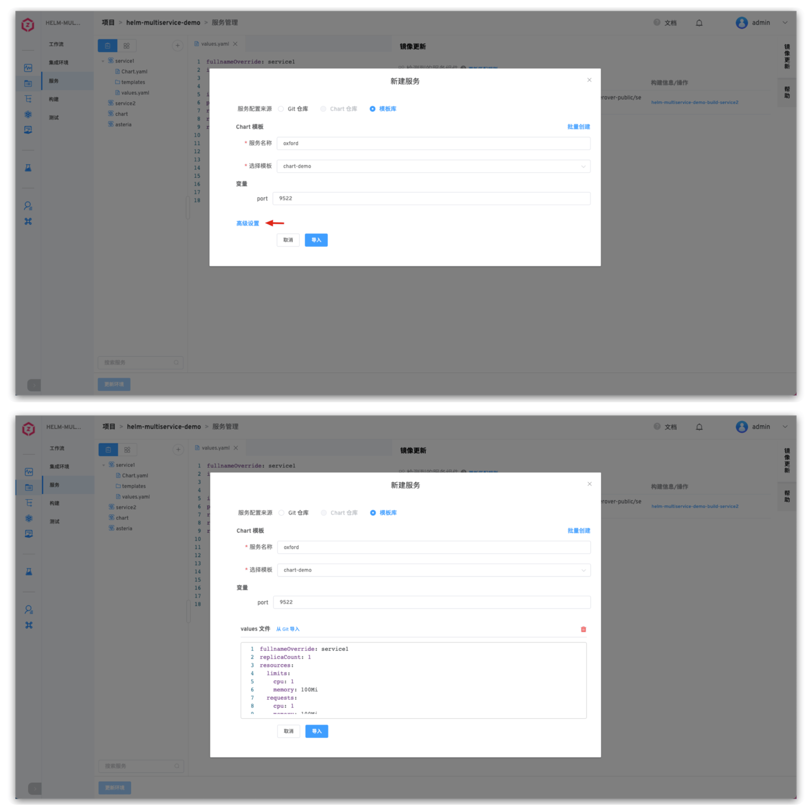

##### 批量创建服务

- 点击 `+` 按钮，选择从模板库新建服务，点击`批量创建`。


- 选择 Helm Chart 模板，选择要导入服务的 values 文件，导入即可。

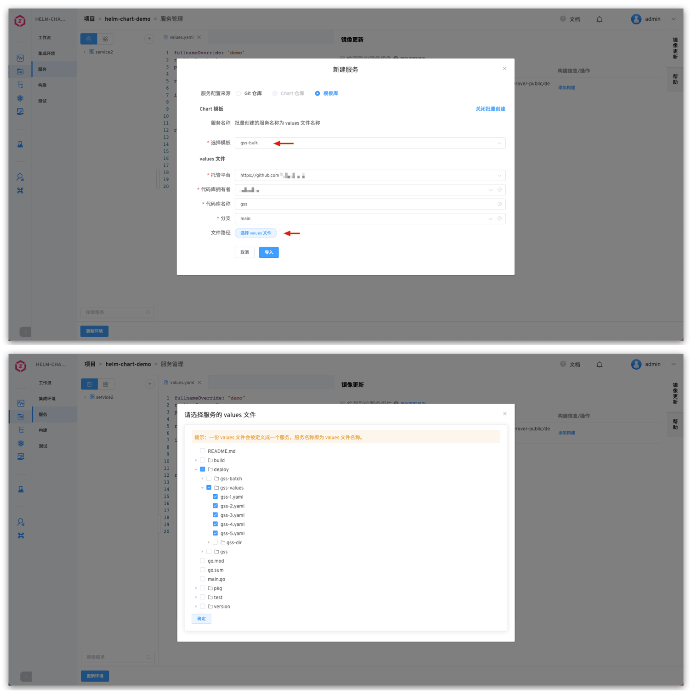

- 一份 values 文件会被定义成一个服务，values 文件名即为服务名。服务批量创建完毕后，点击`更新环境`即可将服务快速应用于环境中。

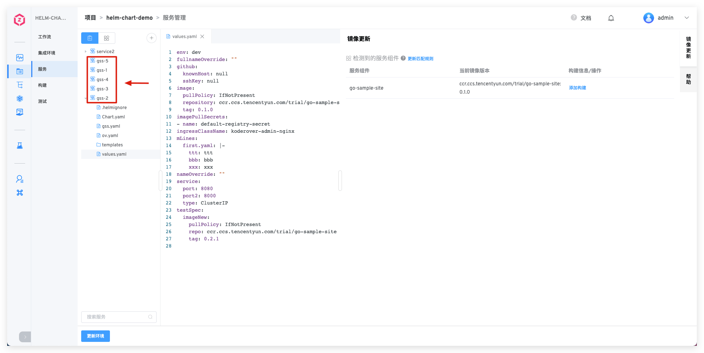


#### 服务组件镜像信息自定义

导入 Helm Chart 配置文件后，系统会按照内置规则解析 vaues.yaml 文件中的镜像内容。当默认规则不满足需求时，用户可自定义镜像解析规则。


Zadig 系统会解析镜像名为可被部署和更新的服务组件，系统关于 values.yaml 中服务组件内置的解析规则如下：
1. values.yaml 中有如下代码段结构，拼接 `image.repository:image.tag` 作为该组件的镜像版本，服务的部署版本和更新均围绕 `image.repository` 和 `image.tag`。该例中即为：`ccr.ccs.tencentyun.com/koderover-public/backend:latest`。

::: details
```yaml
# Helm Chart values.yaml Demo
key1: value1
key2: value2
key3:
  key4: value4
  key5:
    image:
      repository: "ccr.ccs.tencentyun.com/koderover-public/backend"
      tag: "latest"
  key6:
    ...
...
```
:::
2. values.yaml 中的 `image` 字段的值为镜像信息，服务的部署版本和更新均围绕 `image`。该例中即为 `ccr.ccs.tencentyun.com/koderover-public/backend:latest`。

::: details
```yaml
# Helm Chart values.yaml Demo
key1: value1
key2: value2
key3:
  key4: value4
  key5:
    image: "ccr.ccs.tencentyun.com/koderover-public/backend:latest"
  key6:
    ...
...
```
:::

3. 用户也可自定义解析规则，提供关于镜像的明确信息。说明如下：
- 使用 key 的绝对路径来解析组件的镜像信息，下例中，自定义规则中填入 `deploy.image.repo`/`deploy.image.name`:`deploy.image.tag` 即可。
::: details
```yaml
key1: value1
key2: value2
...
deploy:
  image:
    repo: library
    name: ubuntu
    tag: 20.04
```
:::
- 使用 key 的相对路径来解析服务组件的镜像信息，下例中，自定义规则中填入 `repo`/`name`:`tag` 即可。
::: details
```yaml
key1: value1
key2: value2
...
deploy:
  image:
    repo: library
    name: ubuntu
    tag: 20.04
```
:::
- 支持使用一份解析规则来解析多个服务组件，下例中，自定义规则中填入 `repo`/`name`:`tag` 即可解析出 `service1` 和 `service2` 的镜像分别为 `library/service1:v1` 和 `library/service2:v2`。
::: details
```yaml
key1: value1
key2: value2
...
deploy:
  service1:
    repo: library
    name: service1
    tag: v1
  service2:
    repo: library
    name: service2
    tag: v2
```
:::
- values.yaml 文件中可复用部分 key，下例中，自定义规则中填入 `public.repoInfo`/`name`:`tag` 即可解析出 `service1` 和 `service2` 的镜像分别为 `library/service1:v1` 和 `library/service2:v2`。
::: details
```yaml
key1: value1
key2: value2
...
public:
  repoInfo: library
deploy:
  service1:
    name: service1
    tag: v1
  service2:
    name: service2
    tag: v2
```
:::

- 自定义规则中的 `仓库地址/命名空间` 和 `标签名` 非必填，下例中，在自定义规则的`镜像名`中填入 `deploy.image.name` 即可

::: details
```yaml
deploy:
  image:
    name: library/ubuntu:12.04
```
:::

### 更新服务

#### 从 Git 仓库导入的服务

- 在`服务`模块，选择服务，点击服务右侧的同步按钮，点击`加载`同步最新的服务配置。

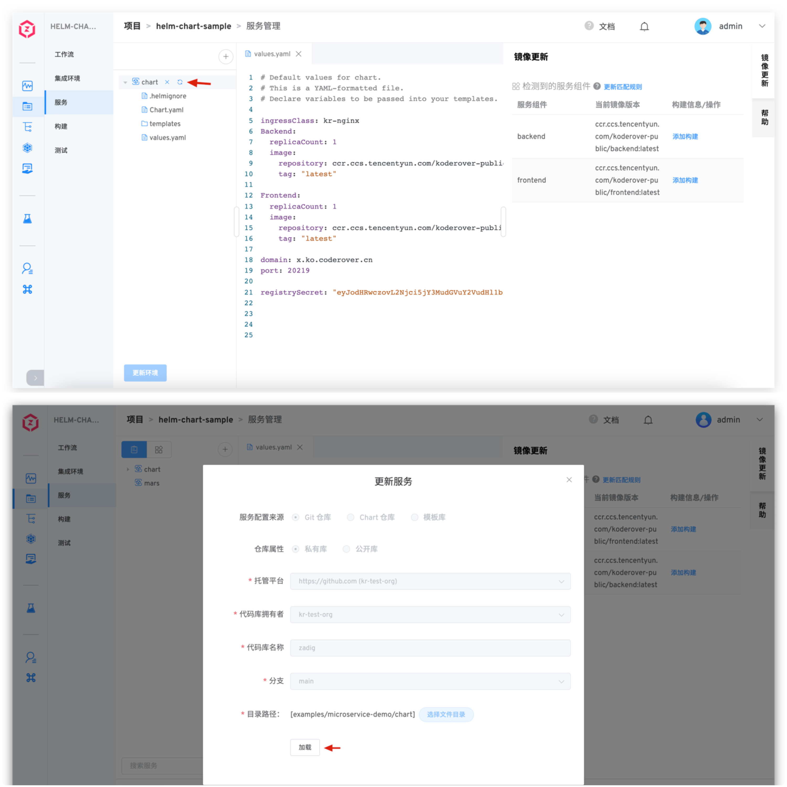

#### 基于模板创建的服务

- 在`服务`模块，选择服务，点击服务右侧的同步按钮，按需修改变量和 values 文件，点击`导入`即可。

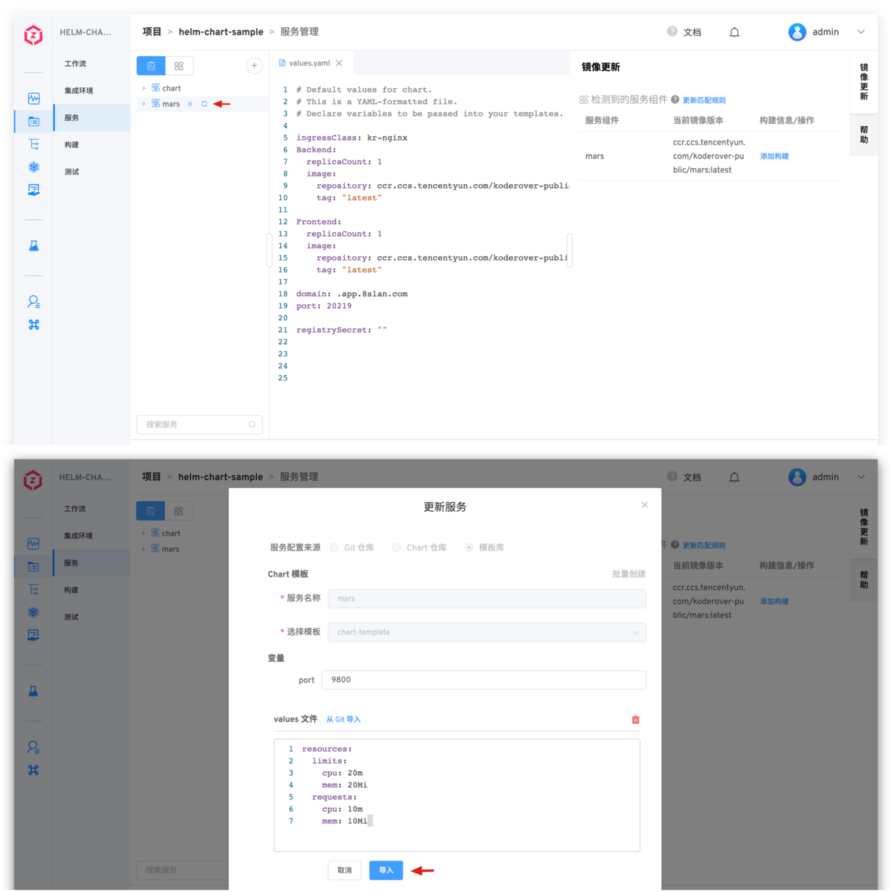

### 删除服务

- 从`服务`模块中将服务配置删除。
- 点击 `更新环境`按钮，将删除的服务从相应环境中移除。


### Helm Chart 样例

> 建设中，敬请期待


## 托管项目服务

### 配置托管服务
- 在托管项目中点击`环境`，进入环境管理页面，进行托管服务管理。

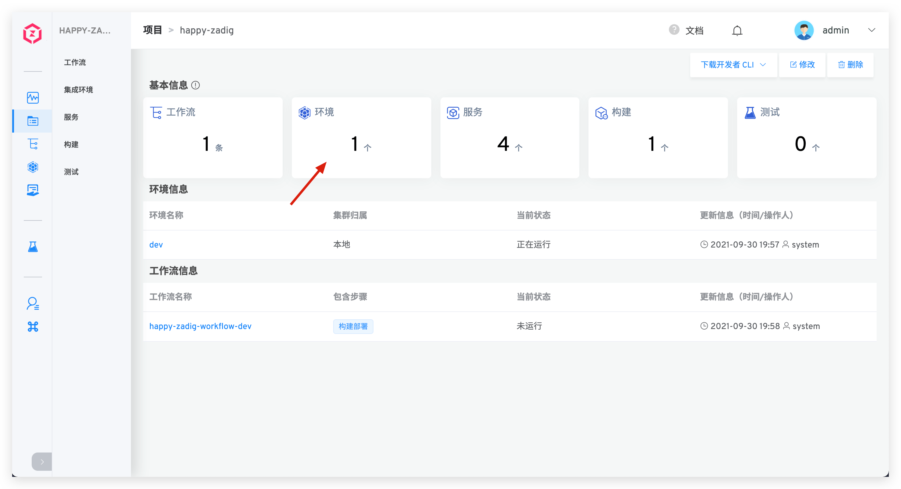

- 点击`配置托管`，对 `dev` 环境的服务进行管理。

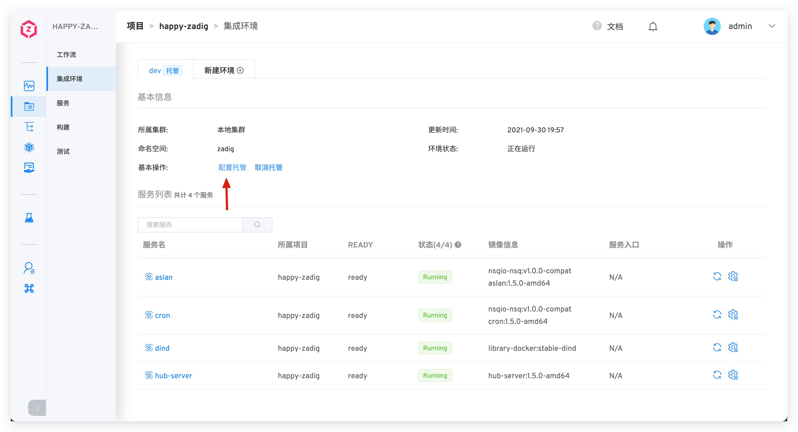

- 按需选择左侧列表中的服务拖至右侧，点击`下一步`，新增对该服务的托管管理。

### 更新服务

可通过对服务进行左右侧拖动，实现对托管服务的调整和管理。


- 可对新加入的服务配置构建，以便使用工作流对托管的服务进行自动部署更新。


## 主机服务
在 Zadig 系统上主机服务的定义主要包括服务的构建脚本、资源配置、部署配置和探活配置。

### 新增服务

- 项目中点击服务部分，进入服务管理页面。


- 点击新建按钮新建服务。


- 输入服务名称。

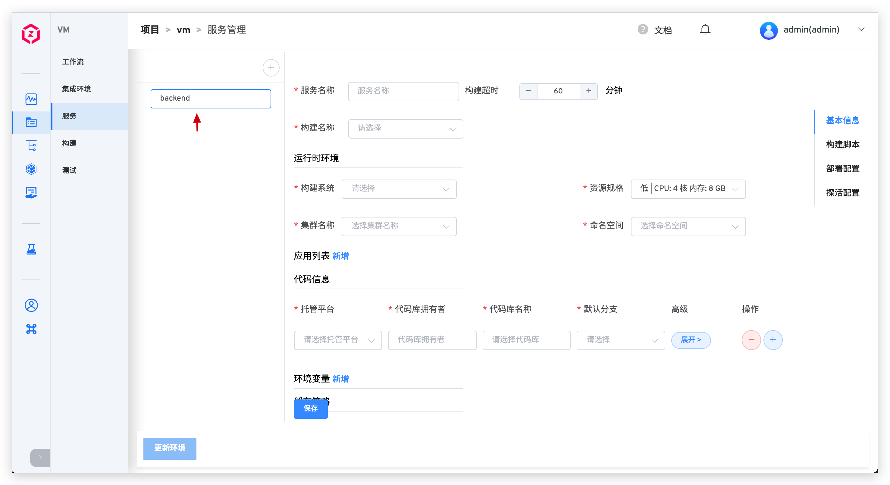

#### 构建脚本

- 配置构建脚本，定义服务的构建打包过程。

主机服务的构建脚本相关配置说明，参考[构建模块](/v1.9.0/project/build/)。

#### 部署配置

- 配置部署脚本，定义服务的部署过程。

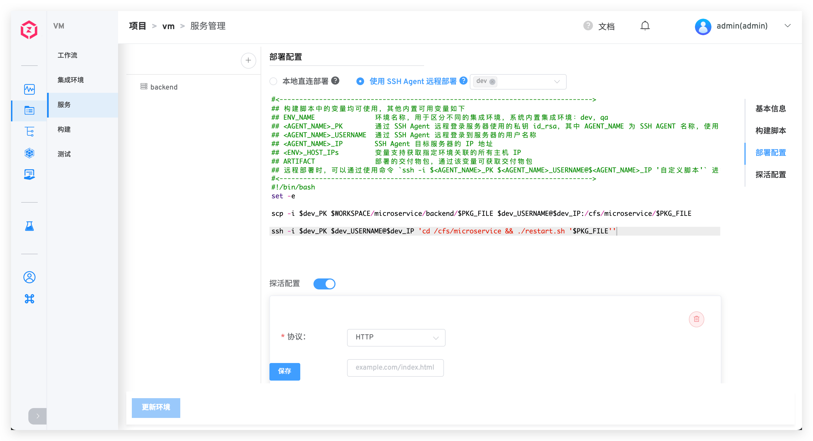

说明：
- 部署方式：
    - `本地直连部署`：直接在 Zadig 所在集群中执行部署操作，需确保 Zadig 系统能连通或访问到脚本中的主机地址。
    - `使用 SSH Agent 远程部署`：安全登录到目标机器，执行部署操作。
- 部署脚本和构建脚本共享存储卷，在构建脚本中生成的包在部署脚本中直接获取。
- 部署脚本可以使用构建脚本中系统内置变量，构建包需使用 `$PKG_FILE` 获取。

#### 探活配置

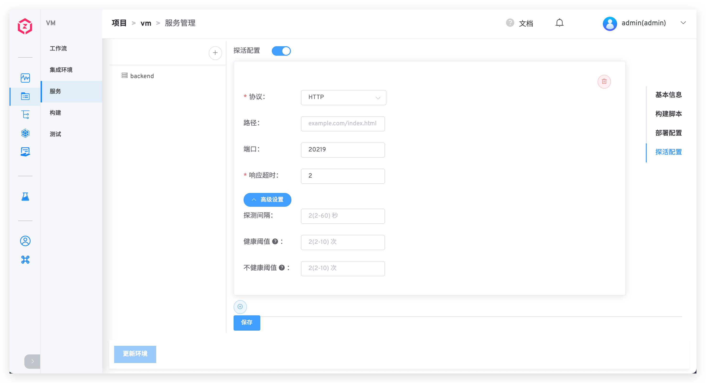

字段说明：
- `协议`：支持 HTTP、HTTPS 和 TCP。
- `路径`：HTTP/HTTPS 请求的健康检查路径。
- `端口`：支持 1 - 65535 端口。
- `响应超时`：超出设定时间，判断为不健康。
- `高级设置`：
    - `探测间隔`：两次探活请求的间隔时间，默认 2s。
    - `健康阈值`：从不健康变为健康的连续探测次数。
    - `不健康阈值`：从健康变为不健康的连续探测次数。


### 更新服务

- 选择需要修改的服务，修改服务配置，点击`保存`-> 点击`更新环境`->在弹框中选择需要更新的环境。

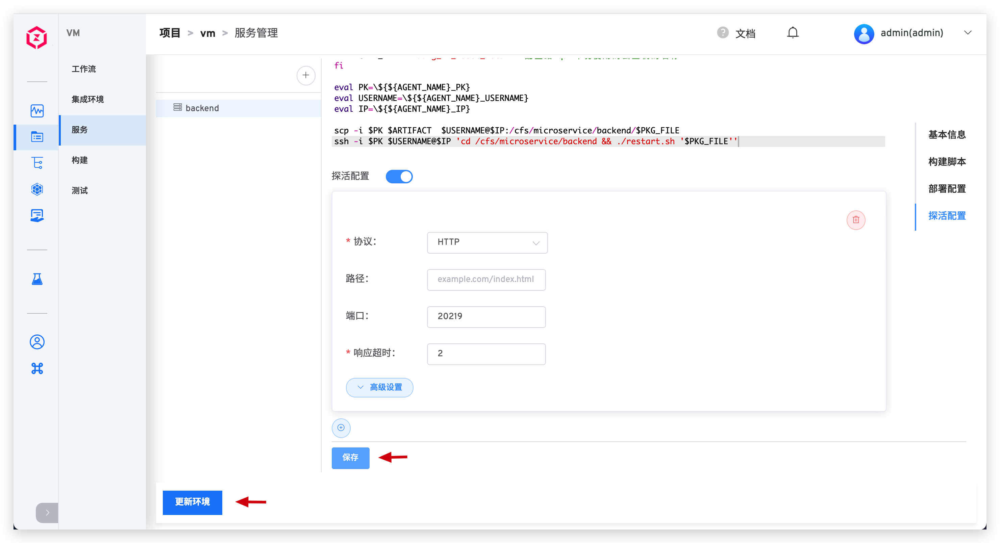
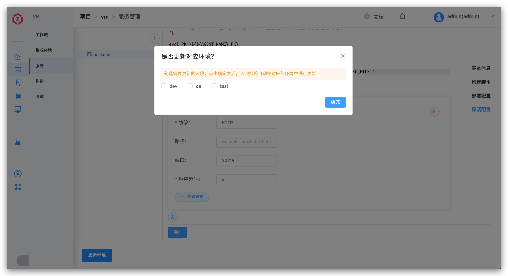


### 删除服务

- 从 `服务` 模块中将服务配置删除。


- 更新环境，将删除的服务从相应的环境中移除。

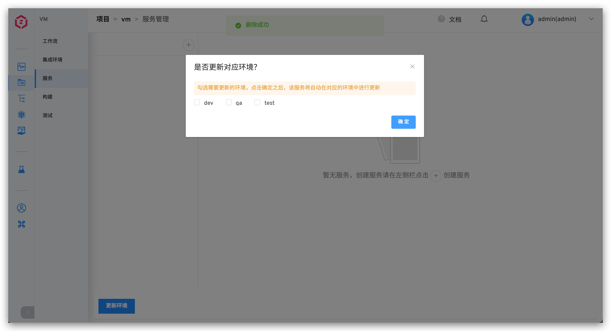