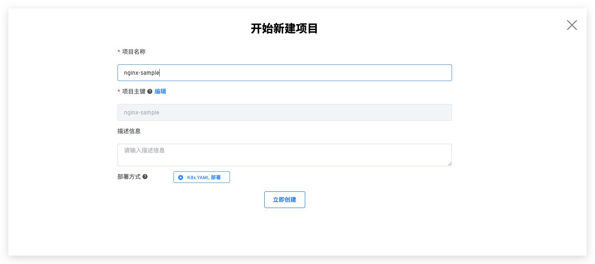
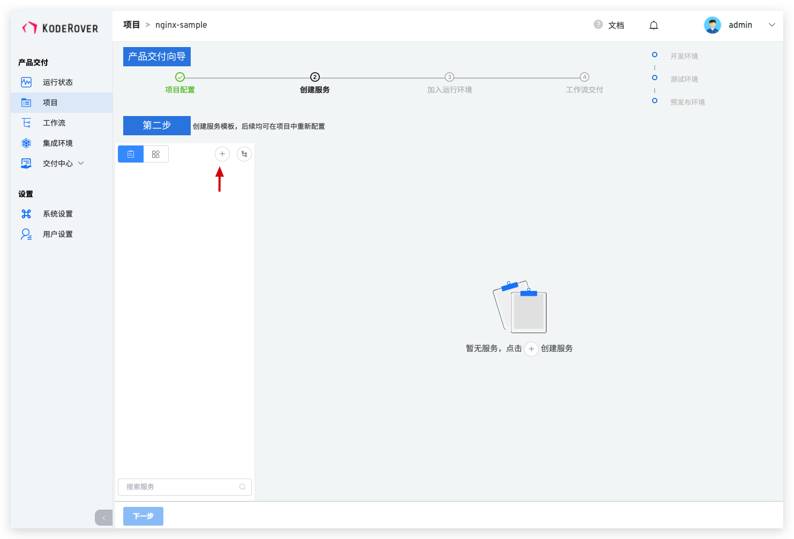
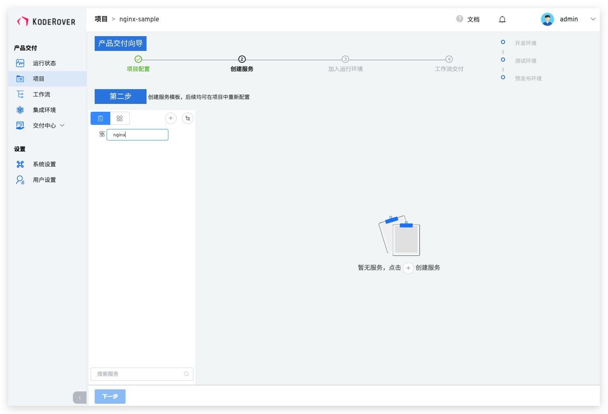
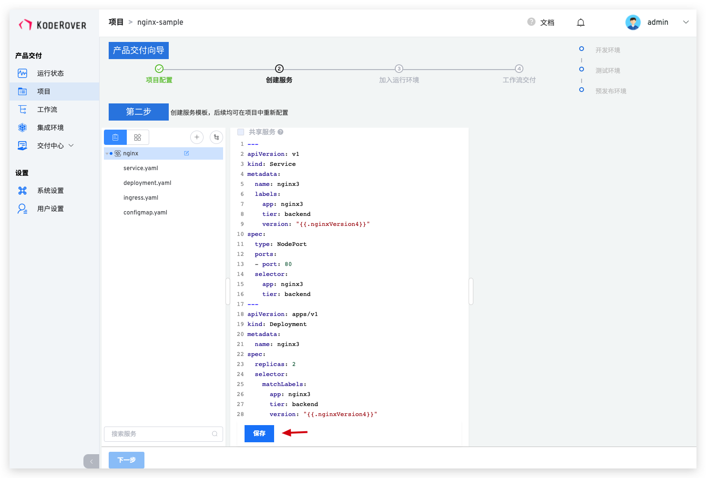
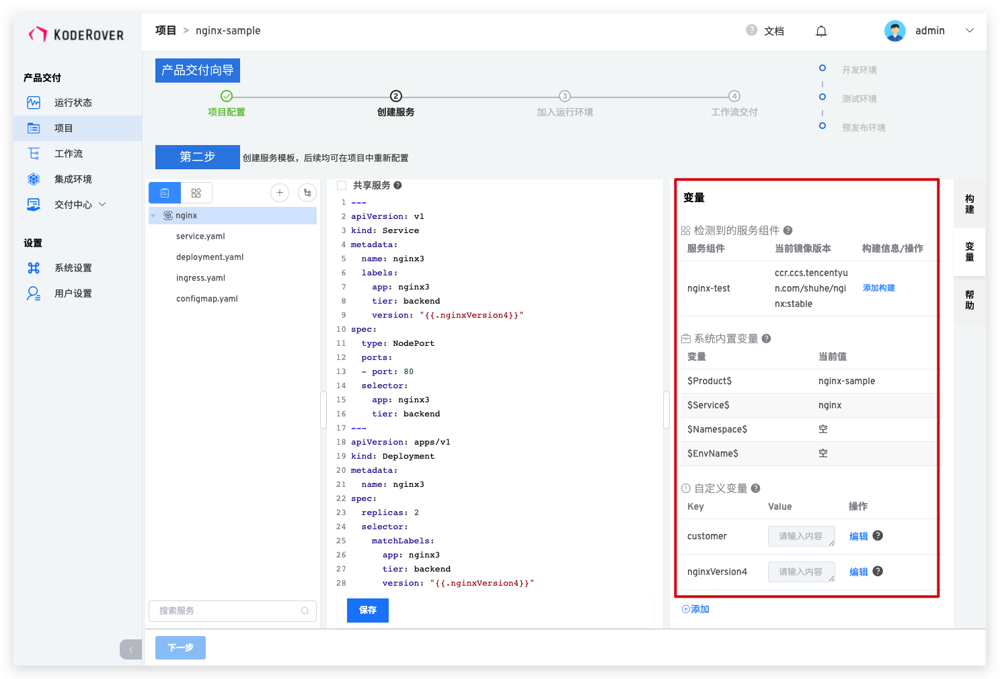
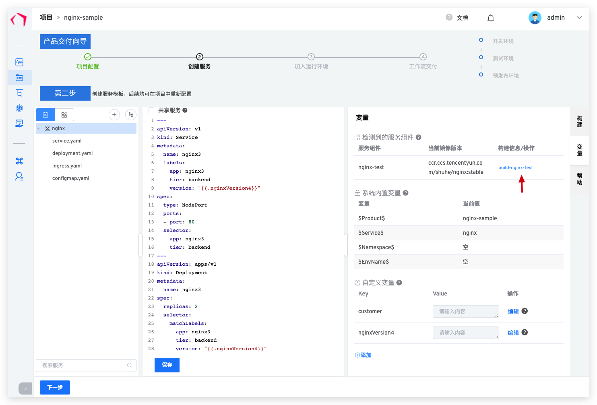
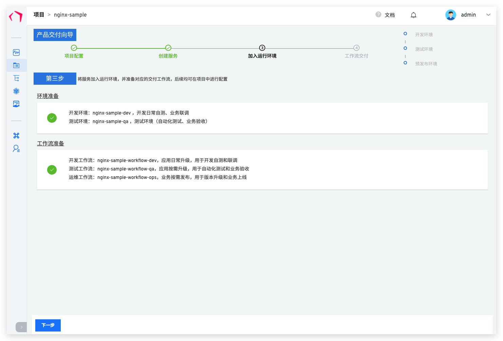
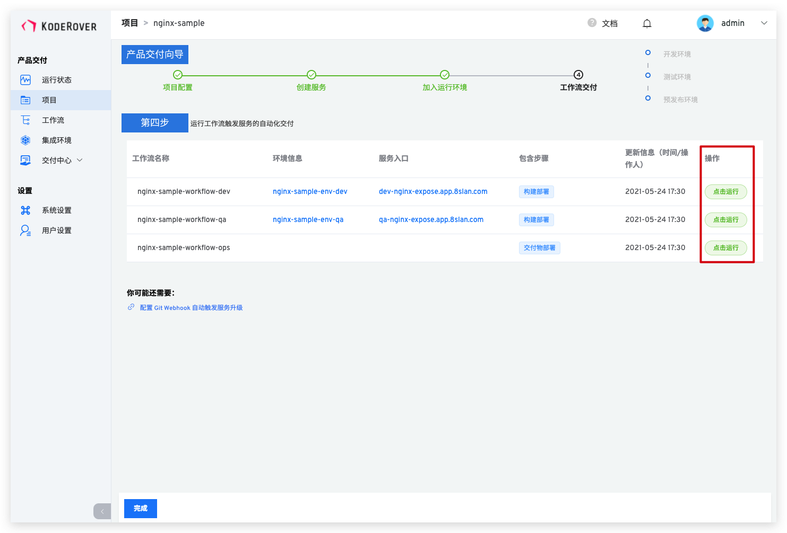
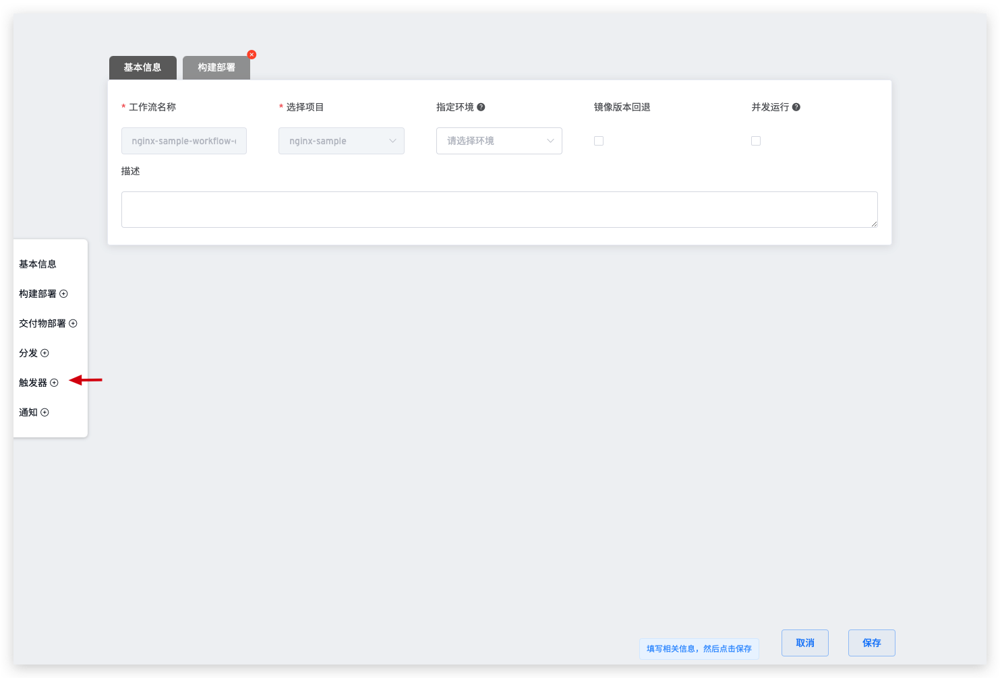

本文旨在帮助新用户快速入手熟悉使用整个 Zadig 系统基本能力，包含从 Code 到 Ship 的整个过程的演示，本文以容器化项目 Nginx 为例。

## 准备工作

- 项目案例源码： [NGINX](https://github.com/koderover/Zadig/tree/main/examples/nginx) ，也可配置自己的私有仓库，代码源集成请参考 [代码源集成-GitHub 集成](/settings/codehost/#github-集成)
- 服务 YAML 文件：[YAML](https://github.com/koderover/Zadig/tree/main/examples/nginx/yaml)
- 配置 GitHub 的 Webhook，Webhook 配置请参考 [GitHub Webhook](/settings/webhook-config/#github-webhook-配置)

## 第 1 步：项目配置

- 点击项目 -> 点击新建项目按钮，创建项目，具体内容如下图所示：

点击创建按钮，进入项目创建向导，点击下一步开始创建服务：

## 第 2 步：创建服务

::: tip
创建服务有 2 种方式： 
第 1 种：点击「创建服务」直接把服务的 K8s YAML 内容粘到系统中  
第 2 种：选择从 Git 仓库同步 YAML 文件  
本示例中采用第 1 种方式
:::

::: warning
请提前配置好代码源和镜像仓库集成，如安装时未配置，具体配置请参照[`系统配置->集成管理->代码集成`](/settings/codehost/) 以及 [`系统配置->镜像仓库管理`](/settings/image-registry/)
:::

点击创建服务按钮进行新建服务：

输入新的服务名：

将 YAML 内容粘贴到编辑器：

将 YAML 内容粘到系统之后，系统会自动检测 YAML 格式是否合法，点击保存之后，右侧会自动加载出系统变量、自定义变量以及服务组件，这里也可以根据需求继续添加自定义变量

## 第 3 步：创建构建

创建构建，这里可以选择为 `nginx-test` 这个服务组件添加构建，然后选择代码库和添加构建脚本，具体如下图所示：

根据构建需要的实际环境安装应用，同时依次选择平台和代码库以及分支。

编写构建脚本，并点击保存构建

点击保存按钮后可以看到对应的服务组件已经关联了构建，点击构建名称也可以继续进行编辑

点击下一步按钮，继续流程

## 第 3 步：创建环境和工作流

构建添加完成后，点击下一步，稍等片刻，系统会自动创建 2 套环境和 3 条工作流，2 套集成环境分别给开发和测试使用，3 条工作流也会自动绑定对应的开发环境以达到持续交付的目的。具体如下图所示：
::: tip
不同服务创建环境所需的时间有所不同，请耐心等待创建完成
:::

点击下一步进入工作流交付。
## 第 4 步：工作流交付

点击运行 Dev 工作流，来完成 Dev 环境的持续交付，点击运行按钮启动工作流

根据实际需求选择要交付的服务、以及对应的构建分支或者 PR，点击启动任务

其它环境的服务交付和 Dev 环境的类似，在此不再赘述。

到此，Zadig 的基本功能已经演示完毕，下面将展示如何配置自动触发工作流和版本交付。

### 配置自动触发工作流（可选）
::: warning
前提条件：需要配置 GitHub Webhook，Webhook 配置请参考 [`GitHub Webhook`](/settings/webhook-config/#github-webhook-配置)
:::

点击编辑 Dev 工作流

添加触发器

打开 webhook 开关

点击添加 webhook 配置，按需填写相关配置

保存工作流的修改

在 GitHub 中提交 PR 后，在 check list 中会展示对应的系统工作流状态：

- 点击任务链接可以链接到系统里面查看具体的工作流信息：

待工作流运行完成后，可以看到环境里面的服务镜像已经被更新

### 配置工作流 IM 状态通知（可选）

工作流提供接入第三方 Webhook 能力，可以为工作流配置一个状态通知，以便及时得到工作流任务状态反馈，目前支持：
- 钉钉
- 飞书
- 企业微信
其它平台正在持续接入中

#### 飞书

通知到飞书，具体过程如下
配置步骤图示：
第 1 步：在飞书上添加一个 Bot，获得 Webhook 地址

第 2 步：点击编辑工作流，添加通知模块，正确填写飞书 Bot 的 Webhook 地址，并选择需要通知的事件

通知效果图示：

解锁更多功能和服务，请查看更多[经典案例](/examples/voting)。
