本文通过前端工程化在 Zadig 平台上的持续交付实践，详解一个典型的前端项目案例是如何在 Zadig 平台落地的。

## 前端工程化持续交付背景

> 在了解这套解决方案对前端自动化效能所起到的提升之前，我们不妨思考几个问题：

- 在容器环境下，一次前端版本的发布应该包含哪些内容？
- 一次前端版本的发布流程，其中有哪些模块是可以被 CI 自动化完成的？
- 一次前端的 `Hotfix` 从跑完整个流程到验证上线最快要多久？
- 前后端联调是否占用了很多时间？有没有办法去提效？
- 团队中不同成员开发不同的模块时有没有更优雅的方式解决测试环境相互占用的问题？
- 新成员加入团队如何最快速的投入开发？

> 下面就从这些问题开始展开，来聊聊通过 Zadig 我们是如何解决这些问题的。可以让前端工程达到以下效果：

- 一次前端的 Hotfix 从跑完整个流程到验证上线最快要多久？

     - 按照这套流程，一次轻量级别的前端的 hotfix ，除去必不可少代码编写时间、验收时间。实际花费在构建、部署以及运行测试的时间。最快可以达到 `5 分钟`级别就进行一次 hotfix 修正。当然不同的项目也会有不同的额外流程，大型的项目很可能花费的时间会更多。

- 前后端联调是否占用了很多时间？有没有办法去提效？

    - 镜像级别服务构建，前后端联调将`不再受环境约束`。降低联调成本到`只需要切换一个镜像`就可以进行联调。

- 团队中不同成员开发不同的模块时有没有更优雅的方式解决测试环境相互占用的问题？
  - `分钟级`快速的构建出一套属于自己的测试环境，环境导致的占用问题将不复存在

## 在容器环境下，一次前端版本的发布包含哪些内容？

容器环境的一次前端版本发布通常会包括：

- 代码的下载构建及编译
  - 基本信息比如构建分支、PR、Commit 信息、提出人
  - 关联的问题信息，解决什么样的问题或者是新的需求
- 前端运行单元测试以及各种 Lint
  - 单测信息
  - 代码覆盖率报告
- 将 Docker 镜像推送到镜像仓库
  - 镜像的版本、Tag、以及构建时间
- 在测试环境上针对当前版本进行测试
  - 前后端联调
  - 测试验收
- 为待发布的代码打上版本号
- 开发人员编写 ChangeLog 说明当前版本所涉及的修改
- 在预发布环境 （Beta） 测试当前版本
- 正式发布到生产环境

那么清单上的内容有多少是可以自动化的呢？其实除了需要在测试环境上针对当前版本进行测试以编写 changeLog ，其余的都可以通过流程进行自动化。

下面以我们的前端工程为例，先展示我们解决以上问题的成果。

### 代码的下载及构建

目前 Zadig 的构建支持多种方式构建，`分支`、`PR`、`Tag`、以及`分支+PR`组合。

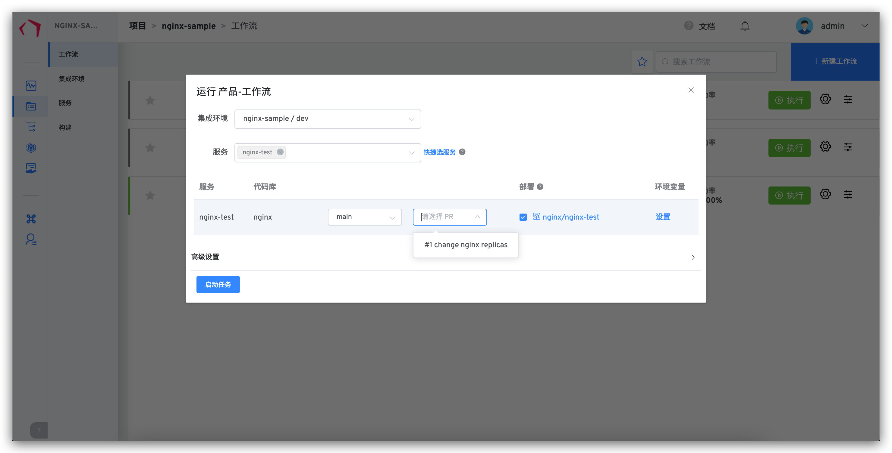
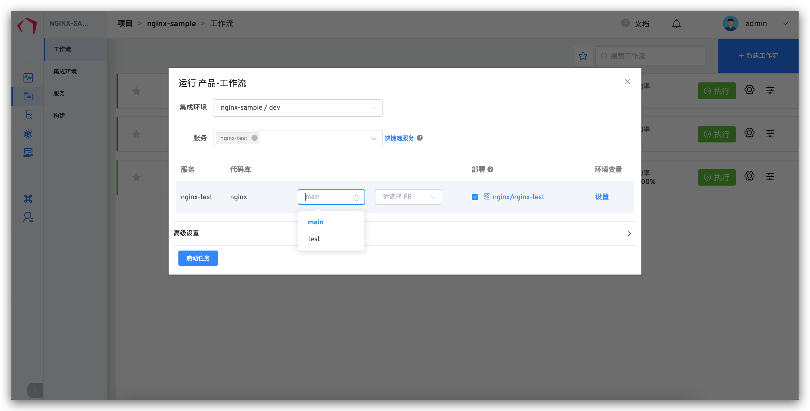

一般而言对于一些前端功能性的验证或者 Fix 我们都会选择通过 PR 去构建，然后快速的在测试环境来做验证。当然我们也同样做了分支以及 Tag 级别的构建支持，毕竟上线我们一般都会选择专门做上线的工作流 ，使用 Tag 或者分支，然后开发去编写相应的 release note 就可以了。下面就是我们使用专门的工作流来做上线的一个例子：

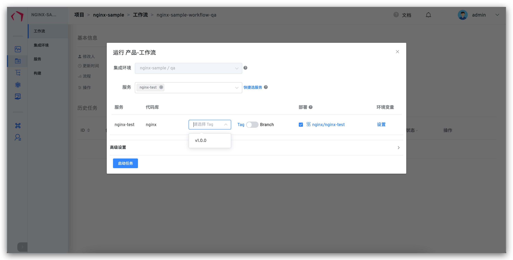

每一个工作流的任务详情，我们默认都会把该次构建的基本信息比如`构建分支`、`PR`、`Commit 信息`等提取出来。这也是目前 CI 的基本操作之一。
为了和企业的内部协作工具联动起来，我们集成了一些第三方工具。比如 Jira，我们通过 Jira 来追踪进度，进行企业内部协作的同时我们把 Jira 也抽象成了 CI 流程中的一环。

通过和 Jira 联动，开发在运行基于 PR 的 工作流 的同时可以更清晰的看到该次构建解决了哪些需求、Fix 了哪些 Bug，以及关联 Issue 的基本属性，包括任务创建人、任务执行人等等。

这样前端开发同学能很清楚的通过一次构建任务来追踪到任务的源头。不至于不知道每次构建都是在解决什么问题。

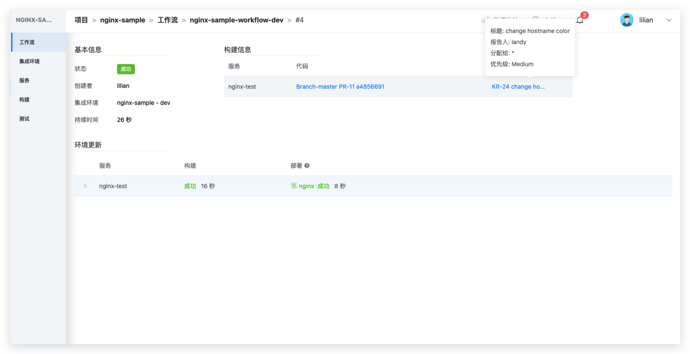

### 前端运行单元测试以及各种 Lint

在单元测试方面，我们可以通过运行一次构建任务，把每次上线构建的项目的单元测试数据上传到质效中心。质量数据上报到质效中心，通过质效中心来对每一个前端项目进行汇总和监控。方便开发主管对团队内部的项目质量进行有效的追踪。

目前在 CI 中运行前端的 `Unit Test` 大致流程，一般都是把这个 stage 步骤通过 script 形式定义在 `npm run build` 之前。

所以引入 CI 之后的构建流程就是：

- 拉取项目代码
- 运行 `npm run unit`
- `npm run build`
- 单测数据上传到质效中心
- 构建服务镜像
- 推送到镜像仓库地址
- 重启对应服务

质效中心-单测覆盖率数据总览

质效中心-单个库单测覆盖率趋势

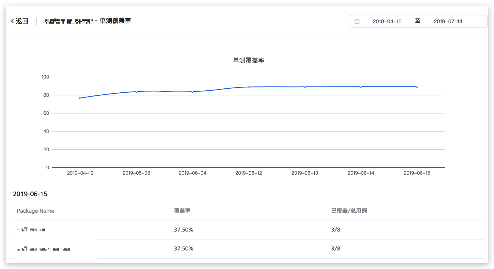
### 在测试环境上针对当前版本进行测试

构建说完了我们谈一谈部署，谈到部署那么就不得不谈环境，一直以来联调环境都是让前端头疼的问题之一。

- 狼多肉少，测试过程中，环境经常被覆盖，不同开发之间，经常要相互等待
- 环境配置管理困难，配置更新不能及时的同步到每个环境里面，导致每次联调负担沉重
- 环境被开发或者测试把配置不小心改坏，无法使用，只能新建。而新建成本又很高，严重浪费时间

为了解决这个问题，我们把每个前端产品，按照项目级别，通过 `Kubernetes Yaml` 中心化的去管理环境配置。每一个项目通过一套服务配置，把多个前后端服务按照启动顺序有序的编排起来。
可以实现分钟级别启动一套新的前端环境。配置管理中心化，管理员或者项目维护者把配置更新后，各个环境会同步下发配置更新的状态，每一个环境可以选择更新或者保持现状。同时我们也提供了`配置的更新 Diff` ，方便开发更容易的了解配置更新动态。

- 服务编排

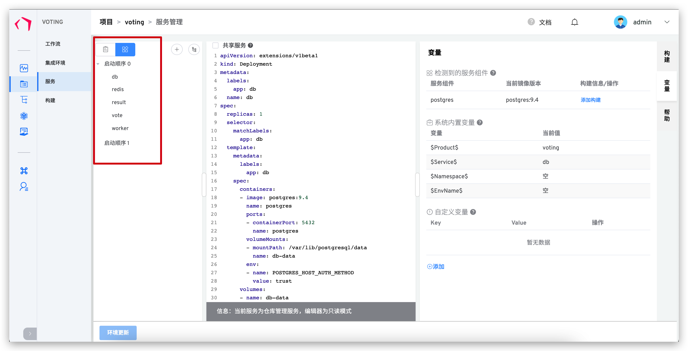

- 通过统一维护的服务配置新建的新环境

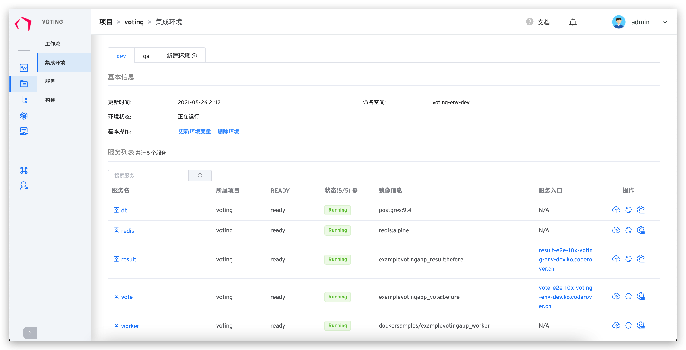

- 当服务配置有更新时，可以在集成环境中看到环境中的服务配置和最新服务配置之间的差异

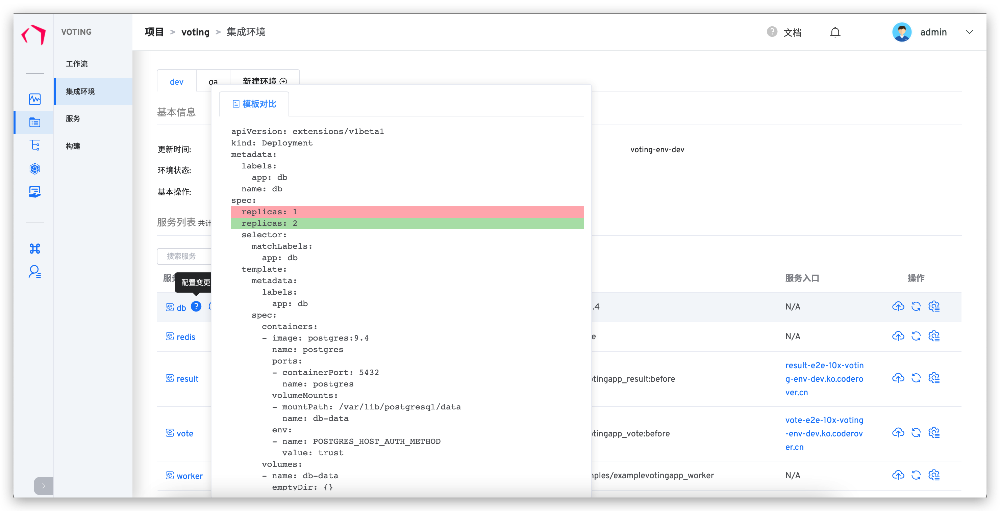
## Zadig 平台实战：一套完整的 CI/CD 流程配置

::: tip
配置人员需要了解业务，熟悉业务的对应服务，不同业务场景下需求不同。本文仅供参考
:::

按照先后顺序，目前大致分为以下步骤：

- 梳理前端业务服务
- 创建项目
- 创建服务
- 创建构建配置
- 创建集成环境
- 创建工作流
- 运行工作流
- 完成

### 梳理前端业务服务

假设目前我们有 frontend 项目。以 frontend 项目为例，前端业务服务的梳理大概分为：

- 了解前端服务是由哪个代码库所构建的，
- 了解前端服务的构建方式，包括但不限于构建脚本、Dockerfile 等
- 了解前端服务的构建依赖，需要哪些环境和基础软件包
- 了解前端服务的配置

以上步骤都已经确认完毕，可以开始创建项目了

### 创建项目

点击`项目`->`新建项目` 填写项目的基本信息。

### 创建服务

创建项目成功之后，点击下一步进入创建服务界面，我们先按照梳理好的前端服务，依次把服务创建起来（具体配置说明可以参照 [新建服务](/project/service/#新增服务) 这一章节）。

此时我们已经把需要的服务创建完毕。
### 创建构建配置

> 构建配置决定了一个服务如何被构建，是脚本构建还是通过 `Dockerfile` 构建

上一步点击保存之后，右侧会展示出服务组件名称 ，选择一个服务组件名称添加构建，进入构建配置详细配置（具体配置说明可以参照[构建](/project/build/#新建构建)这一章节），点击保存构建。

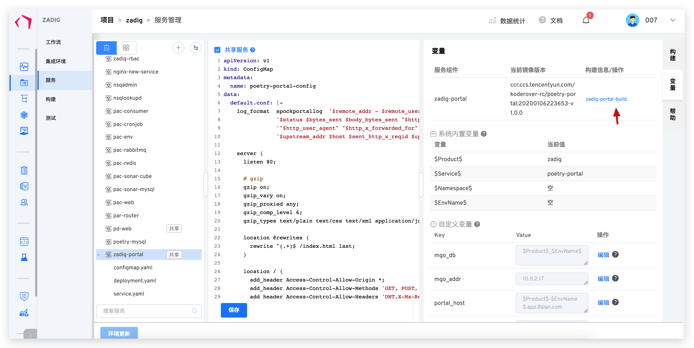
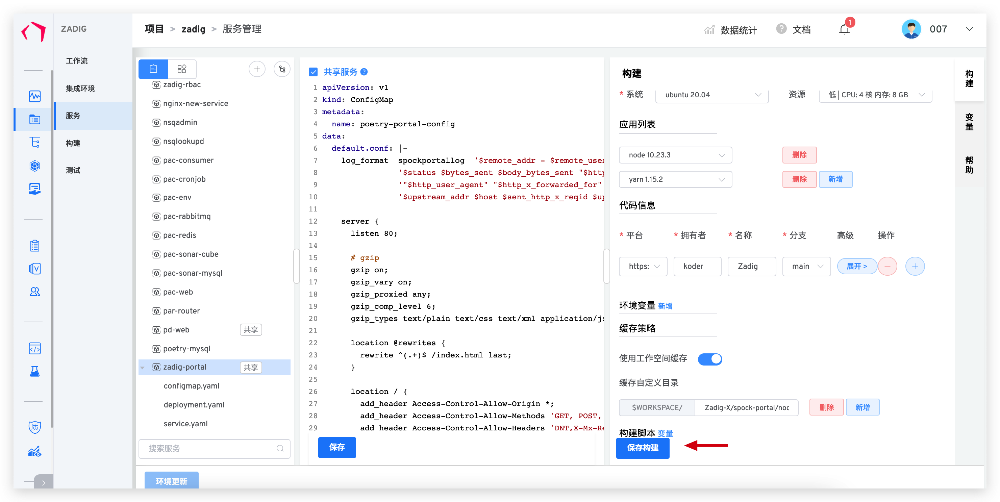
### 创建集成环境和工作流

服务创建完成之后，点击下一步系统会自动创建两套环境和三条工作流。

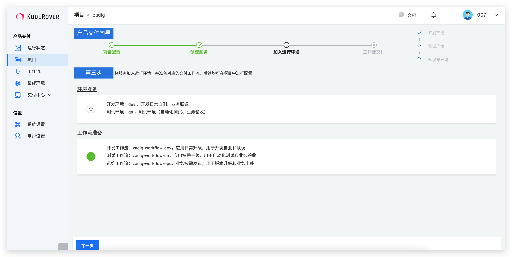

也可以在这个流程外单独创建集成环境和工作流

点击下一步，我们就可以执行已经创建好的工作流了。

> 下面以一次前端需求开发为例，完整的体验下这个前端 CI/CD 流程，我们前端团队刚刚入职了一个新人 007，来负责我们某个前端 website 项目的开发。接到市场部需求需要上线一次促销活动，涉及到的后端 API 接口已经准备好，并且镜像已经构建完毕，推到了私有的镜像仓库。开发主管安排了 007 参与这项工作。007 接到任务后大致可以分这样几步:

- 新建一套 website 环境用来自测，更换默认的后端服务镜像为准备好 API 镜像
- 本地代理到测试环境，进行需求开发
- 开发完成后提交代码运行工作流，发到 Beta 进行预上线的验证
- 验证完毕后执行上线工作流

下面展示具体的过程：

1. 创建集成环境，填写好环境名称后我们检查可以看到默认的环境变量以及服务的镜像

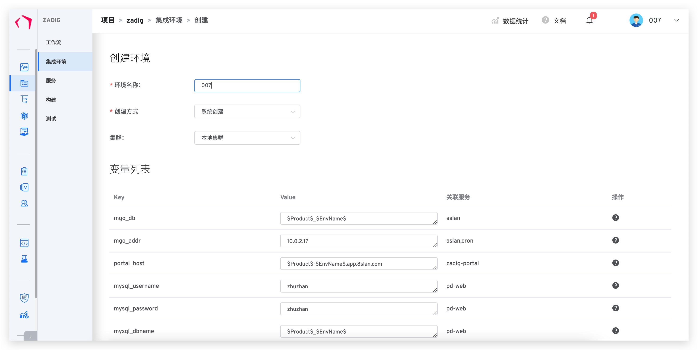

2. 几分钟后 007 成功创建出了属于他自己的环境

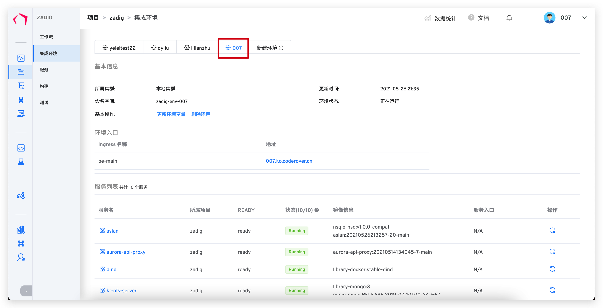

3. 007 把后端的服务换成约定好的镜像准备进行开发

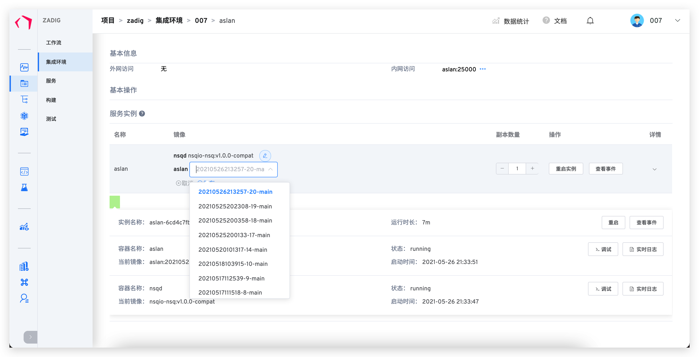

4. 007 在前端项目里通过 Webpack 的 Proxy-middleware 把默认的后端入口 API 地址代理到本地

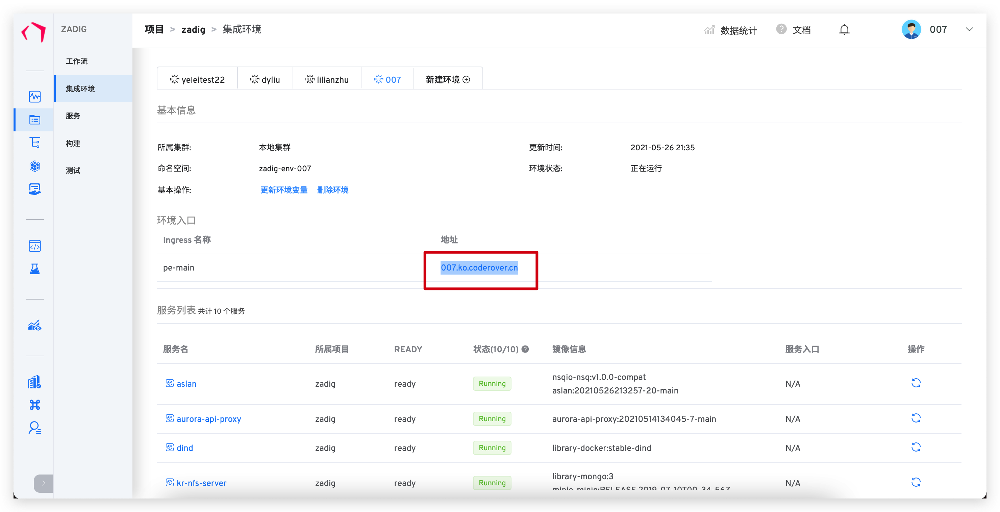
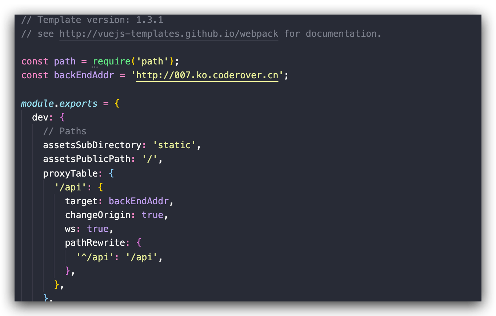

5. 007 运行前端项目的相关 run 命令，正常的进行需求开发了

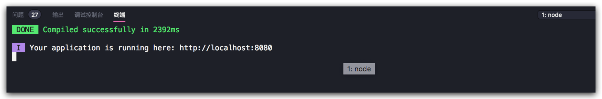

6. 开发完毕，007 准备提交代码给相关人员 Review 准备推送到环境上看看效果。
007 选择了手动根据自己的 PR 触发构建而不是根据 webhook 自动触发。

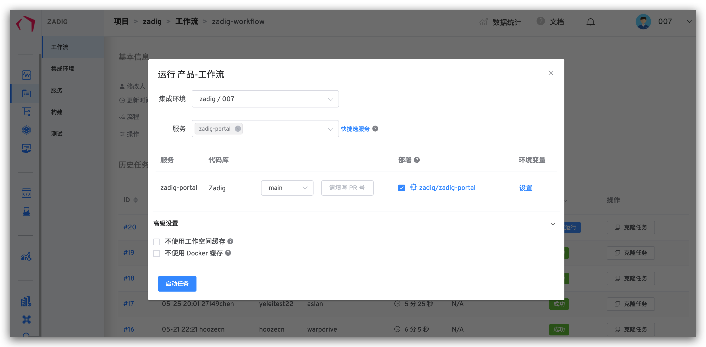

7. 007 看了一下构建日志，一切正常。本次改动已经正常的更新到 007 环境，准备发给测试人员进行验收测试了。

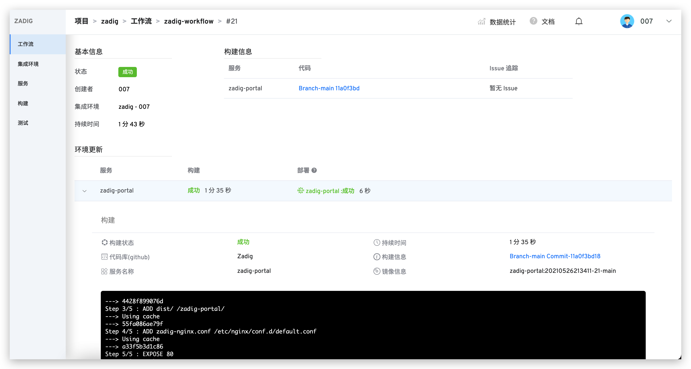

8. 测试人员在测试验收时，发现某个接口返回值异常，007 通过实时的容器日志发现是后端对接口数据的边界处理出现问题，遂反馈给后端。

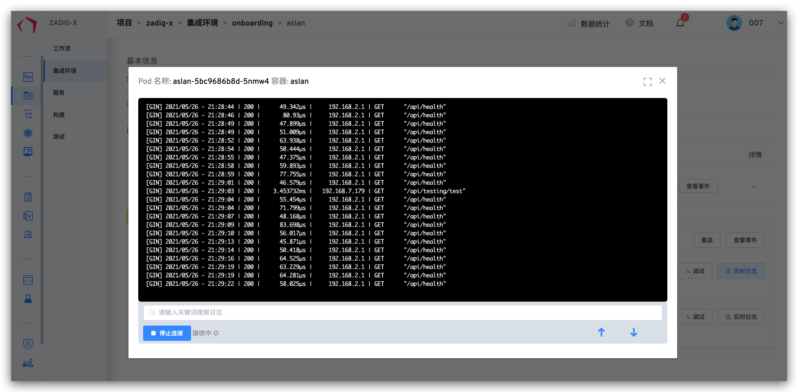

9. 后端修改后再次验收通过，准备执行 ops 工作流进行版本交付。

