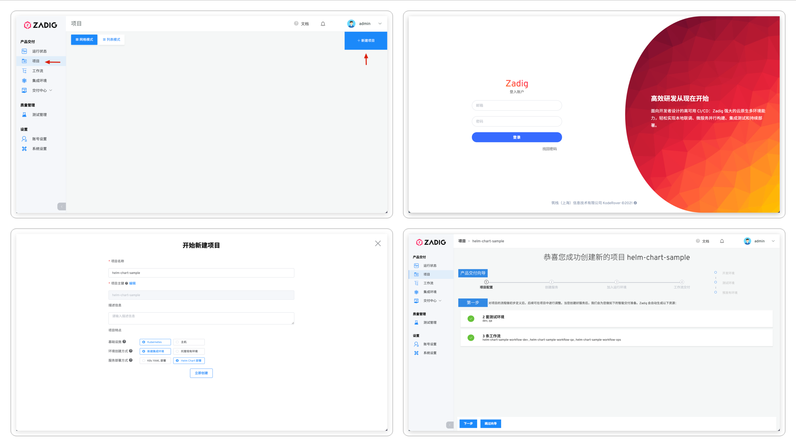
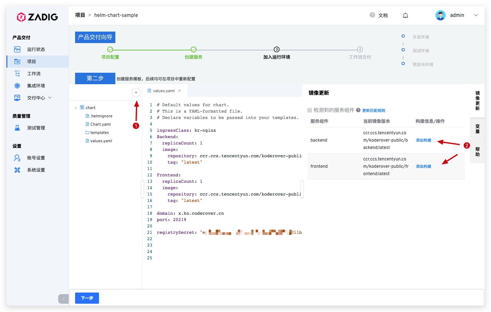
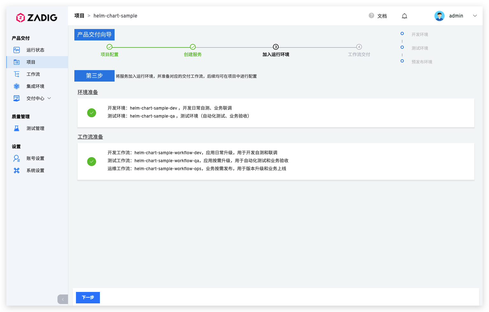
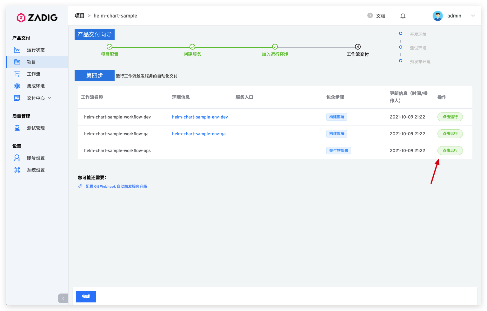

## 新建项目

进入 Zadig 系统，点击「项目」-「新建项目」，基于`Kubernetes`、`新建集成环境`、`Helm Chart 部署`的特点组合，点击「立即创建」，完成项目创建。

## 服务配置

点击`下一步`，创建服务并为服务配置构建。

- 选择从代码仓库导入 Helm Chart 相关模板，本例中使用 [koderover/zadig](https://github.com/koderover/zadig) 仓库的 [microservice-demo](https://github.com/koderover/zadig/tree/main/examples/microservice-demo/chart) 案例。
> 更细节的信息可参考 [Helm Chart 服务](/project/service/#helm-chart-服务)

- 导入完毕后，系统会自动解析使用 Helm Chart 定义、安装和升级的 K8s 资源。

- 为 `backend` 服务配置构建：点击`添加构建`，为服务组件添加构建配置，填写构建所需基本信息和构建脚本后保存。

> 1. 添加构建所需应用，选择`go`
> 2. 选择代码仓库
> 3. 填写构建脚本

>  更细节的信息请参阅 [构建配置](/project/build/)。

## 加入环境

服务配置完毕后点击`下一步`, Zadig 系统会默认为该项目创建两套集成环境和三条工作流。

待环境和工作流准备完毕，点击`下一步`，进入到工作流交付环节。

## 工作流交付

- 执行指定工作流，对服务进行更新升级。

- 在工作流执行详情页面可实时跟踪构建日志，待工作流成功运行完毕，服务会被自动更新部署，产品升级完毕。

