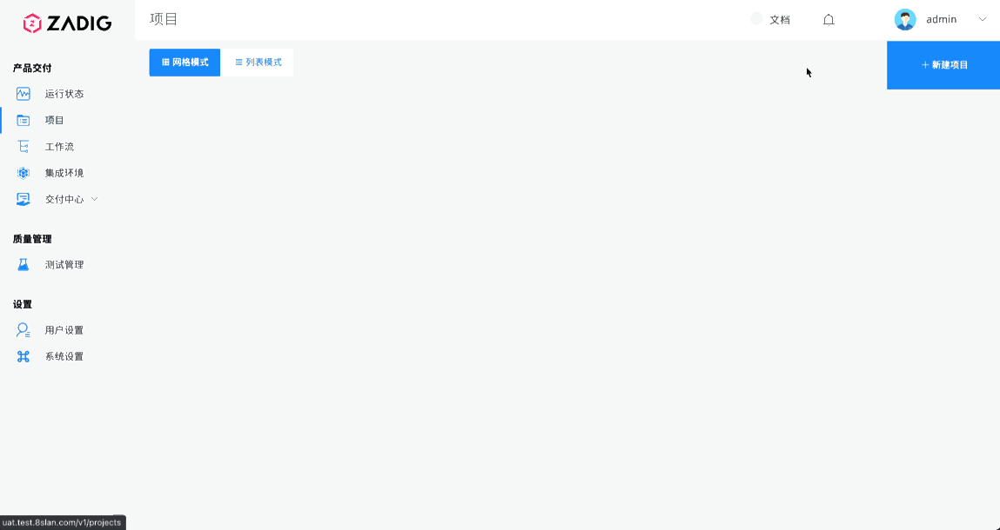
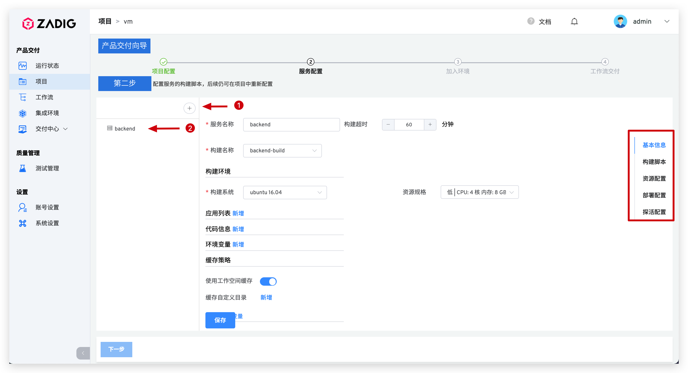
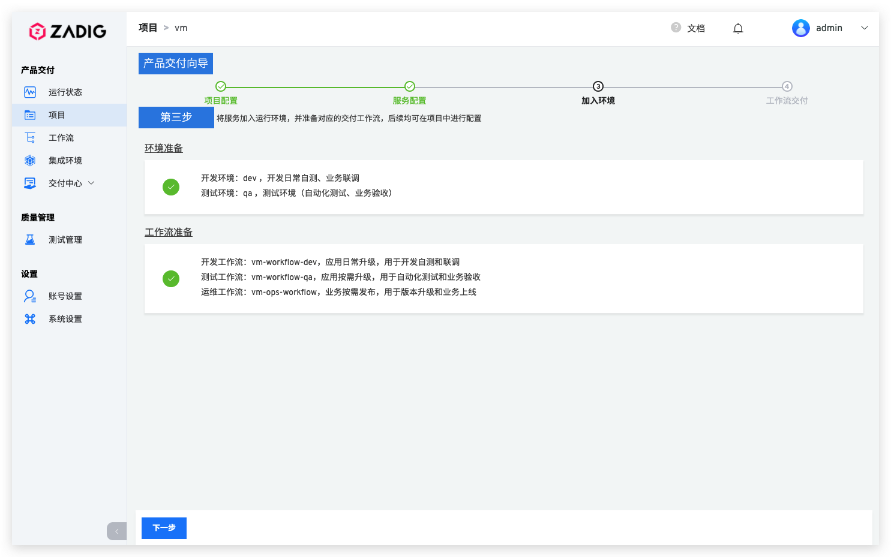
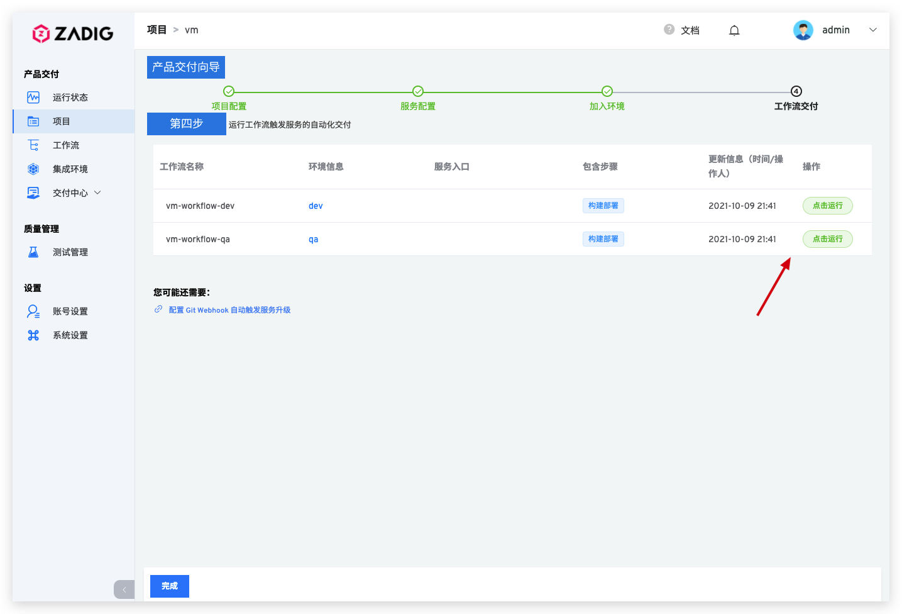

## 新建项目
进入 Zadig 系统，点击「项目」-「新建项目」，基于`主机`的基础设施创建项目，点击「立即创建」，完成项目创建。

## 服务配置

新建服务，填写服务基本信息。并分别为其配置构建、主机资源、服务部署及服务探活等基本操作。

> 参阅 [主机服务](/project/service/)，完成相关配置项。

## 加入环境

主机服务配置完毕后，保存并点击`下一步`，Zadig 系统会默认为该项目创建两套集成环境和两条工作流。

## 工作流交付

待环境和工作流准备完毕，点击`下一步`，可触发工作流对服务进行更新，对产品进行发布。

