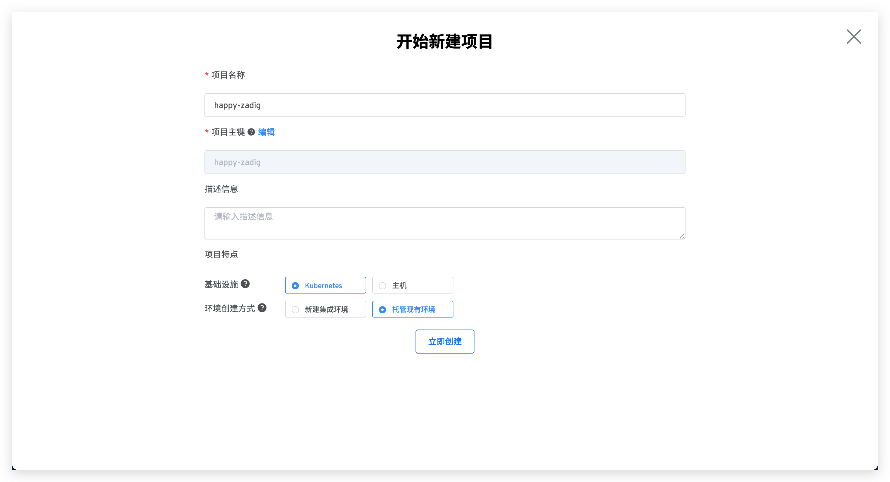
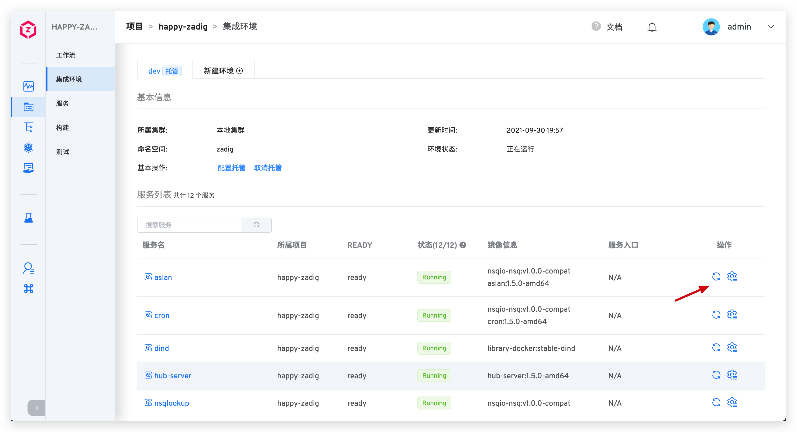

## 托管 K8s YAML 服务
> 在 Zadig <Badge text="v1.5.0"/>及以上版本中，支持对 Kubernetes 集群的命名空间资源进行托管管理。通过在 Zadig 中创建环境并托管服务，实现跨集群的测试环境管理、服务管理。

### 新建托管环境
- 新建项目，环境创建方式选择`托管现有环境`。

- 填写环境名称，选择托管集群和集群里的命名空间，并选择要被托管管理的服务。
> 1. Zadig 可对本地集群和非本地集群的服务进行托管，本地集群指 Zadig 系统所在的集群。
> 2. 配置多集群请参考[集群管理](/pages/cluster_manage/)。

- 系统会自动解析服务组件，可为其添加构建，为工作流自动部署做准备。

- 进入下一步后点击`完成`，至此一个托管项目创建完成，实现服务托管管理。

### 更新托管服务
- 触发工作流，选择要更新的服务并启动任务，实现被托管服务的自动化部署升级。

::: warning
暂不支持 Webhook 自动触发托管服务更新
:::

### 添加/删除托管服务
- 在托管项目中点击`环境`，进入环境管理页面，进行托管服务管理。

- 点击`配置托管`，对`dev`环境的服务进行管理。

- 按需选择左侧列表中的服务拖至右侧，点击`下一步`，新增对该服务的托管管理。
> 也可通过将右侧已托管服务移至左侧来实现取消对该服务的托管管理。

- 可对新加入的服务配置构建，以便使用工作流对托管的服务进行自动部署更新。
> 也可以不在此环节配置构建，待服务托管至当前`dev`环境后，在项目的构建管理里进行配置。

- 集成环境中可预览被托管服务的状态、镜像等信息，可对托管的服务进行重启等操作。

- 点击具体的服务，可查看该服务更细节的信息，包括但不限于修改服务镜像版本、查看服务部署事件、查看实时日志等操作。

