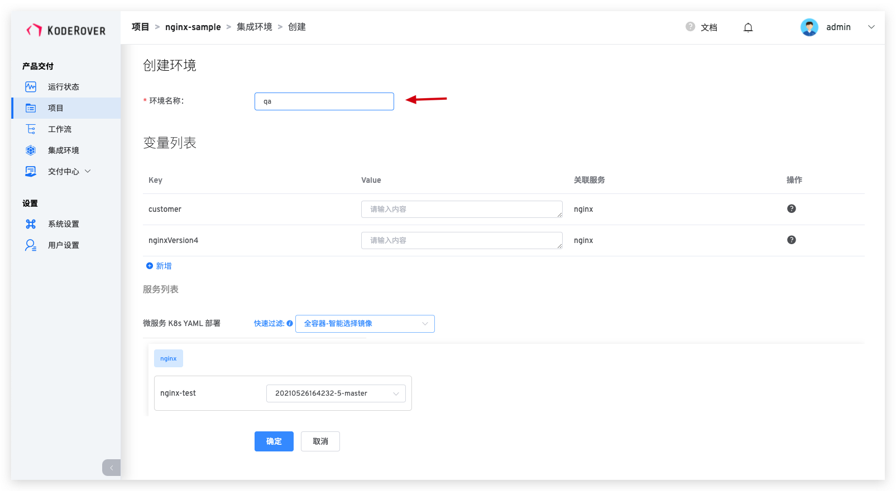

本文主要介绍 Zadig 的集成环境操作。
## 创建环境
在项目中，点击`新建环境`按钮进入创建集成环境页面。

### 创建方式
目前平台支持 2 种方式来创建环境：
- 系统创建：通过在 Zadig 产品创建的服务配置新建环境
- 托管外部环境：接入外部集群的环境，系统对托管的环境提供更换镜像，变更副本数量，查看实时日志，查看事件，调试等基本功能

::: tip
托管外部环境目前支持 Kubernetes 中的 Service、Deployment、Statefulset 和 Ingress 资源。 
如果解除托管，不会对 Kubernetes 集群中的资源造成影响。
:::

### 变量列表

在创建项目时可以给环境中相关服务的变量赋值以区分不同的环境。

### 服务列表

该部分可以让用户自定义服务所使用的镜像，与此同时，平台提供 2 个快捷选项：

- `全容器-智能选择镜像`：给每个容器自动选择镜像仓库中最新的镜像版本。
- `全容器-全部默认镜像`：给每个容器选择服务 YAML 中配置的镜像版本。

### 开始创建
点击确定按钮即可开始创建环境

::: tip
服务数量以及启动服务所需的资源会影响环境的创建时间，请耐心等待。
:::
## 查看环境
环境创建完成后，点击不同的环境 Tab 即可切换到该环境的详情页面。

### 基本信息
基本信息包括更新时间，部署环境名，环境状态。

环境状态有以下几种情况：
- `创建中`：正在创建。
- `更新中`：正在更新。
- `删除中`：正在删除。
- `正在运行`：环境中所有服务都是正常的 Running 状态。
- `运行不稳定`：环境中一部分服务处于 Unstable 状态，可能的情况有两种：
	- 容器服务出现了问题.
	- 容器服务正在进行更新操作，例如更新镜像，会出现短时间的服务 Unstable，当更新过程完成之后，服务状态会恢复为 Running。
- `环境可更新`：当已创建的环境对应的环境模板有更新之后，环境处于可更新状态，有读写权限的用户可以看到`更新环境`按钮，点击按钮可对环境进行模板和配置的更新。

### 基本操作

环境操作包括：

- `更新环境变量`：对环境中的引用变量进行更新。
- `更新环境`：当环境对应的服务编排有变更或环境里面的服务 YAML 有变更时，集成环境中会自动出现更新环境按钮
- `删除环境`：删除当前创建的环境，环境删除后不可恢复。
- `环境回收`：按设定的时间，定时删除环境，删除后不可恢复。

## 删除环境

点击基本操作中的`删除环境`按钮即可删除环境

