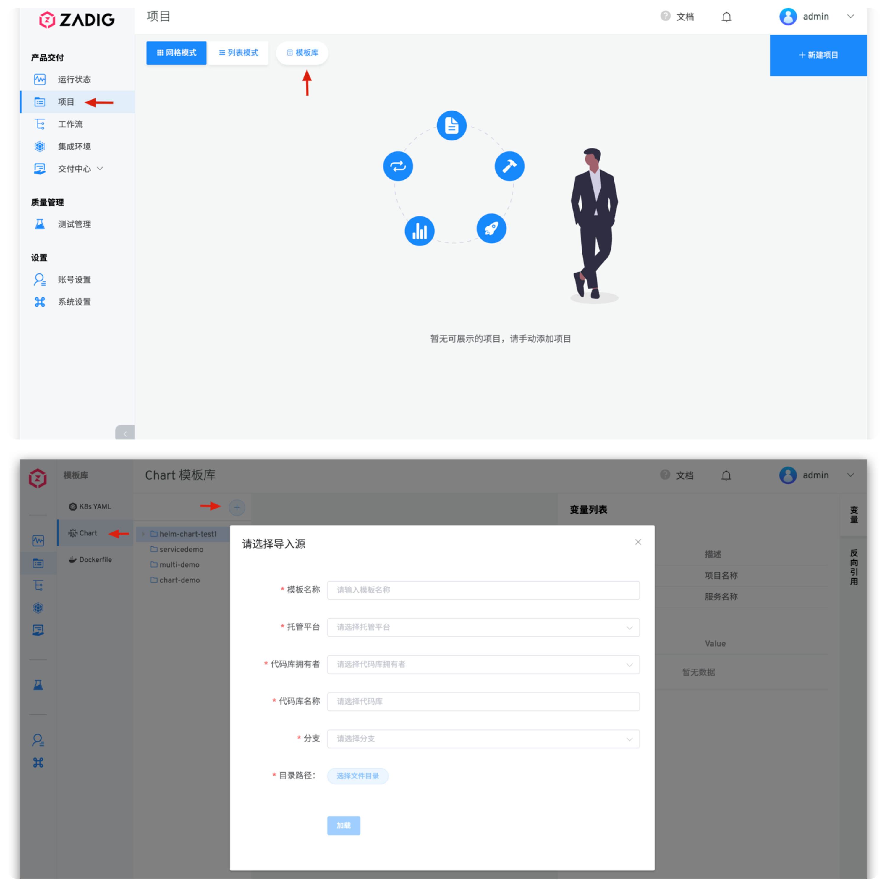
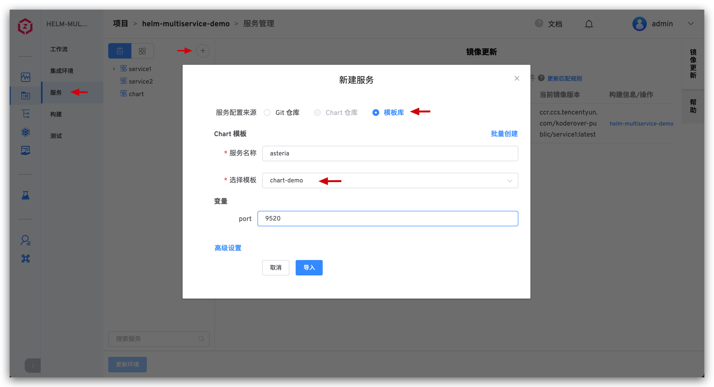
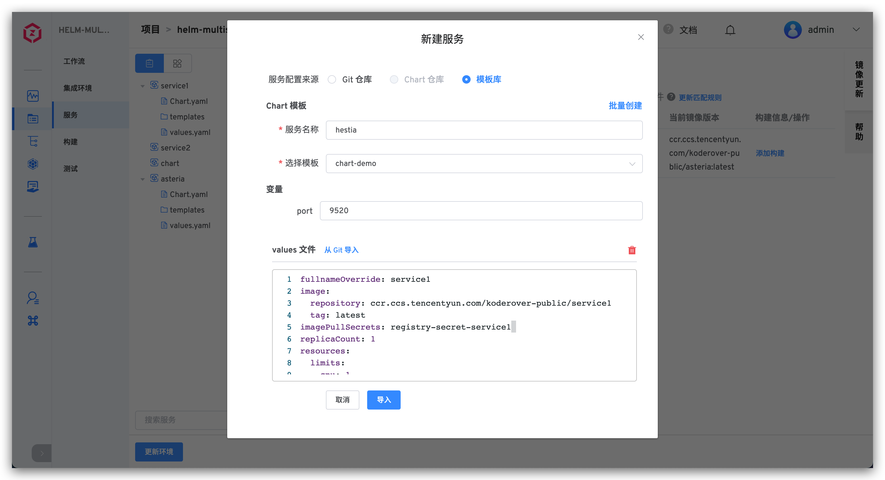

::: tip 背景
在 Zadig <Badge text="v1.6.0"/> 及以上版本中提供了</img> Helm Chart 模板能力，适用于使用 Helm Chart 部署的项目。支持用户更加灵活高效地部署 K8s 应用。
:::

## 新建 Helm Chart 模板

依次访问`项目`-`模板库`-`Chart`，点击`+`按钮，在弹出的模态框里输入 Helm Chart 模板名称并从 Git 仓库导入模板内容。

::: tip 前提
从 Git 仓库导入 Helm Chart 模板要求系统集成对应的 Git 代码源，可参考：[代码仓库集成](/settings/codehost/github)
:::

### 变量列表

模板内容保存成功后，系统会自动解析出模板的 values.yaml 中所使用变量。

- `系统内置变量`：包括 `$T-Project$` 和 `$T-Service$`，可直接在 Helm Chart 模板中使用。在项目中基于模板创建服务后，二者会自动被替换为对应的项目名称和服务名称。
- `自定义变量`：通过形如 `{{.key}}` 的方式在模板中定义使用，可赋予默认值。在项目中基于模板创建服务时，可修改自定义变量的值重新对服务进行定义。

## 使用 Helm Chart 模板
访问使用 Helm Chart 部署的项目的服务模块，点击`+`按钮新建服务，选择从模板库导入。输入服务名称并选择模板，按需对模板中定义的变量值进行修改覆盖后导入服务。

也可以点击`高级设置`，手动输入 values.yaml 或者从 Git 仓库导入 values.yaml 内容，系统会基于模板、重新赋值的自定义变量值以及高级设置中的 values.yaml 文件内容组合生成最终的服务配置。

<!---暂时未实现-->
<!---## 查看 Helm Chart 模板引用列表-->
