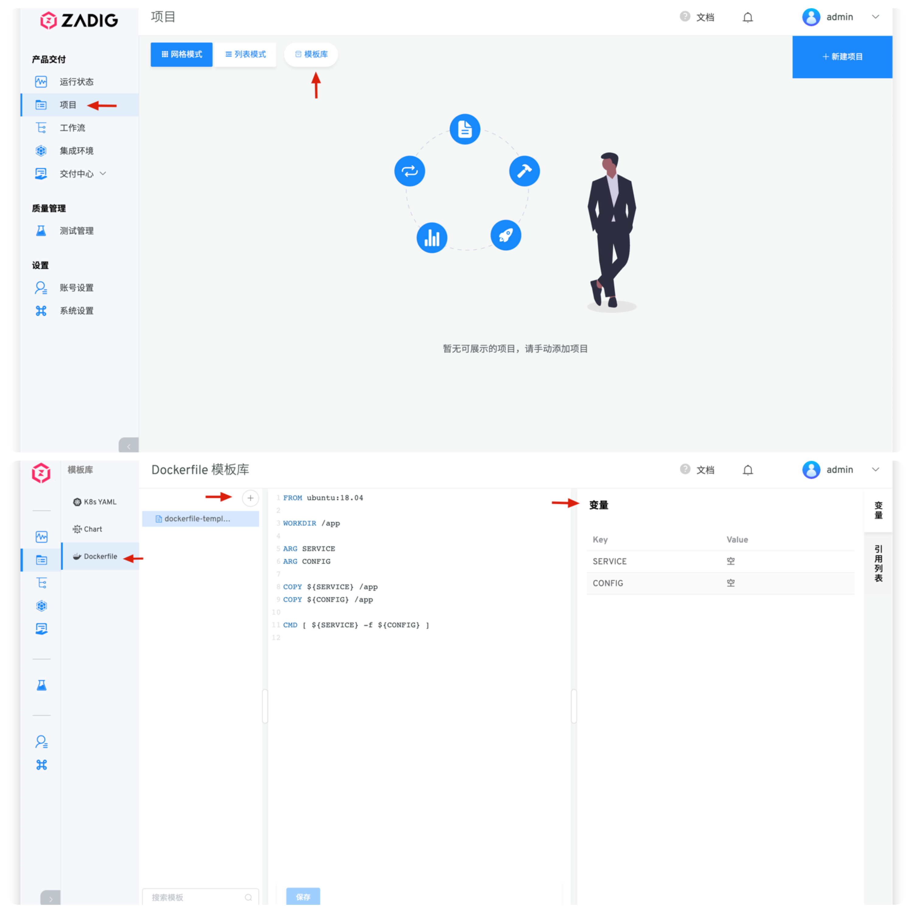
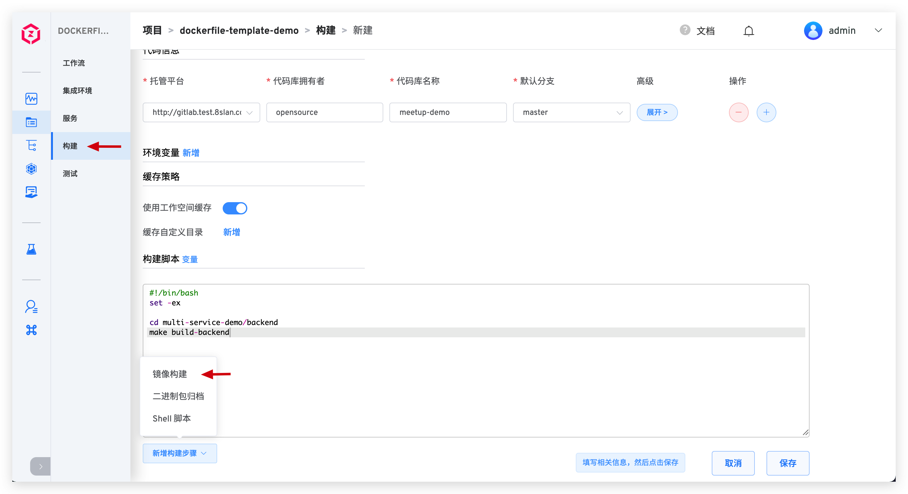
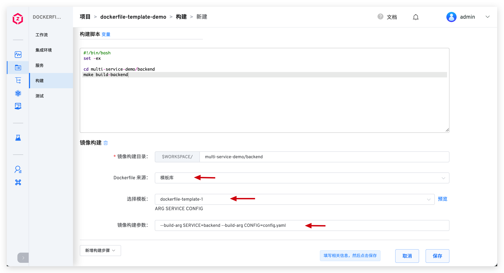

::: tip 背景
在 Zadig <Badge text="v1.6.0"/> 及以上版本中提供了 </img> Dockerfile 模板能力，支持用户将通用的镜像构建步骤包装成模板，最大程度地减少重复构建配置工作。
:::

## 新建 Dockerfile 模板

依次访问`项目`-`模板库`-`Dockerfile`，点击`+`按钮后输入 Dockerfile 模板名字并在右侧填写模板内容，模板内容保存成功后，系统会自动解析出模板中所使用变量。

::: tip 小贴士
Dockerfile 模板在整个系统内均有效，可被应用到不同的项目中使用。
:::

## 使用 Dockerfile 模板

- 访问项目的构建模块，在`镜像构建`步骤中使用 Dockerfile 模板。

- 在镜像构建配置中，依次填写镜像构建目录，选择特定的 Dockerfile 模板以及填写必要的镜像构建参数，保存即可。

::: tip 小贴士
- 选择 Dockerfile 模板后，系统会自动解析模板中所定义 ARG 参数并展示。

- 选择 Dockerfile 模板后，点击右侧的`预览`也可查看 Dockerfile 模板的具体内容。

以上两个小功能，以期帮助您降低配置时的心智负担。
:::

## 查看 Dockerfile 模板引用列表

点击 Dockerfile 模板右侧的`引用列表`，即可查看引用了该模板的项目和构建列表。

