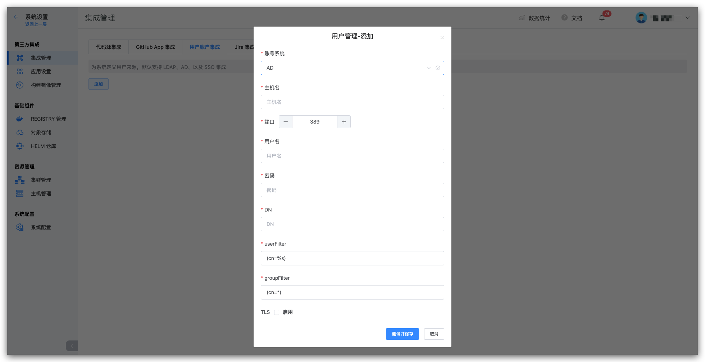

## LDAP

::: tip LDAP
LDAP（Lightweight Directory Access Protocol - 轻量目录访问协议）是一个 Web 应用程序的网络协议，可以从 LDAP 服务上访问和查找用户和用户组信息。
:::
你可以集成 LDAP 目录服务器到 Zadig 上，Zadig 通过授权连接 LDAP 目录服务器，实现用户和用户组的同步。

我们能够支持主流的 LDAP 目录服务器：
- Microsoft Active Directory
- OpenLDAP

### 在 Zadig 中集成 LDAP 目录

- 管理员依次进入 `系统设置` -> `集成管理` -> `用户账户集成`，进入用户集成页面。
- 点击添加按钮
- 添加一个目录类型，选择以下类型：
    - Microsoft Active Directory
    - OpenLDAP
- 根据参数配置，输入需要配置的参数
- 保存设置

参数配置：
| 参数名             | 描述                                                                                                                                                                                                                                                                                                                                                                                         |
|--------------------|----------------------------------------------------------------------------------------------------------------------------------------------------------------------------------------------------------------------------------------------------------------------------------------------------------------------------------------------------------------------------------------------|
| 目录类型           | 选择你将要连接的 LDAP 目录服务器类型。                                                                                                                                                                                                                                                                                                                                                       |
| 主机名             | 目录服务器的主机名。例如：  ad.example.com  ldap.example.com  opends.example.com                                                                                                                                                                                                                                                                                                 |
| 端口               | 你目录服务器正在监听的端口。例如：   389  10389   636（针对 SSL）                                                                                                                                                                                                                                                                                                                   |
| 使用 SSL           | 如果目录服务器使用了 SSL（Secure Sockets Layer），则需要勾选这个选项。  备注：如果希望使用这个选项，你需要配置 SSL 证书。                                                                                                                                                                                                                                                                 |
| 用户名             | 注意区分该用户名和 Zadig 用户名，该用户名被用来连接目录服务器。例如：  cn=administrator,cn=users,dc=ad,dc=example,dc=com   cn=user,dc=domain,dc=name   user@domain.name                                                                                                                                                                                                             |
| 密码               | 上述指定连接目录服务器用户的密码。                                                                                                                                                                                                                                                                                                                                                           |
| 基础 DN（Base DN） | 根专有名称（DN）将会在你在目录服务器上运行查询的时候使用到。例如：  o=example,c=com   cn=users,dc=ad,dc=example,dc=com  针对 Microsoft Active Directory，使用下面的格式来指定基本 DN：  dc=domain1,dc=local   可以根据实际的需求配置来修改 domain1 和 local。  与此同时 Microsoft Server 提供了一个名为 ldp.exe 工具，管路员可以使用该工具在 LDAP 服务器上进行查找和配置。 |
| userFilter         | User 过滤器，关于 LDAP Filter 请参考 https://ldap.com/ldap-filters/                                                                                                                                                                                                                                                                                                                          |
| groupFilter        | Group 过滤器，关于 LDAP Filter 请参考  https://ldap.com/ldap-filters/                                                                                                                                                                                                                                                                                                                        |                                                                             |

## SSO
Zadig 支持用户通过 SSO 账号授权进行登录：

参数说明：
- `Client Id`：用于认证的 Client ID
- `Secret`：用于认证的 Secret
- `Redirect`：SSO 登陆跳转认证的 URL
