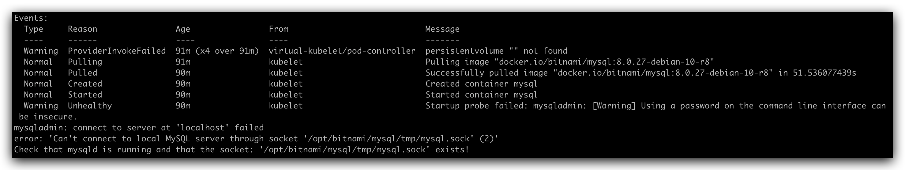

## Mongodb 和 Minio 处于 Pending 状态，安装失败？

Zadig 系统安装的时候，不会介入到集群的存储细节中来，因此，在没有默认 storage class 或是没有指定 storage
class 的时候， 需要事先创建 PV 来让 MinIO 和 Mongodb 正确运行。 以下是一个可以运行的 PV yaml 示例

::: details
```
apiVersion: v1
kind: PersistentVolume
metadata:
  name: zadig-reserved-pv
spec:
  capacity:
    storage: 20Gi
  accessModes:
    - ReadWriteOnce
  hostPath:
    path: "/mnt/zadig/data"
    type: Directory
---
apiVersion: v1
kind: PersistentVolume
metadata:
  name: task-pv-volume
spec:
  capacity:
    storage: 20Gi
  accessModes:
    - ReadWriteOnce
  hostPath:
    path: "/mnt/zadig/data2"
    type: Directory
```
:::

## 安装 v1.7.0 及以上版本，MySQL Pod startupProbe 报 warning 信息



在安装 v1.7.0 及以上版本时，MySQL Pod 创建 15s 后会开始对其进行启动探测检查。这样做的目的是保证有充分的时间来保护慢启动的应用，每次检测异常时会反馈 warning。系统最多会在 100s 内进行 10 次探测检查，遇到此种情况请耐心等待片刻。

::: tip 扩展知识
关于 Kubernetes Startup Probe 的知识点可阅读 [Configure Startup Probes](https://kubernetes.io/docs/tasks/configure-pod-container/configure-liveness-readiness-startup-probes)
:::
